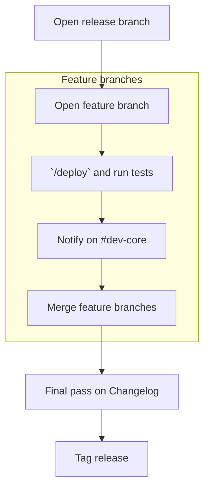

# Releases

There are two types of Renku releases: planned and unplanned.

A release consists of: 

* Helm chart changes to reflect the new versions of individual components.
* Updates to the documentation and the integration tests (both `cypress` and `acceptance`).
* Changes to `CHANGELOG.rst`.
* A new tag in this repository, which results in packaging and pushing out new helm charts and
  corresponding docker images.

This procedure should be followed for *any* release:

* Create a release branch (e.g. `0.46.x`), if one does not already exist, with the
  [release action](https://github.com/SwissDataScienceCenter/renku/actions/workflows/create-release-branch.yml).
* Create feature branches off of the release branch for new features.
  * A feature branch must contain all the changes needed for that feature.
* Squash merge feature branches into the release branch. Do not merge feature branches if they break the platform,
  even temporarily. Make sure:
  * All tests pass with the `/deploy` action.
  * The `/deploy` action does not reference specific component versions, these should be set in the chart.
  * The `CHANGELOG.rst` is up to date and reflects the changes made.
* The release manager merges the release branch into `master` when planned.
  * If a feature branch won't make it into a planned release, point it to the next release branch.
  * This might need a final cleanup PR to consolidate the changelog.
* Be sure `CHANGELOG.rst` is up to date and reflects the changes in the release branch before tagging a release.
This might require a final cleanup PR.

Acceptance tests have to pass on all release branches before merging.

## Planned release

A release is planned at the end of a build cycle and the end of the cooldown period. 
More releases can be done if needed, in which case you should coordinate with the release manager.

### Merge feature branches

Depending on the specific feature, it might be necessary to include changes from multiple components.
Please coordinate with the other teams to ensure that all the necessary changes are merged at the same
time to avoid temporarily breaking the release branch and minimize the impact on other teams.

Ideally, you should include all the necessary documentation and integration test changes in the same PR.

Before merging a feature branch, please always drop a message on the `#dev-core` channel to inform the
other teams about the upcoming changes. This will allow them to plan their work accordingly; even if you
don't expect any conflicts, it's always better to be safe than sorry, especially toward the end of the
build sprint when teams need to wrap up their work and must point their feature branches to the release
branch.

### Merge library updates

Library updates should be merged into the release branches, _not_ `master`.
We strongly discourage merging them just before finalizing a release, unless strictly necessary. This
avoids requiring all the other teams to rebase their PRs too frequently and re-running the tests when
they are already busy finalizing their work.

## Bugfix release

The procedure for a bugfix should be more or less the same as for a planned release. If a branch already exists for the 
correct *minor* version, e.g. `0.46.x` for a release `0.46.0`, start from that branch to create `0.46.1`. Care must 
be taken to rebase or cherry-pick any relevant additions from `master` into that branch. Do not rush this and please
communicate with others on the team to make sure we are not a) accidentally releasing new things with a bugfix and b)
slapping together incompatible changes. 

Once the bugfix is merged to `master`, make sure that it can propagate seamlessly to the other currently active release 
branches.

## Maintenance PRs

Maintenance PRs (e.g. library updates) should generally target the next release branch. 

## Make the release [Product team]

🛳️ Once the work on the release branch is completed: 

* The product and yat teams should review the PR, paying attention to the changelog  
* The product team updates the `CHANGELOG.rst` file when needed to make it more user friendly and potentially highlight relevant features or disrupting changes. 
* Once the PR is merged, a GitHub release and corresponding tag should be made.

## Rollout [YAT]

* Before _any_ rollout is done, consider whether any of the upgrades will result in a longer-than-normal outage. If yes, create appropriate maintenance windows marking specific components as affected. Coordinate maintenance windows with external Renku deployments admins (UniFR, SV).
* Roll out the release: one PR per deployment is automatically created in the `terraform-renku` repository to update the version. Make any needed configuration changes to the PR. Approve and merge the PR to deploy. Important: if needed, add the `scheduled maintenance` label to help avoiding it being merged too early. Limited should be rolled out before Renkulab, as a canary release (see below).
* Limited should be rolled out ~1 week before the Renkulab rollout, to give a chance to find bugs early. E.g. Limited on Wednesday and Renkulab on Monday.
* Make the tag in the `renku` repository, monitor the automatic process of chart publishing and deployment on staging.
* Merge terraform-renku PR, monitor Flux upgrading Renku everywhere.
* After the Limited and RenkuLab deployments are completed, notify the Product team that the deployments are live, so they can post the release Highlights.
