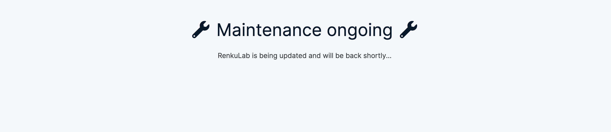
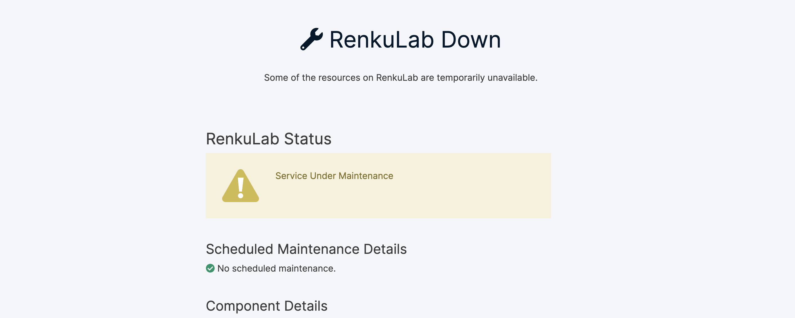
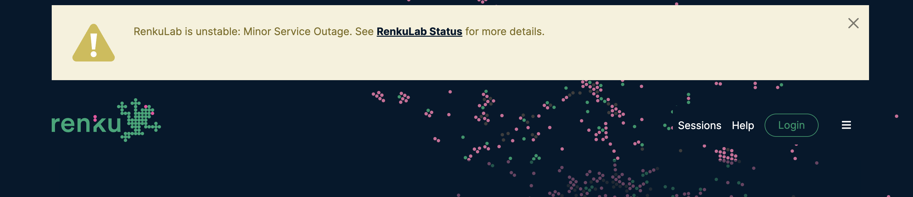
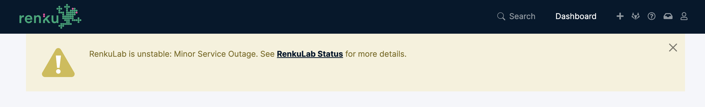
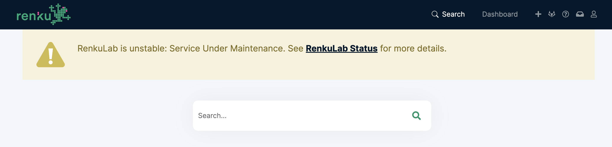
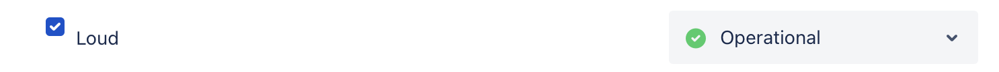
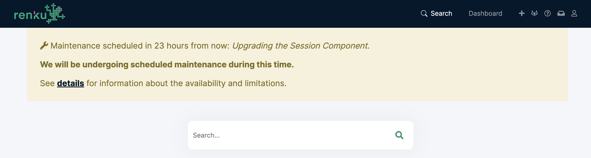

.. _incidents-maintenance:

Communicating Incidents and Maintenance
---------------------------------------

RenkuLab provides configurable options for communicating to users about
incidents and scheduled disruptions to service. For this, RenkuLab integrates
with `statuspage.io <https://www.atlassian.com/software/statuspage>`_  and
displays information contained on the statuspage. Though some features are
available without it, we encourage admins to set up a statuspage.io account and
create a statuspage for their RenkuLab deployment, as this provides for greater
flexibility and control over the information that is presented, and lets users
subscribe to notifications.

To set up the integration, set the ID for the statuspage in the RenkuLab
values file under the key ``ui.client.statuspage.id``.

.. code-block:: yaml

    ui:
      client:
        statuspage:
          id: <statuspage_id>

How the information is presented depends on the severity of the event. The
options are described below, ordered from most to least severe.

RenkuLab Inaccessible
=====================

If RenkuLab is inaccessible, there are two ways to inform visitors about what
is going on. The simplest is to set a message in the RenkuLab values file under
the key ``ui.client.maintenance``. For example, a configuration like the
following.

.. code-block:: yaml

    ui:
      client:
        maintenance: RenkuLab is being updated and will be back shortly...

This will result in the following page shown to all visitors to the RenkuLab
instance.

|

If the ``/user`` endpoint of the API returns an error, then RenkuLab will also
show a *RenkuLab Down* page to users, but this one will embed information from
the statuspage, if one is configured.

RenkuLab Partially Accessible
=============================

If Renku is partially accessible, then information concerning incidents and
maintenance is presented to the user in the form of a banner. When there is an
active incident or a planned maintenance, a banner is shown on the home page of
RenkuLab for users that are not logged in, and on the dashboard for users that
are logged in. For highly disruptive incidents and maintenance, it is possible
to have the banner shown on all pages of RenkuLab.

Incidents
^^^^^^^^^

If there is a current incident registered in the statuspage, then a banner is
shown. For incidents in which the impact is set to ``none`` or ``minor``, the
banner is only shown on one page, either the home page or the dashboard, and
is dismissible.

Minor incident on the home page:

|

Minor incident on the dashboard page:

|

The text ``Minor Service Outage`` comes from statuspage.io, and is determined
by the status of the components that are part of the incident.

For incidents in which the impact is set to ``major`` or ``critical``, the
banner is shown on all pages of RenkuLab, and is not dismissible.

Major incident example:

|

Scheduled Maintenance
^^^^^^^^^^^^^^^^^^^^^

If there is a maintenance scheduled in statuspage.io, a banner is shown
displaying the ``Maintenance Name`` and time information about when the
maintenance window starts.

.. image:: ../../_static/images/ui_maintenance_scheduled_home.png
    :width: 85%
    :align: center
    :alt: Scheduled maintenance example

|

Normally, this information is only shown on the home page (for users that are
not logged in) and on the dashboard (for users that are logged in). However,
it is possible to have this banner shown on all pages of RenkuLab. This is done
by creating a component called ``Loud`` in statuspage.io, and designating it
as affected by the maintenance.

|

When the ``Loud`` component is affected, then the banner is shown throughout
the UI and in a larger font size.

