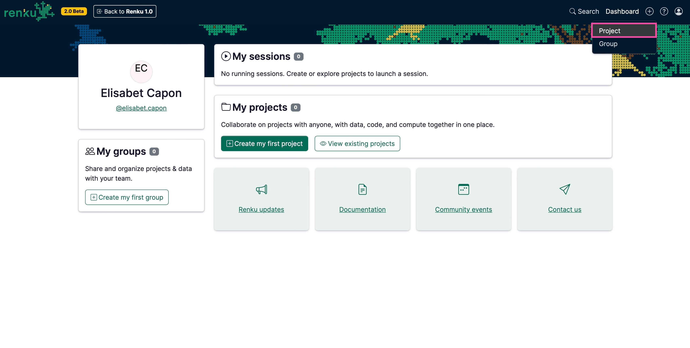
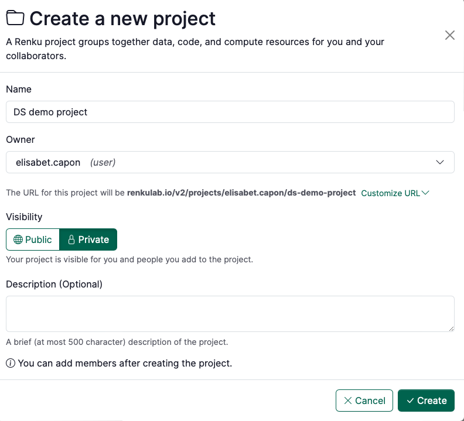

# How to create a new project

Work in Renku is organized around projects: a **project** is the core building block where you connect data sources, code repositories and compute environments (for running sessions). You can grant access to a project to your colleagues and collaborators, or even share some elements (code, data or compute environments) of your project to a broader audience.

To create a new project:

1. Click ➕ at the top right corner of [renkulab.io](http://renkulab.io/v2) after logging in.
    1. Click on **Project**.
    
    
    
2. On the project creation page
    - **Name**: Enter the project identifier.
    - **Owner**: Decide whether the project should be under your user space or under a group you belong to.
    - **Visibility**: Set it either to be **Public** or **Private**.
    - **Description (optional)**: Fill in the description for the project.
        
        
        
3. Add the data for your project. See our collection of How To Guides for options for creating data connectors.
    
    [Untitled](How%20to%20create%20a%20new%20project%20eea72bea221848d7bd0b3338dd859504/Untitled%2064f8e0a6b6b848fab5cd4dd87c11fd0a.csv)
    
4. Add code repository as explained in [How to add a code repository to your project](How%20to%20add%20a%20code%20repository%20to%20your%20project%2053658e1ef33d431bb3c3129a82d99a5f.md)
5. Create a session launcher for working in your project:
    1. Select an environment:
        1. Check out the environments available in Renku via [How to add a session launcher to your project](How%20to%20add%20a%20session%20launcher%20to%20your%20project%20601ba47455354413b87c69447aa33831.md). If these are sufficient for your project, use them!
        2. If you need to customize the environment for your project, you can create a custom environment yourself via [How to use your own docker image for a Renku session](How%20to%20use%20your%20own%20docker%20image%20for%20a%20Renku%20sessi%2011f0df2efafc80af848ffcaf9ccff31c.md), or  [Contact](https://www.notion.so/Contact-dd098db288ff433893a4d4d429da99c1?pvs=21) us if you are in trouble!
    2. Set the session launcher’s default resource class for your project [How to select compute resources for your session](How%20to%20select%20compute%20resources%20for%20your%20session%208811db74f5f04f859d6fe4fb35fcf692.md).
        
        :::note
        
        In order to ensure adequate resources for running the project and to control the consumption of the sessions, remember to assign to the session launcher with the adequate resource class when adding the session launcher to your project. Learn more about custom resource pools for courses: [Request a Custom Resource Pool](Resource%20Pools%20&%20Classes%2011f0df2efafc802dbe05f4dcd375431f.md).

        :::