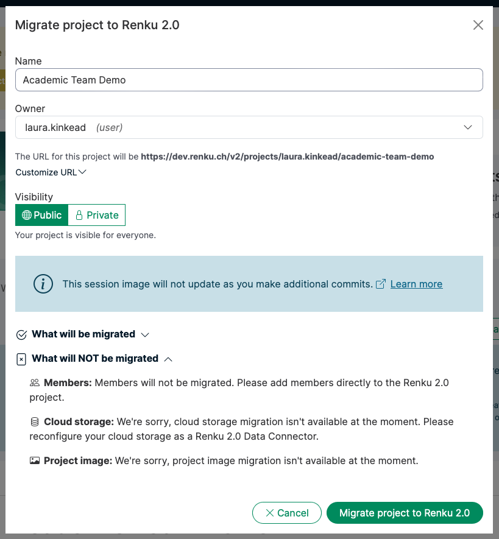
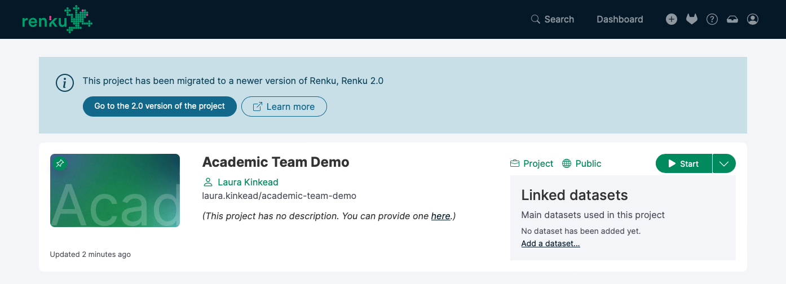
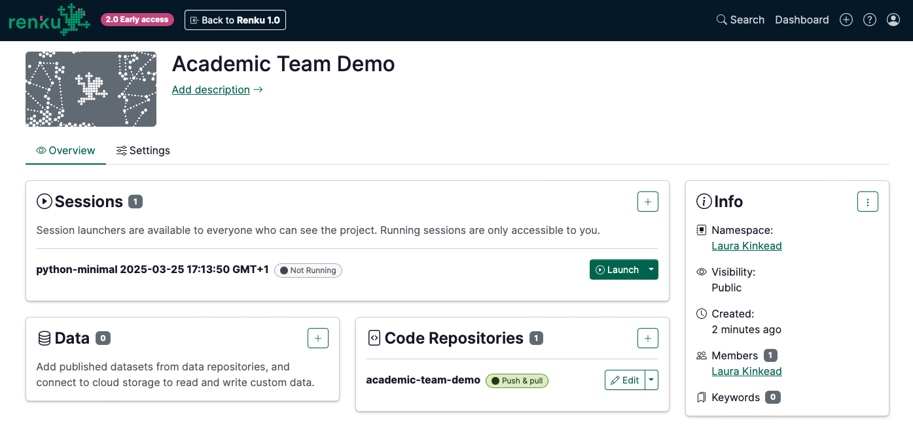
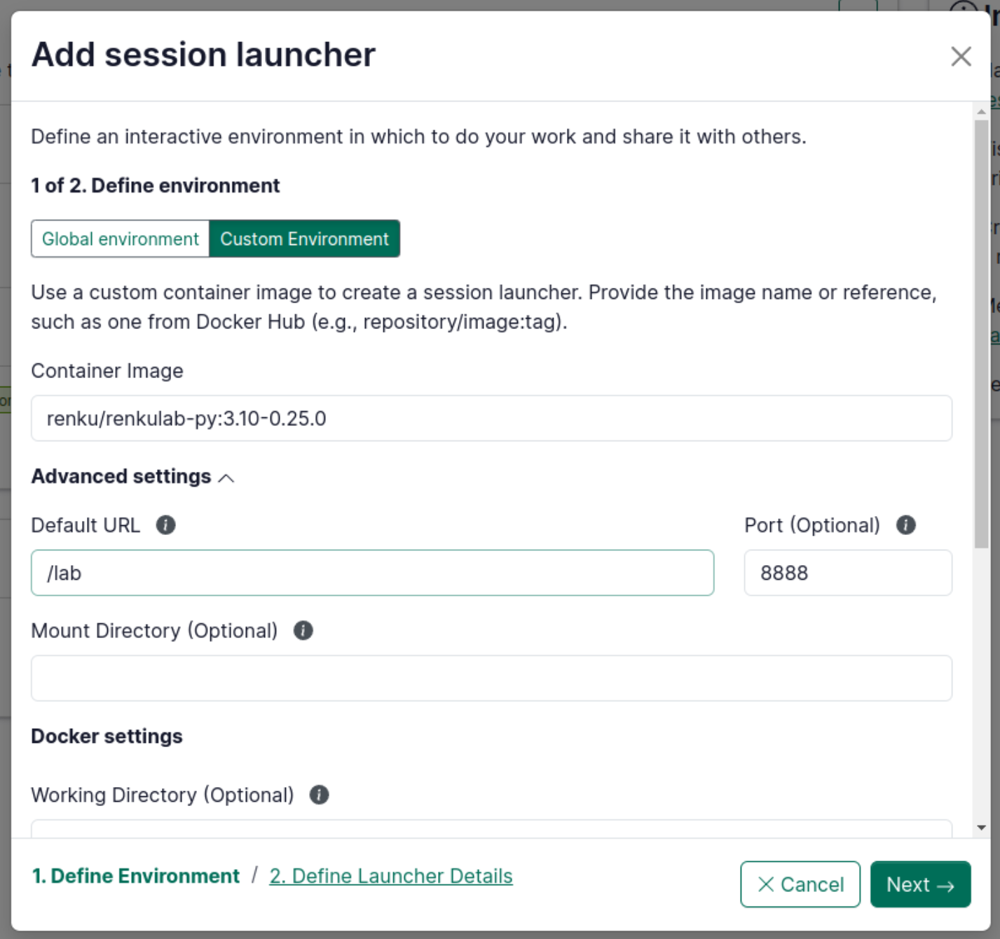

# How to migrate a Renku 1.0 project to Renku 2.0

This guide will explain what migrating a project from Renku 1.0 to 2.0 means, and walk you through how to migrate your project.

# What happens when I migrate a project to Renku 2.0?

### ✅ Code Repository

The project code repository will be migrated automatically, and will show up in your Renku 2.0 project under the **Code repositories** section.

### ✅ ✳️ Datasets & Git LFS Data

Git LFS data, including Renku Datasets, are a part of your code repository, and will be available from inside your Renku 2.0 session via the git lfs command line tool.

Git LFS data will not be downloaded automatically upon session launch, so you must run `git lfs pull` inside your session.

<aside>

**Warning:** Please note that Renku 2.0 takes a significantly different approach to data compared to Renku 1.0. Read more on our [blog](https://blog.renkulab.io/deep-dive-2-0/#data-connectors-replace-datasets). Consider moving your data into an external storage system and connecting it to your project via a [Data connector](Data%20connector%203ae1e46fdb094cc48516a104457e5633.md).

</aside>

### ❌ Cloud Storage Data

Cloud storage migration isn’t available at the moment. Please reconfigure your cloud storage as a Renku 2.0 [Data connector](Data%20connector%203ae1e46fdb094cc48516a104457e5633.md).

### ✅ ✳️ Session

By default, the Renku 2.0 project will be created with a [Session Launcher](Session%20Launcher%20518df05050a7434eb3eb0493181d715c.md) that uses **the latest image created for the 1.0 project**.

<aside>

**Info:** The session image will not continue to update as you make additional commits. This functionality is coming to Renku 2.0 soon! For more info, check out our design doc: [Define a custom environment from a repo](https://www.notion.so/Define-a-custom-environment-from-a-repo-1570df2efafc80f4b6b3ceb5a09d1569?pvs=21)

</aside>

If you have a pinned image, the pinned image will be used.

The default resource class used by your Renku 1.0 project session will be set as the default resource class in the Renku 2.0 session launcher.

### ✅ ✳️ Workflows

You may continue to use Renku workflows in your session via the CLI.

<aside>

**Warning:** Please note that Renku 2.0 takes a significant different approach to workflows compared to Renku 1.0. Read more on our [blog](https://blog.renkulab.io/deep-dive-2-0/#a-new-vision-for-workflows).

</aside>

### ✅ Metadata

Project title, description, and keywords will be automatically migrated. You have the option to modify the title of the project during the project migration process.

One exception is the project image, which is not migrated at this time.

### ❌ Members

Project members will not be migrated. Please add members directly to the Renku 2.0 project after migrating.

<aside>

**Tip:** If you would like to share a set of projects with a group, you can create a Renku 2.0 group! See [How to create a group](How%20to%20create%20a%20group%20bebe023733aa4ae39a5a164e56f487ac.md).

</aside>

# Automated Migration

<aside>

**Info:** Currently, automated migration is only supported for public projects. Migration for private projects is coming soon.

</aside>

Here’s how to migrate your Renku 1.0 project to 2.0:

1. Open a Renku 1.0 project that you own. Only project owners can migrate projects.
2. In the banner at the top of the project page about project migration, click **Migrate**
    
    
    
    The migration banner invites you to migrate your project to Renku 2.0.
    
3. Review that the project name, owner, and visibility as as you want.
    
    
    
    The migration modal shows you what components of the project will and will not be migrated.
    
    <aside>
    
    
    **Tip:** If you would like to share your project with a group, we recommend creating that group in Renku 2.0 (see [How to create a group](How%20to%20create%20a%20group%20bebe023733aa4ae39a5a164e56f487ac.md)). Then, come back to the project migration and select that group as the **owner** for the migrated project.
    
    </aside>
    

After you migrate the project, if you return to the 1.0 version of the project, you will see a banner with a button to go to the 2.0 version of the project.

Banner inviting you to switch to the 2.0 version of the project.

The project now in Renku 2.0!

# Manual Migration

If for whatever reason you need to migrate a project manually, you can do so by creating a new Renku 2.0 project with all of the same code, data, and session components. Here’s how:

1. Create a new project in Renku 2.0
2. **Code:** Add your Renku 1.0 project GitLab URL to the Code section in your Renku 2.0 project
    1. See [How to add a code repository to your project](How%20to%20add%20a%20code%20repository%20to%20your%20project%2053658e1ef33d431bb3c3129a82d99a5f.md)
3. **Data**: If you use cloud storage in your project, create a data connector for the cloud storage object.
4. **Session:** Add your Renku 1.0 project docker image:
    1. Navigate to your Renku 1.0 project in **GitLab**
    2. Navigate in the left menu to **Deploy** and then **Container Registry**
    3. Click on the repository
    4. Find your latest tag, and click the 📋 icon to copy the URL. It should look like this:
        1. [registry.renkulab.io/laura.kinkead1/n2o-pathway-analysis:980f4a3](http://registry.renkulab.io/laura.kinkead1/n2o-pathway-analysis:980f4a3)
    5. In your Renku 2.0 project, → Click on the ➕ in the Sessions box to create a new Session Launcher
        1. Select **Custom Environment**
        2. Paste the URL you copied from the GitLab container registry in the **Container Image** field
        3. In the **Advanced Settings**, specify the **Default URL**:
            1. If it’s a Jupyter-based image, enter `/lab`
            2. If it’s a RStudio-based image, enter `/rstudio`
        
        
        
    6. Click **Next**
    7. Give your Launcher a **name** that describes what it does