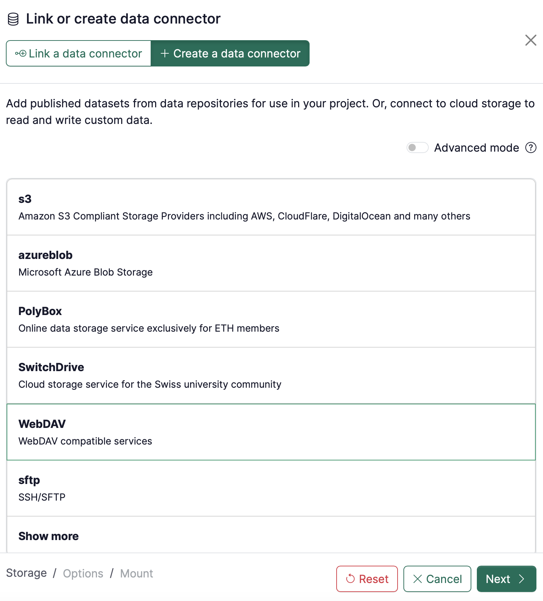

# How to add a dataset from ETH Research Collection

:::info

If you would like to connect your project to a public data source (e.g. ETH Research connection), you can use the platform’s technology to create such connection.

:::

## ETH Research Collection

This platform uses webdav for connecting to data, if available in the public libdrive space. Please follow the following steps to connect your project to this data source.

In your project’s dashboard:

1. Under **Data** section, click on  **+** button
    1. Click on **+ Create a data connector**
    2. Select **WebDAV**
    
    
    
2. Use the following settings:
    - **URL:**  https://libdrive.ethz.ch/public.php/webdav
    - **Username:** #id,  where #id is the identifier of your data (e.g. #id = i974KegIjhJJxkK for the last part of the URL of your data, as you can read in the URL [here](https://libdrive.ethz.ch/index.php/s/i974KegIjhJJxkK) in this example)
        
        
        
3. Click on **Test connection.**
4. A message in green “The connection to the storage works correctly.” should appear. Click on **Continue**.
5. Specify the final details of the data connector, namely:
    1. **Name**: term to refer to your data connector
    2. **Owner**: select the namespace the data connector belongs to (either you as a user or a group)
    3. **Visibility**: decide whether it should be public or private
    4. **Mount point**: name of the directory in your session workspace where the folder will be mounted
    5. **Read-only**: ensure that it is clicked (option by default)

:::note

For examples of data from the ETH Research Collection to add to your project, see [Data & Code for Workshop Challenge](https://www.notion.so/Data-Code-for-Workshop-Challenge-01c5c6a5e8ba49f0aa840a31c474fec8?pvs=21).

:::