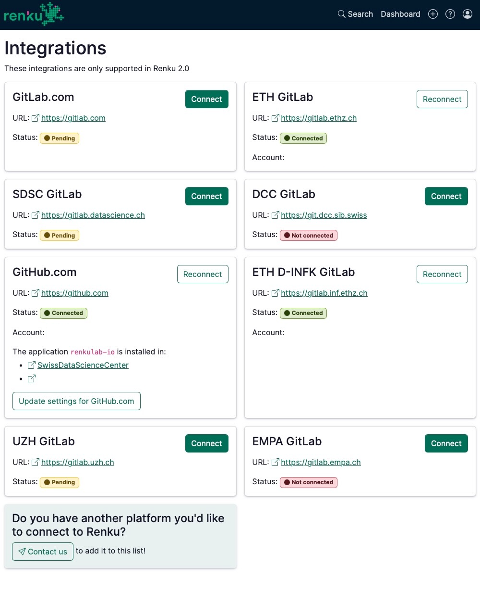

# How to connect your Renku account to your GitHub or GitLab account

Renku allows you to connect to several external service providers, including GitHub, GitLab, ETH GitLab and SDSC GitLab.

<aside>

If your institution has a dedicated GitLab instance you would like to integrate with Renku, do not hesitate to [Contact](https://www.notion.so/Contact-dd098db288ff433893a4d4d429da99c1?pvs=21)  us, and we will be happy to add it to the list.

</aside>

1. In the User menu in the top right corner, click on **Integrations.**
2. For the desired services, click on **Connect.**
    1. Approve the steps. After that, the service status will turn into connected.

1. Follow the prompts to install the Renku app in the namespace(s) where you want to use repositories in Renku.

<aside>
💫

Now you can [add code repositories to your projects](How%20to%20add%20a%20code%20repository%20to%20your%20project%2053658e1ef33d431bb3c3129a82d99a5f.md) and read & write them in sessions!

</aside>

[Screen Recording 2025-09-12 at 12.09.11.mov](./connect-your-renku-account-to-your-github-or-gitlab-account-10.mov)