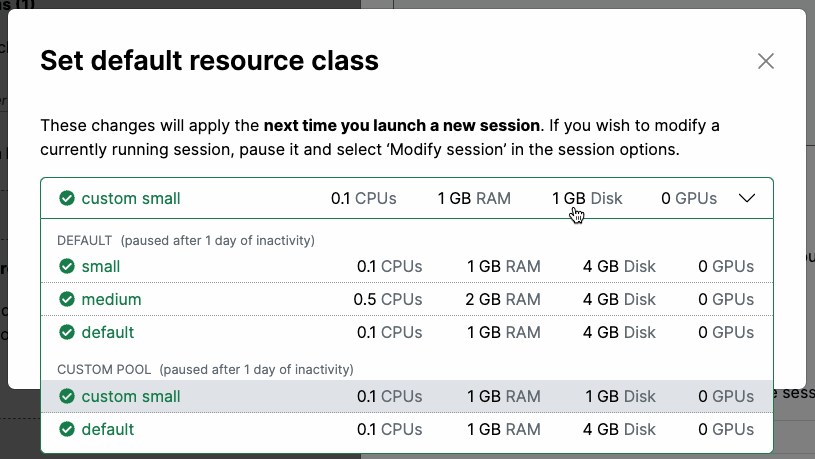
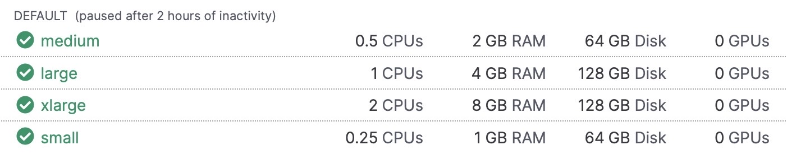

# Resource Pools & Classes

The compute resource available to Renku users are determined by the **resources pools** the user has access to. To specify the resources for a project’s session launcher, you select a **resource class** from any of the resource pools available to you.

## Resource Pools

A **resource pool** is a total resource quota, a set of users who are allowed to use resources from that quota, and culling times for sessions using those resources.

- **Resources:** For example, a resource pool may be configured for 160 CPUs, 1024 GB RAM, and 16 GPUs.
- **Users:** There is no limit to how many users can be added to a resource pool. And conversely, a user may be granted access to any number of resource pools. All resource pools the user has access to show up in their resource selector when they configure their RenkuLab session.
- **Culling times:** You can customize the max idle time for your resource pool(s). For example, in the Public resource pool (the default resource pool available to all RenkuLab users), sessions auto-pause after 2 hours of idle time, and shut down after 2 weeks. You may customize these thresholds to be longer or shorter.

## Resource Classes

A resource pool contains a set of **resource classes**. A resource class is a resource configuration that a user can select for their RenkuLab session.

For example, a resource class may be:

- 12 CPUs, 80 GB RAM, 2 GPUs, 50 GB *default* disk, 500 GB *max* disk

As users run sessions, their session resources (the resource class the session is using) comes out of the quota on the resource pool. If the resource pool’s quota has been reached, users won’t be able to start any more sessions in that resource pool (but they may run sessions in other resource pools).

For custom resource pools granted to users, you may customize the resource classes in you resource pool.

## The Public Resource Pool & Classes

On RenkuLab, the following resources classes are publicly available (in the “public resource pool”):

## Request a Custom Resource Pool

<aside>

Do you need more resources than are available in RenkuLab’s public resource classes? [Contact](https://www.notion.so/Contact-dd098db288ff433893a4d4d429da99c1?pvs=21) us! We can configure a custom resource pool for your needs upon demand. We apply flat, transparent pricing, passing down infra rates savings.

</aside>