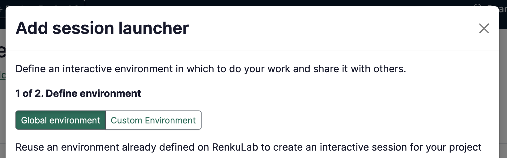
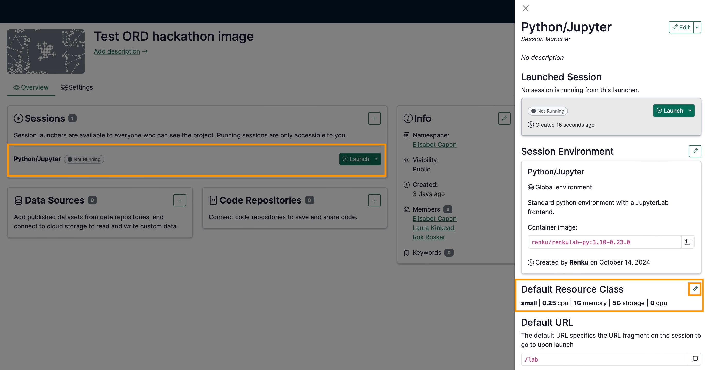

# How to add a session launcher to your project

There are 3 ways to create a session launcher on RenkuLab. Which of the situations below best describes you?

### **I just want to get started quickly!**

Choose from the **Global environments** to create a session with commonly used packages pre-installed.

→ Continue [below](How%20to%20add%20a%20session%20launcher%20to%20your%20project%20601ba47455354413b87c69447aa33831.md) with the documentation on this page to get started!

### I have a **code repository that defines what packages I need.**

Select the **Create from Code** option and let Renku build a environment based on your code for you- no knowledge of Docker required!

→ See [How to create an environment with custom packages installed](How%20to%20create%20an%20environment%20with%20custom%20packages%20%201960df2efafc801b88f6da59a0aa8234.md).

### I already have a **docker image I want to use.**

Select the **External Environment** option to configure Renku to run your docker image.

→ See [How to use your own docker image for a Renku session](How%20to%20use%20your%20own%20docker%20image%20for%20a%20Renku%20sessi%2011f0df2efafc80af848ffcaf9ccff31c.md).

---

The rest of this guide will walk you through creating a basic launcher with a global environment.

In the project page:

1. In the **Sessions** section click on ➕ to add a new session launcher
2. Choose **Global environment** (if it’s not already selected)
    
    
    
3. Select an environment from the list.
    
    :::info
        
    Don’t see an environment that suits your needs? You can create your own! See [How to create an environment with custom packages installed](How%20to%20create%20an%20environment%20with%20custom%20packages%20%201960df2efafc801b88f6da59a0aa8234.md) or [How to use your own docker image for a Renku session](How%20to%20use%20your%20own%20docker%20image%20for%20a%20Renku%20sessi%2011f0df2efafc80af848ffcaf9ccff31c.md)
    
    :::
    
4. Click **Next**
5. (optional) Give your session launcher a **Name**.
6. Select the **Resource class** that best fits your expected computational needs.
    
    :::note
    
    
    If the available resource classes are too small for your compute requirements, see [How to select compute resources for your session](How%20to%20select%20compute%20resources%20for%20your%20session%208811db74f5f04f859d6fe4fb35fcf692.md) and [Contact](https://www.notion.so/Contact-dd098db288ff433893a4d4d429da99c1?pvs=21)  us!
    
    :::
    
7. Click on **Add session launcher**

:::info

If you need to add dependencies to the environment, see [How to install packages on-the-fly in your session](How%20to%20install%20packages%20on-the-fly%20in%20your%20session%20f1ffb813996943869b50f6c5b263f5c9.md)

:::

:::info

Note that you can always **modify your session launcher** by clicking on it on the project’s page, to open the session launcher side panel:

:::