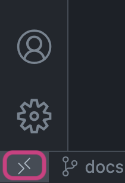

# How to connect to a Renku session from your local VSCode

Would you prefer to work on your Renku project from the comfort of your local VSCode rather than in the browser? This how-to guide shows you how to do exactly that!

<aside>


VSCode tunnels are supported in the following Renku session environments:

- **Most Renku [global environments](How%20to%20add%20a%20session%20launcher%20to%20your%20project%20601ba47455354413b87c69447aa33831.md)** ≥ version `2.7.0`.
    - Global environments where VSCode tunneling is *not* supported include: the RStudio environment.
- **All Renku [code based environments](How%20to%20create%20an%20environment%20with%20custom%20packages%20%201960df2efafc801b88f6da59a0aa8234.md)** that were built (or rebuilt) after September 2, 2025  (release 2.7.0)
</aside>

### **In RenkuLab:**

1. **Launch a Renku session** that uses one of the supported environments listed above.
2. **Open a terminal** inside the session.
3. Run **`start_tunnel`** and follow the instructions:
    1. Log in to VSCode with either your Microsoft account or GitHub account
    2. Open the displayed link and enter the device code
    3. When it shows you another URL to open, you are done. Continue to the next steps.

### **Then, in a VSCode window on your local machine:**

1. Install the **“Remote - Tunnels”** VSCode Extension if you don’t already have it.
    
    
    
    - How to install the VSCode Remote Tunnels extension
        1. Open the **Extension marketplace** by going to View > Extensions
        2. **Search** for “Remote - Tunnels”
        3. Click **install**
2. In the very bottom left of the window, click the **Open a Remote Window** button
    
    
    
    The ‘Open a Remote Window’ button
    
3. Pick **Connect to Tunnel...**
4. If you’re not signed in, you’ll be asked to sign in. Sign into the same account you did when running the `start_tunnel` script
5. You should now see a list of available tunnels on your account, and one of them should be a `renku-...` tunnel. Select it!
    
    
    
    <aside>
    
    
    **Tip**: Do you have more than one Renku session tunnel? You can find the name of the tunnel for each session by looking at beginning of the logs of `start_tunnel`. The line looks like this:
    
    ```
    [2025-09-01 12:06:23] info Creating tunnel with the name: renku-1189b3f2321d0b
    ```
    
    </aside>
    
6. If no files show up at first, click the **Open…** shortcut and enter `/home/renku/work/`
    
    
    
7. You should now see the same files you see in your RenkuLab session, and you can do work exactly like you are in a RenkuLab session!

### Done with your session?

1. Close the VSCode window
2. Back in the browser, pause or shut down your Renku session