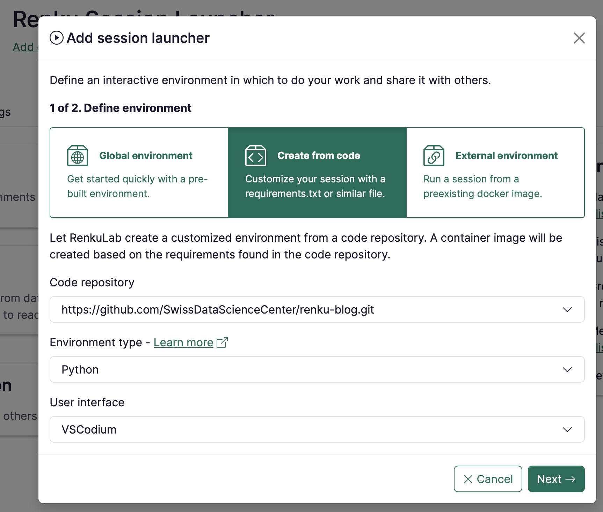
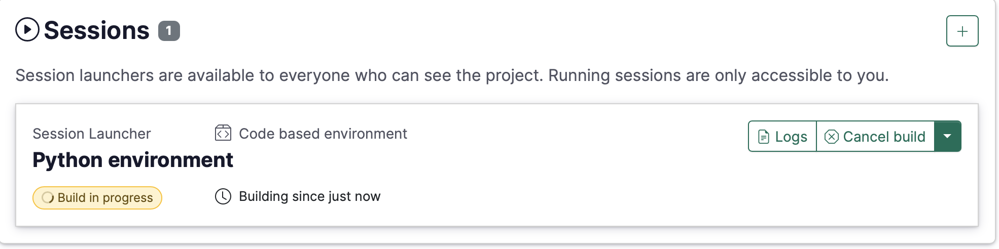

# How to create an environment with custom packages installed

If you’d like a set of custom packages to be installed and ready to go when you (or anyone else) launches a session in your project, you can take advantage of Renku’s **code based environments**.

With Renku code based environments, you can point Renku to a code repository that contains an environment definition file, such as a `environment.yml`, `requirements.txt`, or `pyproject.toml`, and Renku will build a custom environment for your session for you!

This guide has 2 parts:

- First, we will walk through what kinds of files you can use to define code based environments in RenkuLab.
- Second, we’ll show you how to create a code-based environment for your project.

# What kinds of environment definitions are supported?

RenkuLab’s code-based environments currently supports creating **Python** environments. Support for more languages is coming soon!

<aside>


Do you need to install R packages in your Renku session? See [R](How%20to%20install%20packages%20on-the-fly%20in%20your%20session%20f1ffb813996943869b50f6c5b263f5c9.md).

</aside>

## Defining a Python Environment

There are multiple ways you can define a python environment for your Renku session:

- [Miniconda (`environment.yml`) (recommended)](How%20to%20create%20an%20environment%20with%20custom%20packages%20%201960df2efafc801b88f6da59a0aa8234.md)
- [Pip (`requirements.txt`)](How%20to%20create%20an%20environment%20with%20custom%20packages%20%201960df2efafc801b88f6da59a0aa8234.md)
- [Poetry (`pyproject.toml`)](How%20to%20create%20an%20environment%20with%20custom%20packages%20%201960df2efafc801b88f6da59a0aa8234.md)

See below for more details on how to use each of these systems.

<aside>


If you’d like to learn more about the system Renku uses to create python environments, check out https://paketo.io/docs/howto/python/#use-a-package-manager.

</aside>

### Miniconda (`environment.yml`) (recommended)

Include an `environment.yml` file located at the root (top level) of the code repository.

- Here’s an example `environment.yml`:
    
    ```yaml
    # Note: name can be changed
    name: "base"
    channels:
    	# important: do not use 'defaults', but always include 'nodedefaults'
      - conda-forge
      - nodefaults
    dependencies:
      - python=3.9 # set your python version here
      - tensorflow-gpu
      - numba
      - scikit-learn
      - pandas
      - seaborn
      - matplotlib
      - jupyterlab
      - xarray
      - pip
      - pip:
    	  # put packages to be installed by pip here
        - deepsmiles
        - rdkit
    # Note: prefix can be changed
    prefix: "/opt/conda"
    ```
    

Important usage notes:

- Regarding conda channels:
    - `nodefaults` must be included. See example above.
    - We recommend using the `conda-forge` channel or other non-anaconda channels.
    - The `defaults` channel is not recommended and often results in failed builds (due to rate limits imposed by Anaconda).
- Please note that miniconda can only be used at this time to create Python environments, not R environments.
- Environments defined with one of these files will be created via miniconda. Configuring a version of miniconda is not supported.

### Pip (`requirements.txt`)

Include a valid `requirements.txt` file at the root (top level) of your code repository. Renku will create an environment from this file using `pip`.

<aside>


Defining a python environment via a requirements.txt file will create a python environment with python version `3.10`. It is not currently possible to specify a different python version.

</aside>

- Here is an example `requirements.txt`:
    
    ```
    numpy==2.2.2
    pandas==2.2.3
    jupyterlab==4.3.5
    ```
    

### Poetry (`pyproject.toml`)

Including a `pyproject.toml` file at the root of your code repository triggers the poetry installation process. The buildpack will invoke `poetry` to install the application dependencies defined in `pyproject.toml` and set up a virtual environment.

Note that poetry version 1.8.3 will be used.

- Here is an example `pyproject.toml`:
    
    ```toml
    [tool.poetry]
    name = "python-poetry-1"
    version = "0.1.0"
    description = ""
    authors = ["Flora Thiebaut <flora.thiebaut@sdsc.ethz.ch>"]
    readme = "README.md"
    # Important: use `package-mode = false` if the repository
    # is not an installable package.
    package-mode = false
    
    [tool.poetry.dependencies]
    python = "^3.12"
    numpy = "^2.2.2"
    pandas = "^2.2.3"
    jupyterlab = "^4.3.5"
    scipy = "^1.15.1"
    torch = "^2.6.0"
    pytorch-lightning = "^2.5.0.post0"
    
    [build-system]
    requires = ["poetry-core"]
    build-backend = "poetry.core.masonry.api"
    ```
    

## Defining an R Environment

<aside>


This feature is coming soon. For now, please see [R](How%20to%20install%20packages%20on-the-fly%20in%20your%20session%20f1ffb813996943869b50f6c5b263f5c9.md).

</aside>

# How to create a code-based environment for your Renku session

<aside>


**Important**: This functionality only works with **public code repositories**. If your code repository is private, please see [Creating a code-based environment from a private code repository](How%20to%20create%20an%20environment%20with%20custom%20packages%20%201960df2efafc801b88f6da59a0aa8234.md).

</aside>

1. Make sure the code repository that contains your environment definition file is added to your Renku project.
2. Create a **new session launcher**
3. Select the  **Create from code** option
    
    
    
4. Select the **Code repository**
    
    <aside>
    
    
    Note: The code repository must be public
    
    </aside>
    
    <aside>
    
    
    Note: The code repository must be already linked to the Renku project
    
    </aside>
    
5. Select the **Environment** **type** (Python, *more coming soon*)
6. Select the **User interface** you’d like your session to have (VSCodium or Jupyterlab, *more coming soon*).
7. Click **Next**
8. Define the **name** of the Session Launcher
9. Select the default **compute resources**
10. Click on **Add session launcher**

The environment is now being built by RenkuLab. You can see the status on the session launcher.



When the environment is built, you can launch your session.

# Updating a code-based environment

1. When you want to make changes to your environment (add new packages), first update the environment definition file in the code repository where the environment is defined.
2. Then, rebuild the environment in RenkuLab:
    1. Click on the session launcher to open the session launcher side panel.
    2. Navigate to the **Session Environment** section.
    3. Click on **Rebuild**.

# [experimental] Using a dashboard with a code-based environment

<aside>


Temporary and experimental: the description below is a current work-around but we will streamline this workflow in the near future!

</aside>

Your project might have a nice dashboard inside, which you would want others to see. If your repository’s requirements include a dashboard tool (e.g. streamlit or plotly dash), it is relatively simple to have Renku build the image, and convert it to show the dashboard instead of VSCodium. This way, you can have, for example, one launcher for development that you use and another to show others the results.

To set up a dashboard with an environment built from your repository, you can follow these steps:

1. Follow the steps for creating a [code-based environment](How%20to%20create%20an%20environment%20with%20custom%20packages%20%201960df2efafc801b88f6da59a0aa8234.md) above.
2. Once the image is done building, edit the environment and change it to a “Custom Environment”
3. Edit the `Command` to be `["bash", "-c"]` and `Args` to correspond to your app - see common examples [here](How%20to%20use%20your%20own%20docker%20image%20for%20a%20Renku%20sessi%2011f0df2efafc80af848ffcaf9ccff31c.md).

Once you are done, your environment configuration should look something like this:


And your launcher set up could be, for example:


# Creating a code-based environment from a private code repository

<aside>


Coming soon!

</aside>