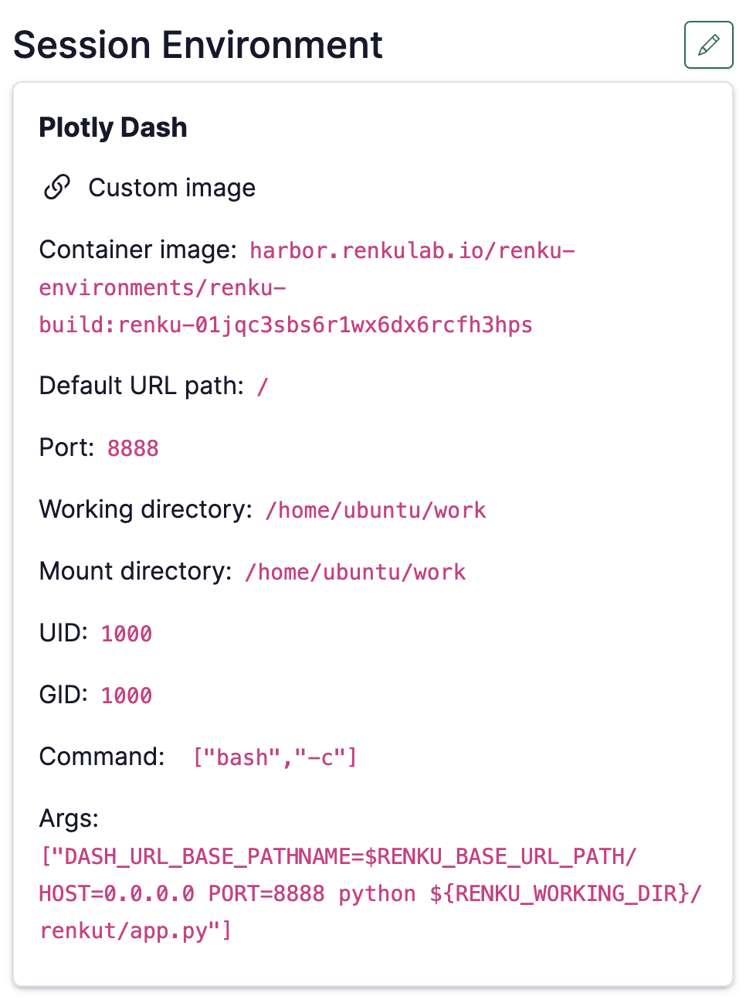
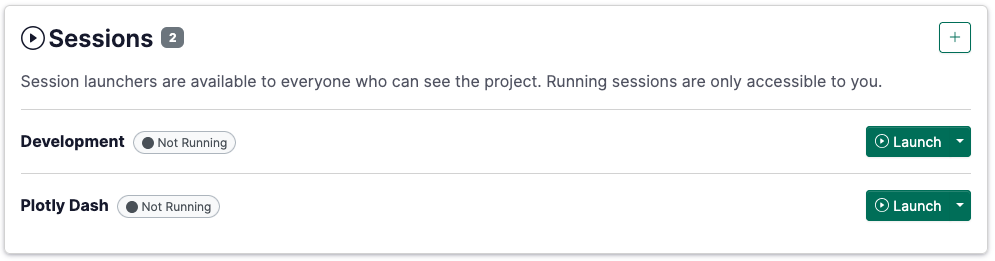

# How to create a Dashboard (Streamlit, Plotly Dash)

<aside>
ℹ️

Renku allows Docker images with user-specific entry points. This feature makes it easy the creation of user-specific environments, including setting up Streamlit apps. Check [How to use your own docker image for a Renku session](How%20to%20use%20your%20own%20docker%20image%20for%20a%20Renku%20sessi%2011f0df2efafc80af848ffcaf9ccff31c.md)  for the full list of details and options.

</aside>

There are mainly two options two have your own Streamlit app served in Renku, either without access to the codebase or with access to the code.

# Create an app with a code-based environment

Check [How to create an environment with custom packages installed](How%20to%20create%20an%20environment%20with%20custom%20packages%20%201960df2efafc801b88f6da59a0aa8234.md)  for the full list of details.

<aside>


Temporary and experimental: the description below is a current work-around but we will streamline this workflow in the very near future!

</aside>

Your project might have a nice dashboard inside, which you would want others to see. If your repository’s requirements include a dashboard tool (e.g. streamlit or plotly dash), it is relatively simple to have Renku build the image, and convert it to show the dashboard instead of VSCodium. This way, you can have, for example, one launcher for development that you use and another to show others the results.

To set up a dashboard with an environment built from your repository, you can follow these steps:

1. Follow the steps for creating a [code-based environment](How%20to%20create%20an%20environment%20with%20custom%20packages%20%201960df2efafc801b88f6da59a0aa8234.md) above.
2. Once the image is done building, edit the environment and change it to a “Custom Environment”
3. Edit the `Command` to be `["bash", "-c"]` and `Args` to correspond to your app - see common examples [here](How%20to%20use%20your%20own%20docker%20image%20for%20a%20Renku%20sessi%2011f0df2efafc80af848ffcaf9ccff31c.md).

Once you are done, your environment configuration should look something like this:



And your launcher set up could be, for example:



# 🔒Special Use Case: Create an app without sharing the code

If you want to serve a dashboard or app without sharing your code, follow this guide.

Create a session launcher using the **Custom Image** option, and provide the following values:

- Container Image: Build a docker image that includes streamlit and any other requirements needed by your streamlit app.
- Port: `8888`
- Command ENTRYPOINT:

```json
["sh", "-c"]
```

- Command Arguments CMD (fill in `<your-repo-name>/<your-app>`) ([learn more](How%20to%20use%20your%20own%20docker%20image%20for%20a%20Renku%20sessi%2011f0df2efafc80af848ffcaf9ccff31c.md)):

```json
["streamlit run $RENKU_WORKING_DIR/<your-repo-name>/<your-app>.py --server.port=8888 --server.address=0.0.0.0 --server.baseUrlPath=$RENKU_BASE_URL_PATH"]
```

You can now start a session with your new streamlit launcher to access the streamlit app directly in your browser.