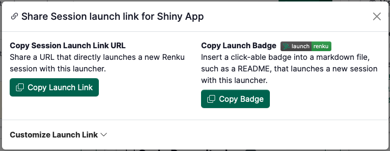
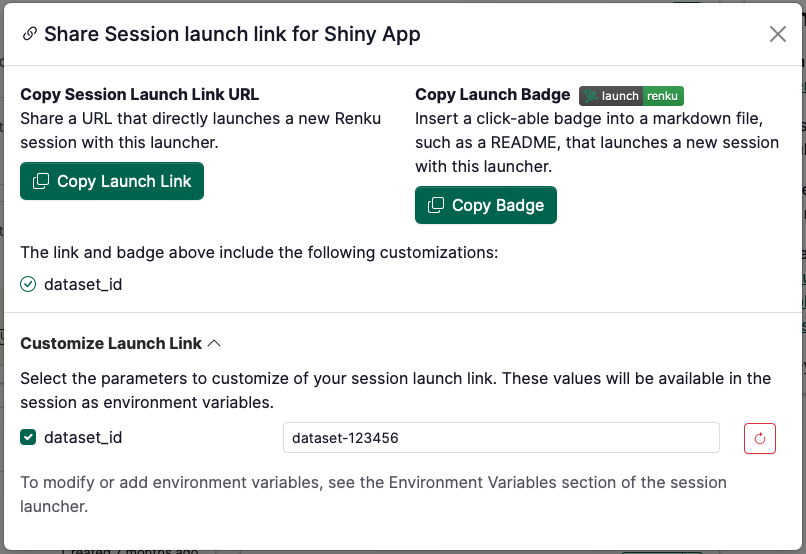

# How to share a session launch link

Ever wanted to send someone a direct link to launch a Renku session?

Maybe you're running a workshop and want participants to jump straight into the analysis, or you've built a dashboard that clients should access without navigating through project pages first.

Create custom launch links that do exactly that. Share them as simple URLs or embed them as colorful markdown badges—whatever fits your workflow.

## How to share a launch link.

1. Open the Launch Link modal. There are 2 ways to get here:
    - **From the project page:** On the launcher you would like to share, click the drop down menu next to Launch, and select **Share session launch link**
        
        
        

- **From inside a running session:** In the top bar of the running Renku session, click the  🔗 icon in the session controls.
    
    
    
1. Choose either to copy a Launch Link or markdown Launch Badge.
    
    
    
2. Paste the Launch Link or Launch Badge in a webpage or README file for your viewers to click!

When someone clicks on a Renku Launch Link, they will be taken directly to the session launch screen, skipping the Renku project page.

<aside>

Tip: If you’d like your launch link to be usable by anyone, don’t forget to make sure your project is public!

</aside>

## **Make Launch Links Even Smarter with Environment Variables**

You can also pass information directly to sessions through custom launch links.

Imagine you have a data catalog with dozens of datasets. Instead of creating separate Renku projects for each one, create a single project with all your analysis tools, then generate custom launch links that tell the session which dataset to load. When someone clicks your custom link, the dataset ID gets passed as an environment variable that your session can automatically pick up and use.

### How to Customize a Launch Link

First, add an environment variable to your session launcher.

1. Clicking on the **Session Launcher** to open its **side panel**.
2. Scroll down to the **Environment Variables** section.
    
    
    
3. Click on the ✏️ icon to edit the launcher’s environment variables.
4. Give your environment variable a name, and optionally a default value.
    
    
    
5. Click **Update session launcher** to save.

Now, customize the launch link with the environment variable you just created.

1. On the project page, in launcher you would like to share, click the drop down menu next to Launch.
2. Select **Share session launch link**
3. Click the drop down to **Customize Launch Link**
4. **Check the box** next to the environment variable you’d like to customize
5. Enter a **value** for that variable for the launch link
    
    
    
6. Copy wither the Launch Link or Launch Badge above. The copied link will contain a customized url that contains your customized value.
7. Paste the Launch Link or Launch Badge in a webpage or README file for your viewers to click!