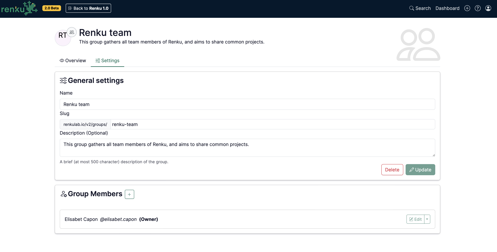
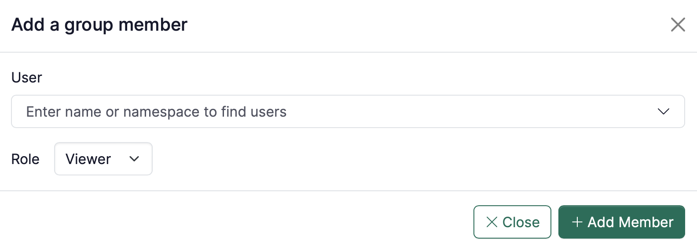

# How to add members to a group

1. Go to the Group page and edit its properties under the tab **Settings**:
    
    
    
2. Click on the **+** in the **Group Members** section.
    - **User**: Find a user by typing the person’s name.
    - **Role**: Decide the rights of the users when adding them (you can always come back to this page to revise people’s rights by click on **Edit**).
    
    
    

:::note

To learn more about roles in groups, see [Group Permissions](Permissions,%20Roles,%20and%20Access%20Rights%20%5Bdeprecated%5D%209c0aea98b26c4c02ba6323326fa949e1.md)

:::