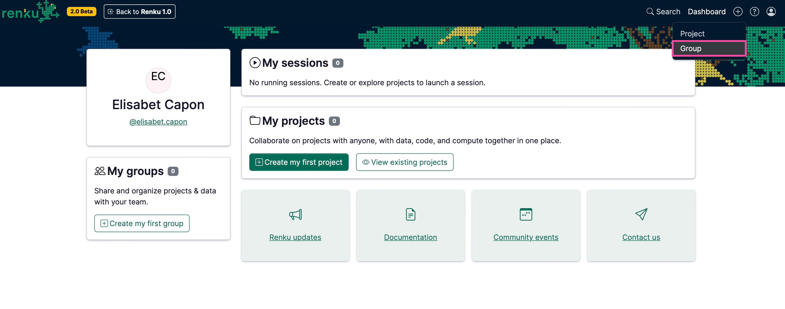
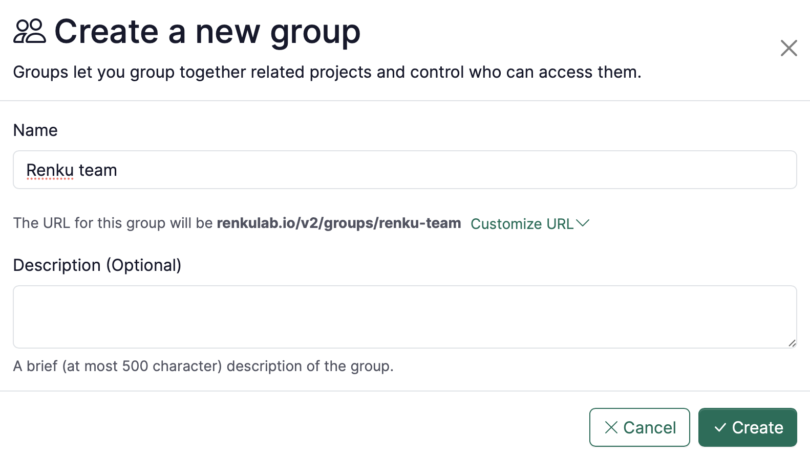

# How to create a group

<aside>
💡

Creating a group allows you to gather all the information and resources (data, people, projects, etc.) of your team or research project under a single roof.

</aside>

1. Click ➕ at the top right corner of [renkulab.io](http://renkulab.io) after logging in.
    1. Click on **Group**.
    
    
    
2. On the Group creation page:
    - **Name**: enter your preferred identifier.
    - **Description (Optional)**: add the description of your group.
    - Click on the **Create** button.
    
    
    
3. To add people to your group, see [How to add members to a group](How%20to%20add%20members%20to%20a%20group%20d6fcc0dbe8654d9b9a210a1df98b5c54.md)