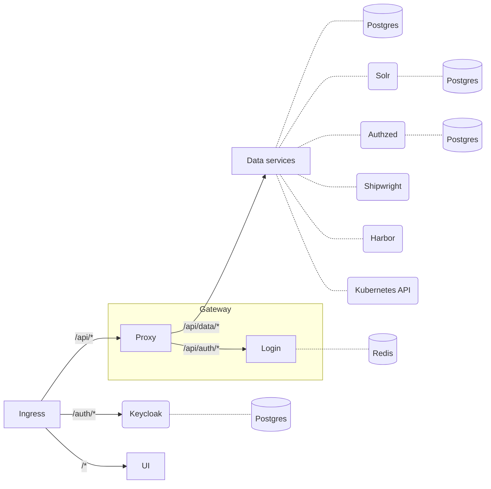

# Services

A summary of the main services that make up Renku and how they are organized.

## Overview

Unless specifically stated every service below is either a Deployment or StatefulSet
in Kubernetes.

### Developed in-house

- **Gateway**: Login, routing and injecting Keycloak access tokens.
- **Data service**: The main backend service for Renku.
- **Secret service**: Stores and manipulates user secrets.
- **K8s watcher**: Watches Kubernetes events for user sessions and populates the information in Postgres.
- **UI**: Serves static assets for the user interface.
- **UI server**: Backend for frontend, most likely to be fully eliminated in the future.
- **Amalthea**: Kubernetes operator that controls user sessions.

### Cronjobs and initialization

- Platform initialization
- Postgres initialization for Keycloak
- Postgres initialization for Authzed 
- Postgres initialization for Renku data service
- Data tasks: Various tasks that perform periodic updates like updating the Solr documents and updating the list of users from Keycloak.

### Third party

- **Postgres**: Stores all information about projects, users and sessions.
- **Redis**: Stores user login sessions.
- **Authzed (SpiceDB)**: Stores authorization information and is queries for authorization decisions.
- **Solr**: Stores search documents and indices.
- **Keycloak**: Stores user information and is used for Authentication.
- **Harbor**: Image registry for images built from code by Renku.
- **Shipwright**: Runs the builds for Docker images stored in Harbor.

## Networking

This is a summary and not an exhaustive list. For more information refer to the network
policies and ingress manifests in the Helm chart.

