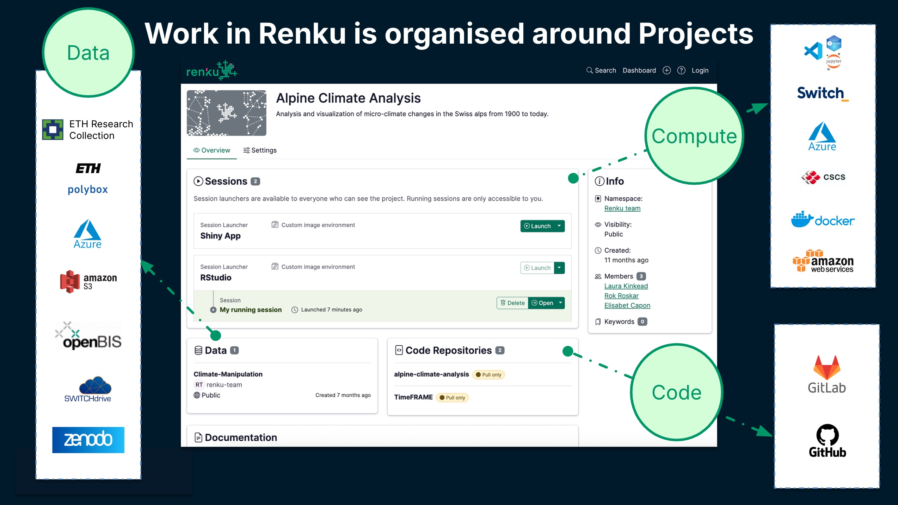

# Renku Users Documentation

Renku is an open-source platform that connects the ecosystem of data, code, and compute to empower researchers to build collaborative communities.

Our mission is to enable the Swiss National Open Research Data (ORD) Strategy, supporting the accessibility and reuse of research data across Switzerland.

## Connecting data, code, compute, and *people*.

Stop juggling multiple platforms and scattered resources. Renku provides a seamless environment where all your project components work together.

      

# Renku empowers collaboration by reducing friction

import Admonition from '@theme/Admonition';

<Admonition type="success" icon="🔎" title="Findability">

**On Renku, your project doesn’t exist in isolation.** The connections to other research activities are preserved, powering discovery and understanding. 

</Admonition>

<Admonition type="success" icon="🤝" title="Accessibility">

**Collaborate on your Renku project with anyone,** across specialties and skill levels.

</Admonition>

<Admonition type="success" icon="⚙️" title=" Interoperability">

**Connect, Share, Launch!** It just works.

</Admonition>

<Admonition type="success" icon="♻️" title="Reusability">

**Publishing your project is as easy as flipping a toggle from private to public.** Offering your work for discovery and reuse is automatic, not added work.

</Admonition>

# How Renku works

Renku is a platform for collaborative data science developed at the [Swiss Data Science Center](https://www.datascience.ch). It enables researchers to build collaborative projects that bring together [data](/docs/users/data/data), [code](/docs/users/code/code-repository), and [compute resources](/docs/users/sessions/session-launcher) from a variety of sources. 

Rather than hosting all these resources itself, Renku is a connecting hub that provides the means to bring them all together. For example, a project might use a published dataset from [Zenodo](https://www.notion.so/How-to-connect-data-from-data-repositories-such-as-Zenodo-or-Dataverse-1eb0df2efafc802ab3bef1c47c8c45b4?pvs=21), raw data from a shared [cloud storage resource](/docs/users/data/data) and code from a [GitHub repository](/docs/users/code/guides/add-code-repository-to-project). These are then made seamlessly available in containerized browser-based compute [sessions](/docs/users/sessions/session). Renku sessions can run on Renku servers or on an external computational resources such as a local cloud provider or - coming soon! - an HPC cluster. The sessions can be used for development with [environments](/docs/users/sessions/guides/add-session-launcher-to-project) like VSCode, Jupyter, or RStudio, or they can be used to display dashboards with Streamlit or Shiny. To promote sustainable computational research, Renku also makes it straightforward to build Docker images based on users' [software requirements](/docs/users/sessions/guides/create-environment-with-custom-packages-installed), ensuring that everyone using a project does so with the right software stack.

Collaborate on a fully reproducible Renku project by adding project [members](/docs/users/collaboration/guides/add-people-to-project), and showcase interactive demos and apps with anyone via [public session launch links](/docs/users/sessions/guides/share-session-launch-link). For larger collaborations, users can organize projects and other assets under [groups](/docs/users/use-cases/groups), which helps streamline collaboration.

Renku is developed under the Apache 2.0 license and can be deployed on a variety of cloud infrastructures offering Kubernetes. The flagship instance operated by the Swiss Data Science Center is available under [https://renkulab.io](https://renkulab.io/) and is open to everyone with a publicly-accessible free resource tier.

:::tip

Want to try it out? [Get started with Renku](/docs/users/getting-started/)! 

:::

<iframe width="560" height="315"
src="https://www.youtube.com/embed/FXgXzBuqJnk?si=ycdHhlSponqsVQje"
title="YouTube video player"
frameborder=""
allow="accelerometer; autoplay; clipboard-write; encrypted-media; gyroscope; picture-in-picture; web-share"
allowfullscreen></iframe>

<!-- <video controls width="100%" src="https://www.youtube.com/embed/FXgXzBuqJnk?si=ycdHhlSponqsVQje" / >  -->

<!-- <video width="320" height="240" controls>
  <source src="https://www.youtube.com/embed/FXgXzBuqJnk?si=ycdHhlSponqsVQje">
</video> -->
