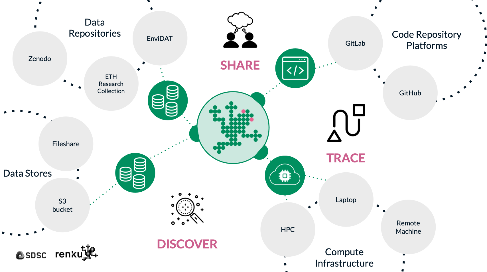

# About

Renku is an open-source platform that connects the ecosystem of data, code, and compute to empower researchers to build collaborative communities.

Our mission is to enable the Swiss National Open Research Data (ORD) Strategy, supporting the accessibility and reuse of research data across Switzerland.

## Connecting data, code, compute, and *people*.

Stop juggling multiple platforms and scattered resources. Renku provides a seamless environment where all your project components work together.

# Renku empowers collaboration by reducing friction

import Admonition from '@theme/Admonition';

<Admonition type="success" icon="🔎" title="Findability">

**On Renku, your project doesn’t exist in isolation.** The connections to other research activities are preserved, powering discovery and understanding. 

</Admonition>

<Admonition type="success" icon="🤝" title="Accessibility">

**Collaborate on your Renku project with anyone,** across specialties and skill levels.

</Admonition>

<Admonition type="success" icon="⚙️" title=" Interoperability">

**Connect, Share, Launch!** It just works.

</Admonition>

<Admonition type="success" icon="♻️" title="Reusability">

**Publishing your project is as easy as flipping a toggle from private to public.** Offering your work for discovery and reuse is automatic, not added work.

</Admonition>
