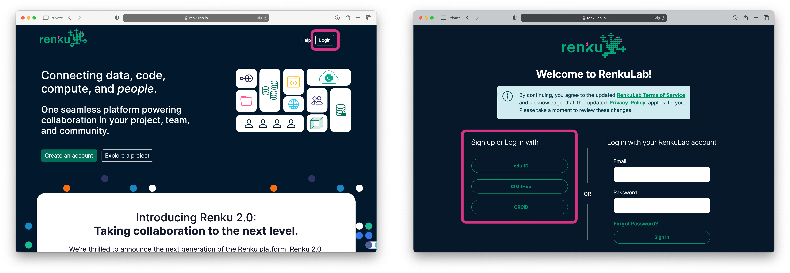

# Get Started

This tutorial will guide you through creating a Renku project related to the analysis of pollutants in the city of Zürich. We will be looking at a dataset from Open Data Zürich and using code from GitLab. We'll use RenkuLab to bring the data and code together in an interactive session where we can do analysis and seamlessly share with others. Let’s get started!

## Create an RenkuLab Account

To begin using Renku, you need to create an account. Follow these steps:

1. Visit [RenkuLab.io](https://renkulab.io/)
2. Click on **Login** in the top right corner
3. Sign up using your preferred option (edu-ID, GitHub, or ORCID)

hello