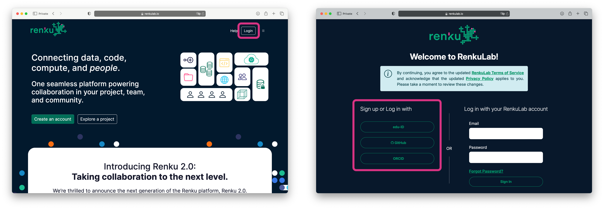

# Create a RenkuLab Account

:::info Before you begin

**Estimated time:** ~20 minutes

**You will need:**

- A **GitHub or GitLab account**: required in step 4 (Connect Code) to link a code repository.

:::

To begin using Renku, you need to create an account. Follow these steps:

1. Visit [RenkuLab.io](https://renkulab.io/)
2. Click on **Login** in the top right corner
3. Sign up using your preferred option (edu-ID, GitHub, or ORCID)

