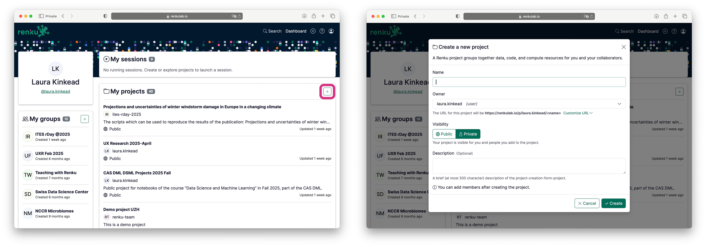

# Create a Project

You will land in your Renku dashboard. From here, you can create a new project:

1. In the **My projects** section of the dashboard, click on **+** to create a new project
2. For project **Name**, enter **Genova Weather Analysis**
   - (Leave **Owner, Visibility**, and **Description** unchanged)
3. Click **Create**.

