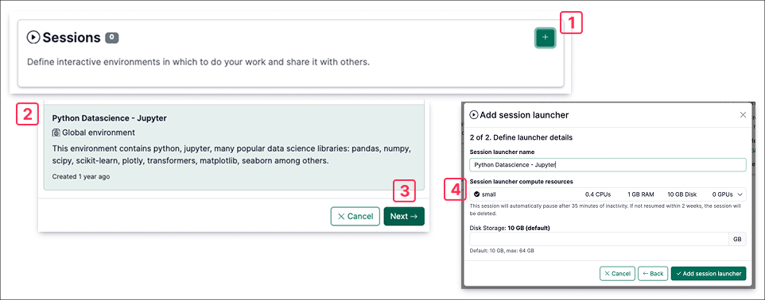
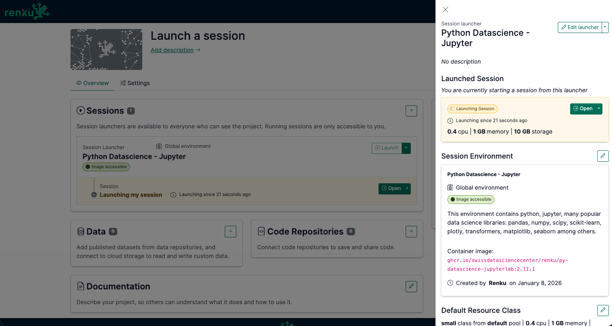

# Launch a Session

## Add a Session Launcher

To run your code and analyze data on RenkuLab, first decide what kind of session environment you would like by creating a session launcher.

1. In the **Sessions** section of your project page, click on **+**.
2. In the **Global environment** tab, scroll down and select  **Python Data Science - Jupyter**. This will give you a pre-configured environment with python and data science packages pre-installed. If you need to install other packages, you can install any necessary packages using the terminal. For a detailed guide for how to install packages, see [How to install packages on-the-fly in your session](../sessions/guides/environments/install-packages-on-the-fly-in-your-session). However, the packages you install on-the-fly in the session will not be shared with other people working with your Renku project. To ensure the adequate dependencies are installed in your environment, follow step 4.3 to create a custom environment from code.
3. Click **Next**.
4. Choose the compute resources for your session based on your project’s needs in the drop-down menu, and select the amount of disk space.




:::info
You can have multiple Session Launchers in your project that run different kinds of sessions. Check out [How to guides to add a session launcher to your project](../sessions/guides/environments)
:::

:::info
Do you need more resources than those available in RenkuLab’s public resource classes? [Contact us!](mailto:hello@renku.io) We can configure a custom resource pool for your team or class.
:::
## Launch a Session

Click on the **Launch** button in your new Session Launcher to start a session.

Once your session has launched, you will see the data and code that you linked to your project inside your session ready to use. The data and code each show up in the file system as folders. Open them up and take a look around!



## Add a second Session Launcher (optional)

When you want to create a RenkuLab session with a set of packages that’s reproducible and shareable, we recommend defining your package dependencies in code. Then, use the ‘Create from Code’ session launcher option to have Renku create a reproducible session environment for you! See [How to create an environment with custom packages installed](../sessions/guides/environments/create-environment-with-custom-packages-installed) for details.

## Run the Code (optional)

Open the notebook `air-quality-analysis/notebooks/exploratory_analysis-genova.ipynb` in the repository. Run the full notebook.

In the final cell, modify plotting part in the for loop, namely the `plt.show()`, to save your figures in the local disk. You can use the following snippets as a reference.

This code will save the figures in the working directory of the session (2 directories up from the notebook).

:::info
The session working directory (where you land when you first open the session) is a temporary scratch space that is saved for as long as your session is running or paused. Content saved here will be deleted if you shut down the session.

:::

```python
file_save_path = '../../'

plt.savefig(file_save_path+'Trend Analysis of ' + str(parameter) + ' in ' + str(location) +' by Date'+'.png')
plt.savefig(file_save_path+'Trend Analysis of ' + str(parameter) + ' in ' + str(location) +' by Date'+'.pdf')
```

If you did [Connect a Storage Space to save your work](../data/guides/connect-data/), try creating the file in your attached storage space (modify the `file_save_path`), and see that it is synced back to the source system.

:::info

The git repository we connected with our project is read-only. However, when you connect your Renku project with a git repository that you have push (write) access to, you will be able to run git commands in the session to save your work back to the code repository! To make this work, first [connect Renku with your GitHub or GitLab account](../code/guides/connect-renku-account-to-github-or-gitlab-account).

:::
