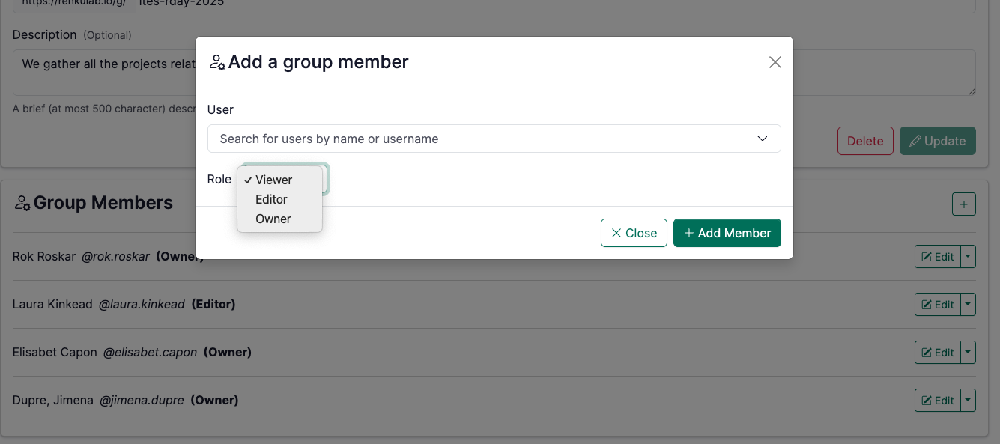

# Share Your Project

### Collaboration is key in research, and Renku makes it easy to share your project.
       

## 5.1 Add People to a Project (optional)

In your project page:

1. Open the **Settings** tab.
2. Go to **Project Members** and click on **+**
3. Search for  the people you want to invite by name or username and set their role. 

    :::info
    Note that in order to add people to your Renku project, they need to already have a Renku account. 
    :::

## 5.2  Make Your Project Public (optional)

If you want to share your project with a wider audience, you can make it public. 

1. In your project page, open the **Settings** tab.
2. Change the project visibility settings and select **Public**.
3. Share the project link with anyone you want to access it by copying the URL.
