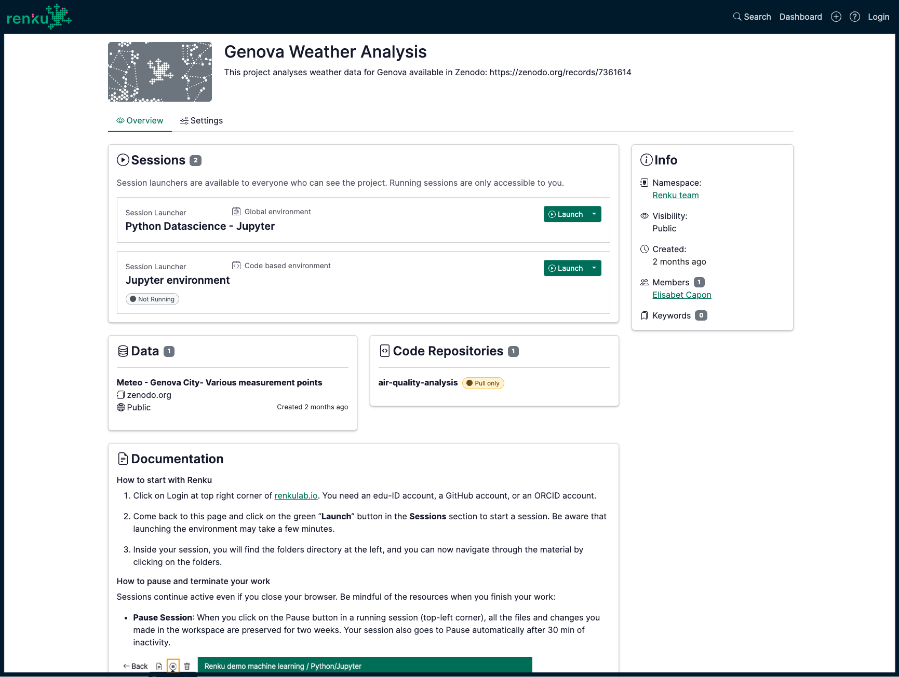

# Next Steps

🎉 Congratulations! You have successfully created a Renku project, connected data and code, launched a session, and shared your project with collaborators.

You can find the project described in this tutorial [here](https://renkulab.io/p/renku-team/genova-weather-analysis)

    

:::tip

Want to learn more? Check out our full library of [Renku Use Cases](/docs/users/use-cases/).

:::
