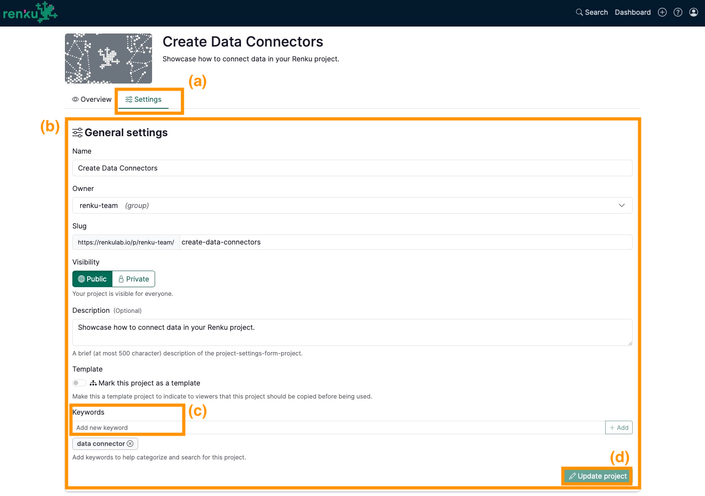

# Add keywords to a project

You can easily add keywords to your project. These metadata may help you in the search and keep your projects organized according to different topics. Remember that you can also add keywords to your data connectors!

In the project page:

1. Click on the **Settings** tab **(a)**
2. Under **General settings** section **(b)**
- Inside the box under **Keywords** **(c)**
    - Add a new keyword and press enter.
- Repeat the previous step for as many keywords as you wish.
- Click on the **Update project** button **(d)**

