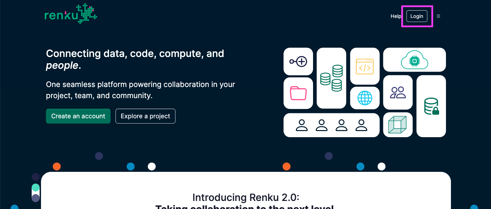
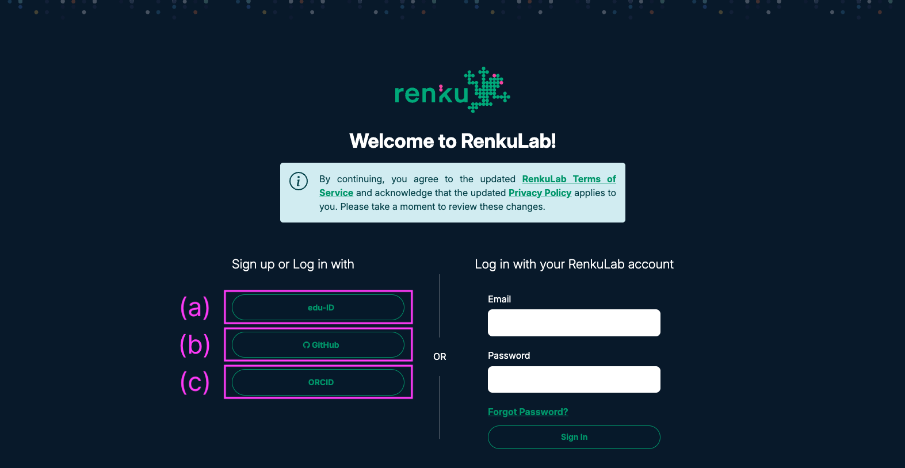
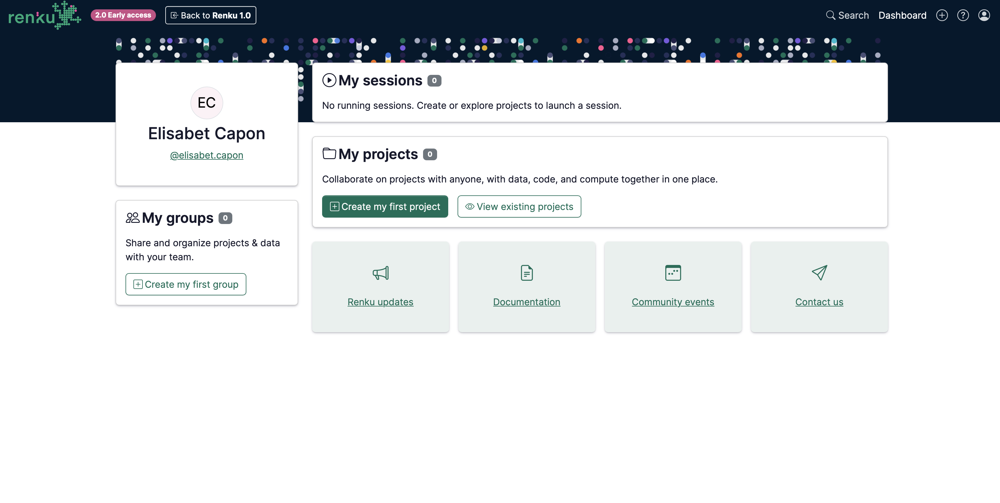

# Create your Renku account

1. Click on Login at top right corner of [renkulab.io](http://renkulab.io)

1. You need an edu-ID account **(a)**, a GitHub account **(b)** or alternatively an ORCID account **(c)**:

<aside>
✨ Creating a GitHub account is a simple 3-steps process that allows email validation. If you do not have any other registration option, please follow the instructions [here](https://docs.github.com/en/get-started/start-your-journey/creating-an-account-on-github) to create your own GitHub account.

</aside>

<aside>
⚠️ If none of the sign-up methods fits you, please contact us to share the best procedure to move forward in your case.

</aside>

1. Welcome to your User Dashboard in RenkuLab! Move forward to create your first project in Renku and get familiar with the available tools!

