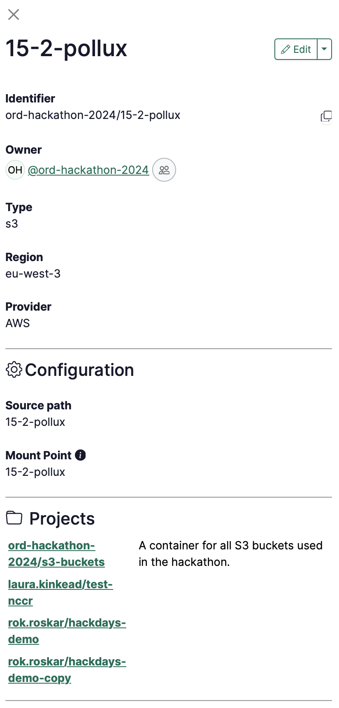

# Data connector

A data connector is a connection to a cloud data resource outside of RenkuLab.

<iframe width="560" height="315" src="https://www.youtube.com/embed/LS-GVUofxVM?si=XJKDZv7ktQy0ATfY" title="YouTube video player" frameborder="0" allow="accelerometer; autoplay; clipboard-write; encrypted-media; gyroscope; picture-in-picture; web-share" referrerpolicy="strict-origin-when-cross-origin" allowfullscreen></iframe>
*Learn how to connect data to a Renku project and how to link and trace data among multiple projects.*

# Data in Renku

RenkuLab interactive sessions can connect with data hosted in cloud storage systems. Once you add the data connector to the project, the storage is simply mounted as another folder in your session. You can concentrate on developing your code to analyze your data, rather than worrying about moving data around!

Plus, when you add a data connector to your project, that connection is available to all project members, so you can share the results with your colleagues or even with the broader community.

:::info

To add a data connector to your project, click the ➕ button in the data section of the project.

:::

## What data systems can I connect to Renku?

RenkuLab supports a range of cloud storage providers, including S3, Azure Blob, sftp, WebDAV and more.

## How are credentials handled for Data connectors?

**The access to the data connector is fully managed by the external storage provider.** When a user launches a session on a project that includes a data connector that requires credentials, Renku will ask that user for their credentials. Renku will only provide the access to the data if the user provides valid credentials.

Being able to *see* a Renku data connector is not the same as being able to *access* the data itself! For example, a data connector may be public, which means other users on RenkuLab can *see* that the data connector exists, and also be protected with credentials, which means that only people with valid credentials can *access* the actual data.

### Saving credentials

You can save your credentials for a data connector in RenkuLab so that you don’t have to enter them every time you launch a session. But credentials are never shared with other users on RenkuLab.  Renku will never give another user access without getting valid credentials from that user.

### How to update or remove and credentials

You can enter or modify the saved credentials for a data connector, and also delete it. Click on top of a data connector and a right-menu appears in the screen. Click on the **drop-down arrow** menu next to **Edit** to access further options to work on your data connector.

## Share, reuse, and trace your data

Data connectors can be shared among projects. You do not need to create the same data connector for multiple projects. Check [How to link a data connector to your project](/docs/10-users/40-data/guides/10-link-data-connector-to-project.md)!

### Track projects linked to your data connector

You can check where your data has been used on the right menu of your data connector under the **Projects** section.

