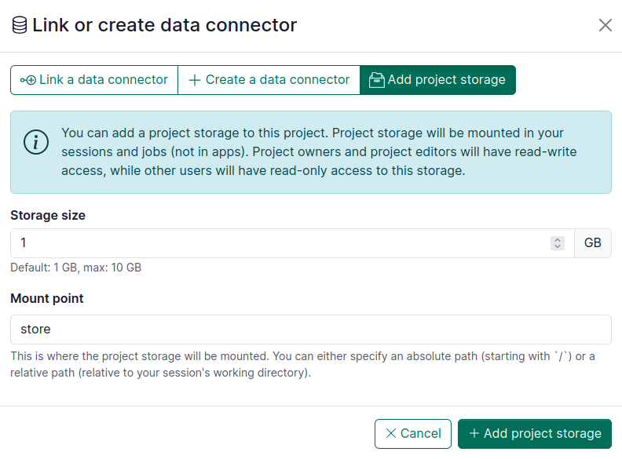

# Project storage

For allowed projects, a project storage provided by Renku can be setup to persist data in sessions and jobs. Only one project storage per project can be setup. Project storage setup and management is done by the project owner. Once setup, the project storage is mounted in sessions and jobs ; project owners and project editors have read-write access, while other users have read-only access to this storage.

## Project storage setup

In your project’s dashboard:
1. Under **Data** section click on **+** button
2. Go to the tab **Add project storage** (if it is not visible, this means the project is not allowed for project storage)
3. Set the properties in the form:  
  i. **Storage size:** Project storage size to provision (in GB)  
  ii. **Mount point:** This is where the project storage will be mounted. You can either specify an absolute path (starting with `/`) or a relative path (relative to your session&apos;s working directory).
4. Click on **+ Add project storage**

