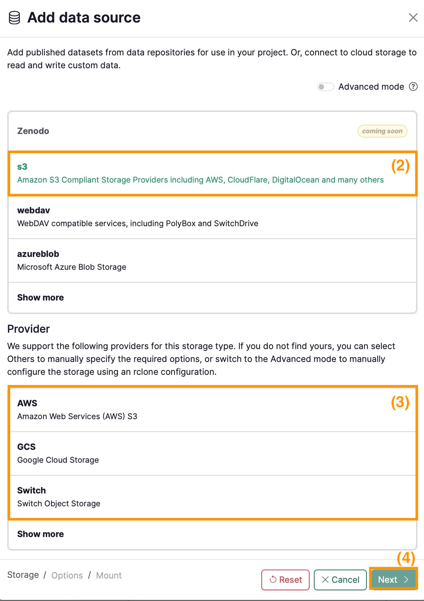
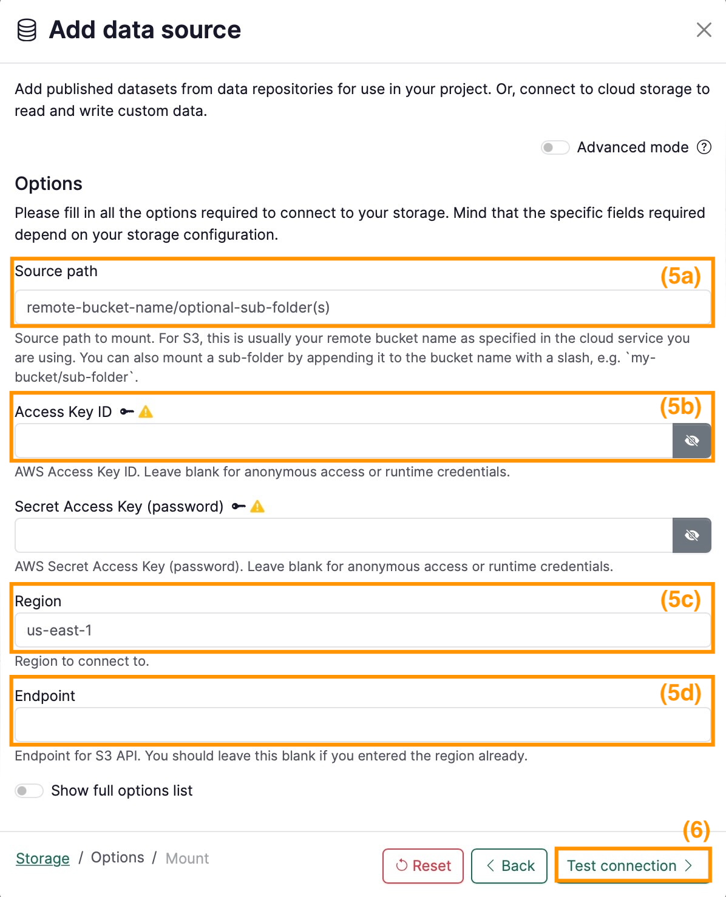
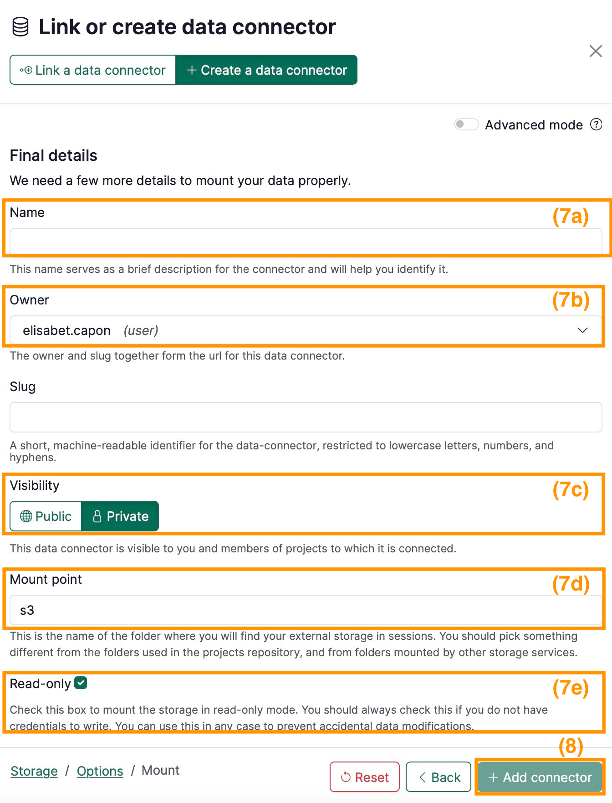

# How to connect an S3 bucket

In your project’s dashboard:

1. Under **Data** section click on  **+** button
2. Select **s3** under **Storage type**
3. Select the **provider** of the cloud storage (e.g. AWS)
4. Click on **Next**

    

    
    

5. Set the properties in the form:
    1. **Source path (5a)**: Source path to mount. For S3, this is usually your remote bucket name as specified in the cloud service you are using. You can also mount a sub-folder by appending it to the bucket name with a slash, e.g. `my-bucket/sub-folder`. (e.g. giab)
    2. **Access Key ID** and **Secret Access Key (5b)**: If the bucket requires credentials, enter them here
    3. **Region (5c)**: (e.g. us-east-1) This field is not required for all buckets. For some cases AWS provides the Region/Endpoint to your s3 bucket as explained [here](https://docs.aws.amazon.com/general/latest/gr/s3.html). Switchengines provides further information about Region and Endpoints [here](https://help.switch.ch/engines/documentation/object-storage/).
    4. **Endpoint (5d)**: (e.g. http://s3.amazonaws.com) This field is not required for all buckets. If the Region is already provided, Endpoint should be left empty.
6. Click on **Test connection** and if succeeds, click **Next**

    

    
    

7. On the last page, fill in the final details for your data connector, namely:
    1. **Name**: pick any name for the data connector (e.g. `Giab`)
    2. **Owner:** select the namespace of the data connector (e.g. the user’s or a group).
    3. **Visibility:** decide whether the data connector should be Public or Private.
    4. **Mount point**: write the folder in your session where the s3 will be mounted.
    5. **Read-only**: uncheck this box if your s3 is write and read.
8. **Add the connector**.

    

    
    

