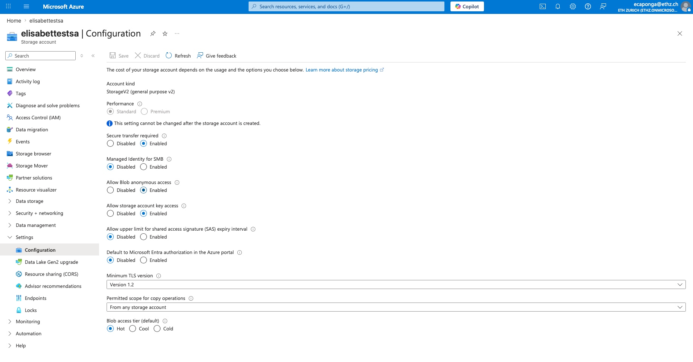
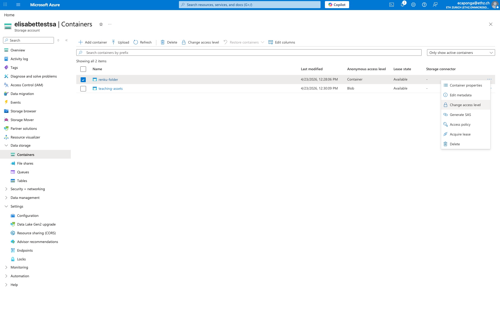
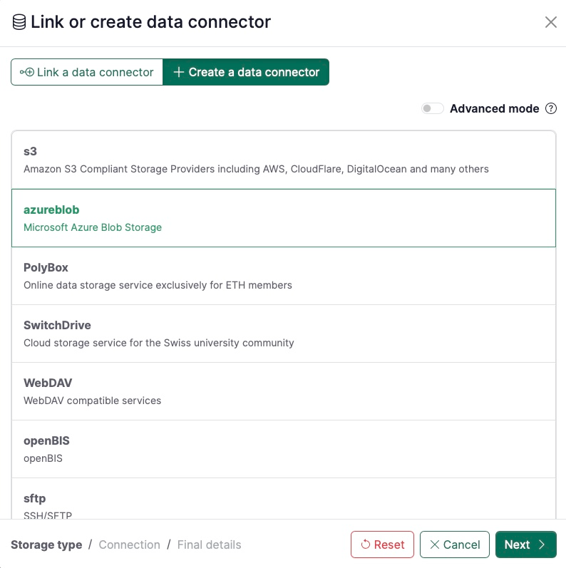
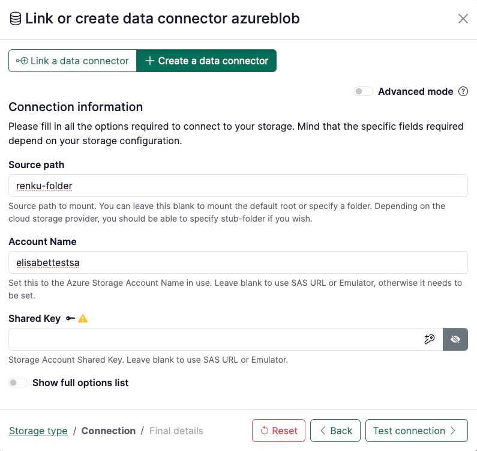
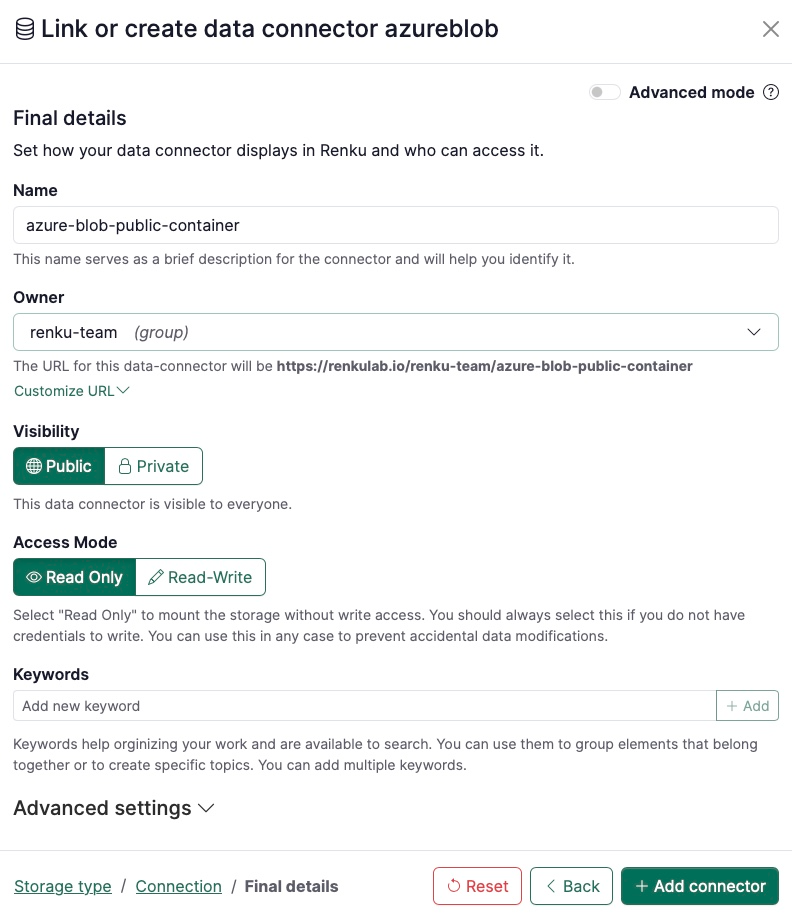
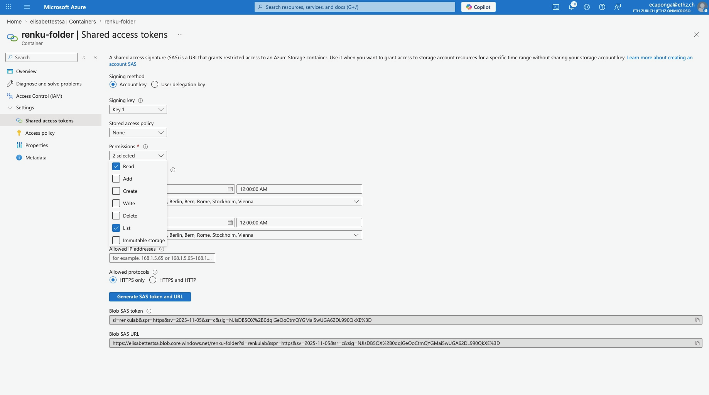
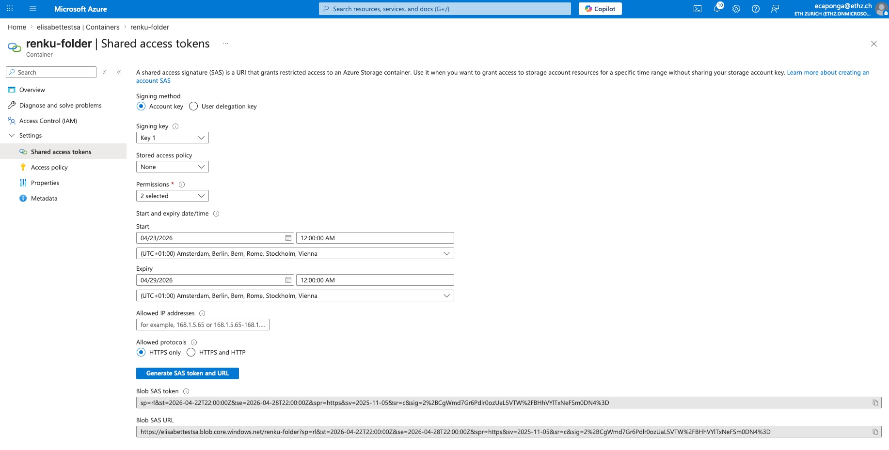
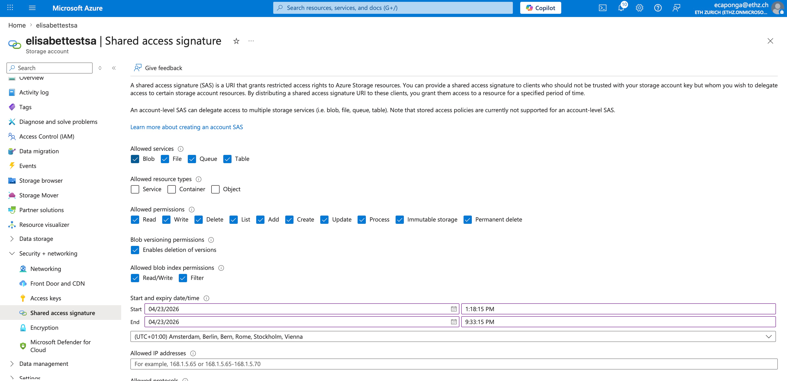

# How to connect to Azure Blob Storage

:::info

This guide assumes Storage Account-level permissions. If you had Azure IAM (Identity) rights, you could use "Service Principals" or "Entra ID" logins, which remains outside the scope of this documentation.

:::

## Public access

This set-up allows you to provide access to data publicly without requiring authentication with **read-only** access. For setting this up, you just need your Azure storage account name and the container name. Bear in mind that access is controlled entirely at container level.

### Azure portal configuration

1. **Account level:** Go to **Settings > Configuration** and set **Allow Blob anonymous access** to **Enabled**.

   

   
   

2. **Container level:** Go to **Data storage > Containers**, select your container, and click **Change access level**.
   - Select **Container**, which allows anonymously listing files and downloading.

   

   
   

### Set up in Renku

1. Under **Data** section click on **+** button
2. Go to the tab **+ Create a data connector** and select **azureblob**.
3. Click on **Next**

4. Set the following parameters in **Connection information**:
   1. **Source path**: the `container_name` as specified in the storage account you are using (e.g. `my-container`). You can also mount a sub-folder by appending it to the bucket name with a slash, e.g. `my-container/sub-folder`.
   2. **Account Name**: the storage account name, e.g. `elisabettestsa`

5. Click on **Test connection** and if succeeds, click **Next**

6. On the last page, fill in the final details for your data connector, namely:
   1. **Name**: pick any name for the data connector (e.g. `data`)
   2. **Owner:** select the namespace of the data connector (e.g. the user's, project's or a group's).
   3. **Visibility:** decide whether the data connector should be Public or Private.
   4. **Read-only**: keep it as read-only access.

7. Click on **+ Add connector**.

## Restricted access

Use this option to share data securely with your collaborators and stakeholders, controlling their access rights (e.g. read-only, write and delete files).

### Azure portal configuration

1. Go to **Data storage > Containers > [Your container] > Settings > Shared access tokens**. Select the desired permissions (e.g. **Read** and **List** for read-only access, select on top **Add**, **Create** and **Write** for read and write access, avoid **Delete** if you want an append/upload-only environment).

   

   
   

2. Click on the button **Generate SAS token and URL**.
3. Copy the generated **SAS URL** field.

   

   
   

### Set up in Renku

Proceed to steps 1 to 3 from the [Public access set-up](#set-up-in-renku).

4. In **Connection information**, click on **Show full options list** and set the following parameters:
   1. **Source path**: the storage account name, e.g. `elisabettestsa`. You can also mount a sub-folder by appending it to the bucket name with a slash, e.g. `my-container/sub-folder`.
   2. **sas_url**: the `blob_sas_url` as generated in your storage account.

Continue with steps 5 to 7 as presented in the [public access set-up](#set-up-in-renku).

:::warning

You will need to share the sas_url value with your collaborators since they will be requested to enter the credentials. This variable will be stored as a user secret.

:::

:::info

The most advanced way to manage external access in Azure is through controlled access with revocation, which allows you to revoke access immediately without changing account keys. You need to create the policy under **Containers > [Your Container] > Settings > Access policy** and click **+ Add policy**. Define a name and the permissions. When you are creating the shared access token, select the policy you just created under **Stored access policy**. If you delete the policy in Azure, access to the container will be instantly revoked.

:::

## Full access to your storage account

This set-up allows you to have access to your full Azure storage account, with the access rights that you decide to set-up.

### Azure portal configuration

1. Go to **Security + networking > Shared access signature**. Select **Blob** service, **Service/Container/Object** types, and check **ONLY Read** and **List**.

   

   
   

### Set up in Renku

Proceed to steps 1 to 3 from the [Public access set-up](#set-up-in-renku).

4. Set the following parameters in **Connection information**:
   1. **Source path**: the `container_name` as specified in the storage account you are using (e.g. `my-container`). You can also mount a sub-folder by appending it to the bucket name with a slash, e.g. `my-container/sub-folder`.
   2. **Account Name**: the storage account name, e.g. `elisabettestsa`

5. Click on **Test connection** and if succeeds, click **Next**

6. On the last page, fill in the final details for your data connector, namely:
   1. **Name**: pick any name for the data connector (e.g. `data`)
   2. **Owner:** select the namespace of the data connector (e.g. the user's, project's or a group's).
   3. **Visibility:** decide whether the data connector should be Public or Private.
   4. **Read-only**: do not uncheck this box, or the data connector will not work properly.

7. Click on **+ Add connector**.
