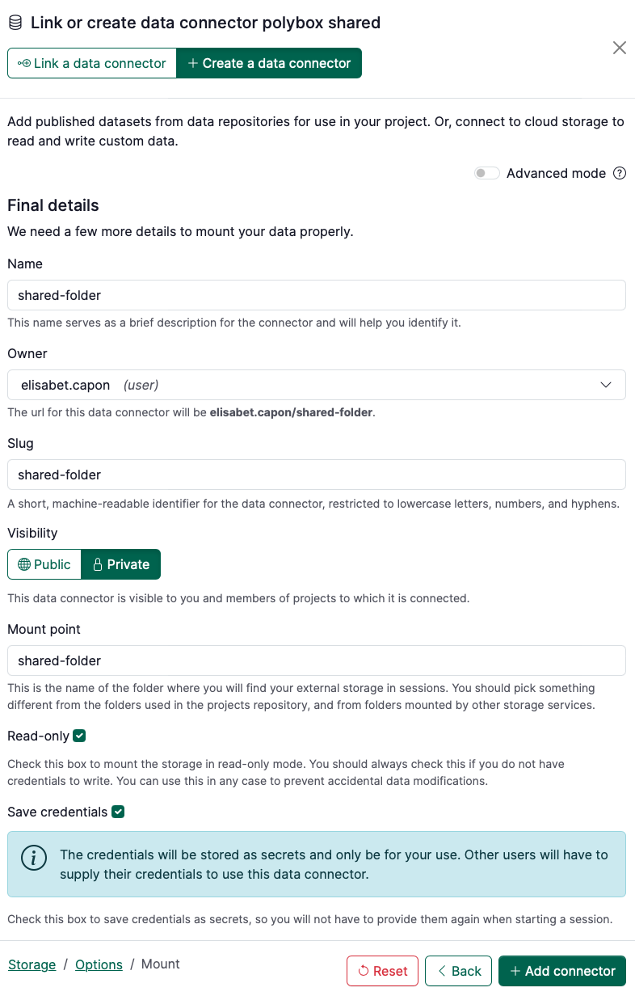

# How to connect a shared Switchdrive or PolyBox folder to your project

:::info

Follow this guide to connect both **privately** & **publicly** shared folders. The only difference
between whether the folder is _public_ or _shared privately_ is whether you set a password on the
folder.

:::

### Create a “public link” for your Switchdrive (or Polybox) folder

In Switchdrive/PolyBox:

1. From the folder containing the data you want to mount (not the data file itself!), click on the **three dots**
2. Click on ‘**Public links**’
3. Click ‘**Create public link**’
    1. Select the read + write settings you want - probably view only since it’s public!
    2. If you want to restrict who can access this shared folder, set a password
4. Click the ‘**Copy to Clipboard**’ 📋 button. The link will look something like this:
    1. [https://polybox.ethz.ch/index.php/s/8NffJ3rFyHaVjgR](https://polybox.ethz.ch/index.php/s/8NffJ3rFyHaVjgR)

### Add the folder to your Renku project

1. Add a new data connector by clicking the ➕ in the Data section of your project.
2. Click on Create a data connector and choose **Polybox** (or **SwitchDrive**)
3. At the bottom, select mode **Shared**.
    
    
    
4. Complete the information to your Shared folder:
    1. **Public link:** Paste the link to the folder.
    2. **Password:** If there is a password for the shared folder, enter that. Otherwise, leave it blank.
        
        <aside>
         For shared folders protected with a password, everyone who launches a session will need to provide the password to the folder in order for that folder to be connected in their session. If the password is not provided, the folder will be empty.
        
        </aside>
        
    3. Click on **Test connection.**
    4. A message in green “The connection to the storage works correctly.” should appear. Click on **Continue**.
    
    
    
5. Specify the final details of the data connector, namely:
    1. **Name**: term to refer to your data connector
    2. **Owner**: select where it belongs (either you as a user or a group)
    3. **Visibility**: decide whether it should be public or private
    4. **Mount point**: name of the directory in your session workspace where the folder will be mounted.
    5. **Read-only**: by default is active. Deactivate if you want to have read/write access.
        
        <aside>
         If you need a folder to be read-only for some users and read+write for other users of the same project, you can create two public links with different rights and add the two connectors to the project. The read+write  should be protected with a password, which can be shared with those users who should access the folder with read+write rights. Therefore, only those users with the password will be able to modify the content of that folder through the appropriate connector.
        
        </aside>
        
    6. **Save credentials**: if there is a password for the folder, click this box if you want to save your password in RenkuLab. (Only you will have access to those credentials. Credentials are not shared in RenkuLab.)
        
        
        
6. Click on **+ Add connector**
