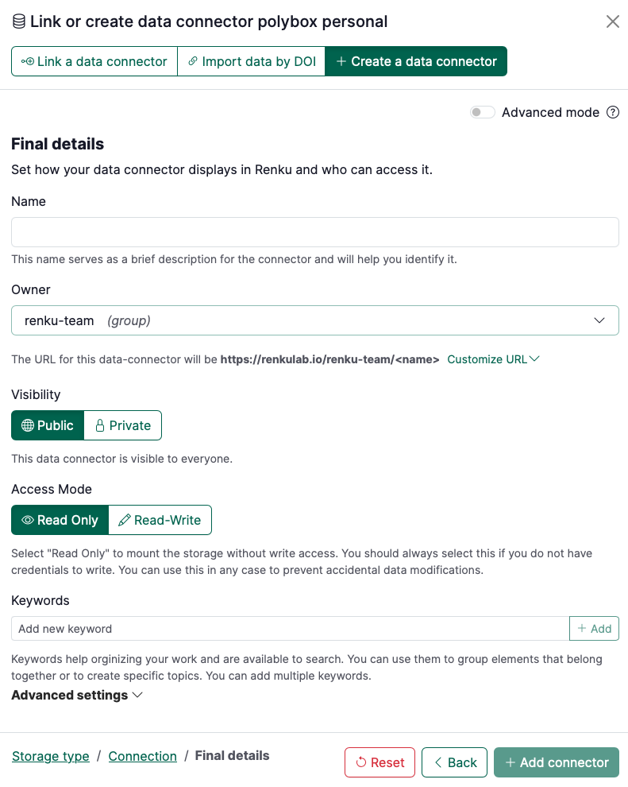

# How to connect a personal Switchdrive or Polybox folder to your project

:::warning

Only use this How-To guide to connect a folder that **only you** use. To connect a folder that you share with others, see [How to connect a shared Switchdrive or PolyBox folder to your project](/docs/users/data/guides/connect-data/connect-shared-switchdrive-or-polybox-folder-to-project) .

:::

1. Add a new data connector by clicking the ➕ in the Data section of your project.
2. Click on **Create a data connector** and choose **Polybox** (or **SwitchDrive**) and at the bottom select Mode > **Personal**.
3. Click on **Next**
    
    
    
4. Fill in the options for your data connector, namely:
    1. **Username**: fill in your username
    2. **Token (or password)**: We strongly encourage you to create a `token` for accessing your private OwnCloud/Nextcloud WebDAV shares to avoid sharing your account password.
        
        To create the token, in your cloud storage application (Switchdrive/PolyBox):
        
        - In your account, go to **Settings > Security**
        - Scroll down to **Devices & Sessions**
        - Generate a token with App name and click on **Create new app passcode**.
    3. **Sub path (optional)**: If you want to mount your entire Polybox/Switchdrive folder, leave this blank. If you want to mount a specific folder, write out the path to that folder.
    4. Click on **Test connection.**
    5. A message in green “The connection to the storage works correctly.” should appear. Click on **Continue**.
    
    
    
5. Specify the final details of the data connector, namely:
    1. **Name**: term to refer to your data connector
    2. **Owner**: select where it belongs (either to the project itself, to you as a user or to a group you are part of)
    3. **Visibility**: decide whether it should be public or private
    4. **Read-only**: by default is active. Deactivate if you want to have read/write access.
    5. **Keywords**: add keywords that may help you organizing your work.
    6. **Advanced settings**
        1. **Mount point**: name of the directory in your session workspace where the folder will be mounted.
        2. **Save credentials**: click this box if you want your token to be saved in your user secrets (only you will have access to those credentials)
6. Click on **+ Add connector**

