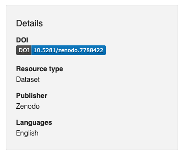
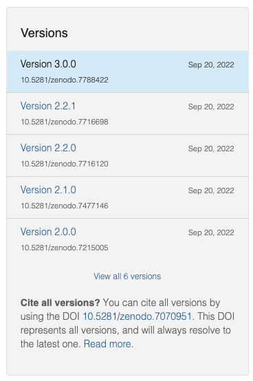
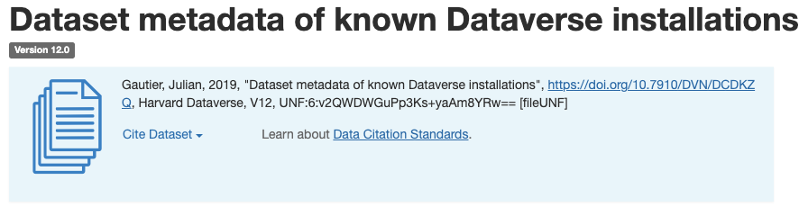
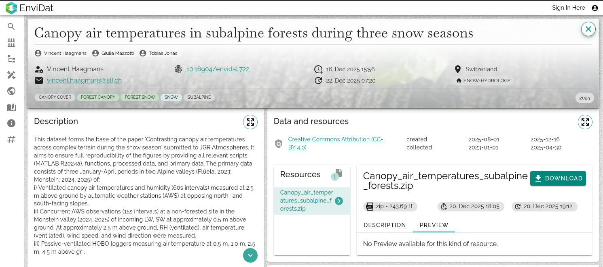

# How to connect data from a published dataset (by DOI)

## Which data repositories are supported?

We support data from the following repositories:

- Any instance running [Invenio](https://inveniosoftware.org/) 
- Any instance running [Dataverse](https://dataverse.org/)
- [EnviDat](https://envidat.ch)

**Examples of Invenio data repositories:**

[Zenodo](https://zenodo.org)
_/_ [CaltechDATA](https://data.caltech.edu)
_/_ [See all](https://inveniosoftware.org/showcase/)

**Examples of Dataverse data repositories:**

[Harvard Dataverse](https://dataverse.harvard.edu)
_/_ [See all](https://dataverse.org)

:::info

Integrations with more data repositories, including ones in the ETH Domain, will be coming soon!

:::

## How to connect a dataset from a data repository to a Renku project

1. Find and copy the DOI on the dataset page (see [How to find the DOI on Zenodo](#how-to-find-the-doi-on-zenodo))
2. On the Renku project page, click the ➕ button in the data section to add a new data connector
3. Select the **Import data by DOI** mode

   

4. Paste the DOI and click **Import**

## How to find the DOI on Zenodo

1. Find the DOI badge box

2. Click the badge and copy the DOI

   

:::note

It is possible to use the DOI of a specific version of a Zenodo record, as well as using the “all versions” DOI (which will resolve to the latest version)

:::

## How to find the DOI on Dataverse

The DOI should appear in the citation box of a dataset:

The DOI is also shown on the “Metadata” tab:

## How to find the DOI on EnviDat

1. Navigate to [EnviDat](https://envidat.ch).
2. Search for the specific dataset or simply click "Explore All" on the home page.
3. Copy the value next to the fingerprint icon near the top of the page, that is the DOI.
   In the example below this would be `10.16904/envidat.722`.

## Example project

Here is an example project that uses datasets from both Zenodo and Dataverse: https://renkulab.io/p/renku-team/demo-project-2

To see the datasets, simply click “Launch” on either of the two session launchers available in the project. The data will automatically appear mounted in the `work` directory.
