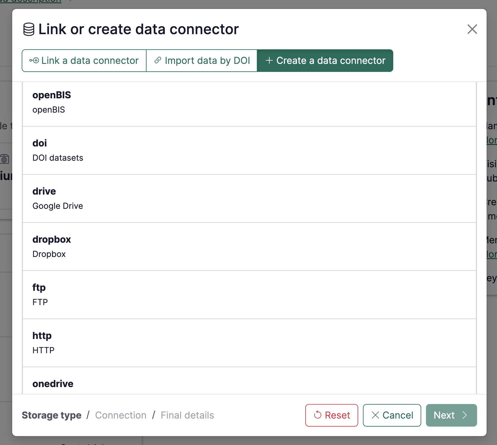
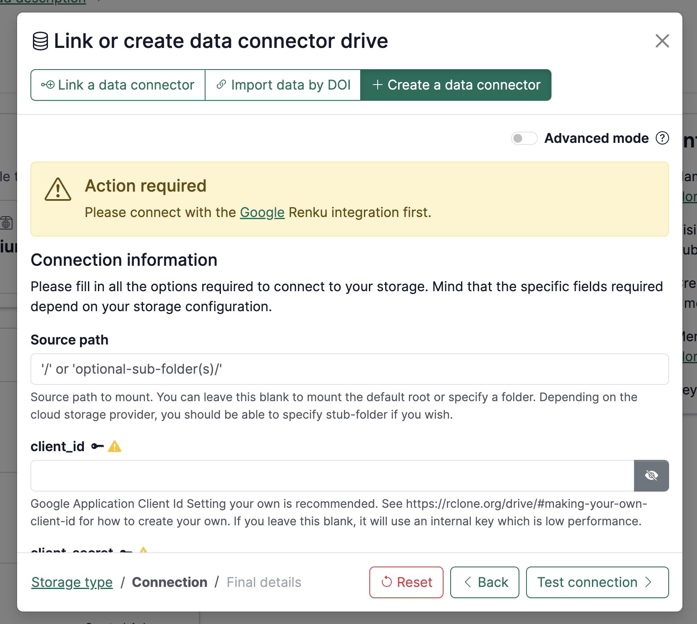
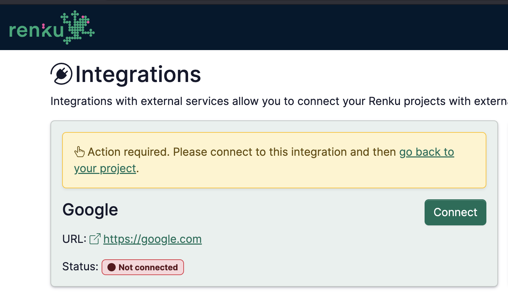
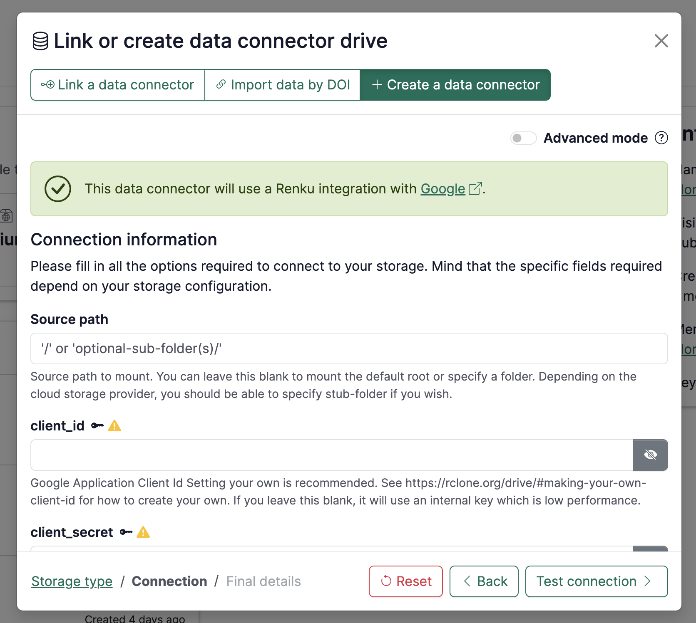

# How to connect a personal Google Drive or Dropbox folder to your project

1. Add a new data connector by clicking the ➕ in the Data section of your project.
2. Click on **Create a data connector**, then pick **Show more** and choose **drive** or **dropbox**.
3. Click on **Next**

4. At this step, you will be prompted to activate the **Google** or **Dropbox** integration if you have not done so yet.
   Click on **Google** or **Dropbox** inside the warning box to connect your account.

5. You will be directed to RenkuLab's integration page. Click on the **Connect** button inside the highlighted integration.

6. Authenticate with your **Google** or **Dropbox** account and accept the permissions requested by RenkuLab.
   Once you are back to the integration page, click on **go back to your project** and re-do steps 1 to 3.

7. Once you are back at step 4, you will see that the **Google** or **Dropbox** integration is active.
   You do not have to fill in any setting at this step. Click **Test connection** then **Continue**.

8. Specify the final details of the data connector, namely:
   1. **Name**: term to refer to your data connector
   2. **Owner**: select where it belongs (either to the project itself, to you as a user or to a group you are part of)
   3. **Visibility**: decide whether it should be public or private
   4. **Read-only**: by default is active. Deactivate if you want to have read/write access.
   5. **Keywords**: add keywords that may help you organizing your work.
   6. **Advanced settings**
      - **Mount point**: name of the directory in your session workspace where the folder will be mounted.
9. Click on **+ Add connector**
