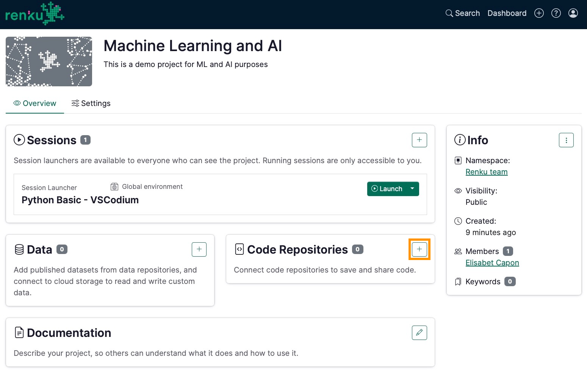
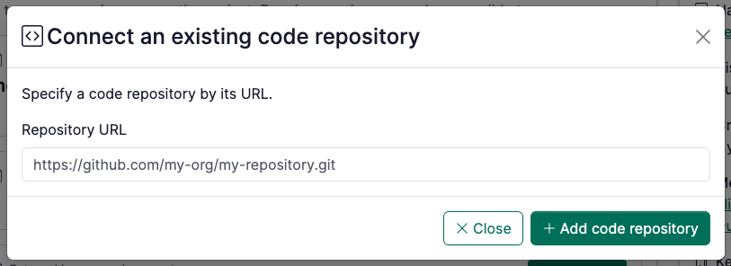

<!-- Highlight available globally -->

# Add a code repository to your project

:::info

In order to access your code repository from RenkuLab, you need to [connect your RenkuLab account
with GitHub/GitLab](connect-renku-account-to-github-or-gitlab-account).

:::

In the project page:

1. Click on ➕ in the Code Repositories section.
    

    
    

2. Fill in the URL of the code repository you want to add to your project. You can copy this URL from the browser page of your code repository.

    

    
    

    :::note

    Note that this should be the HTTP URL for your code repository, not the SSH url.

    :::

3. Click on **Add code repository** button
4. Check that the **access badge** indicates the access level you expect to have for this code repository. If you do not have the access you are expecting, see [How to connect your Renku account to your GitHub or GitLab account](connect-renku-account-to-github-or-gitlab-account).

    :::note

    Once you have connected your accounts, your access to the code repository in RenkuLab will match your access level on GitHub/GitLab:

    - If you are able to write to the repository (push and pull rights) you will see a <Highlight color="#059b11ff">green</Highlight> status.
    - If you can only see the code repository, you will only be able to pull or clone from the code repository (status in <Highlight color="#f1fb36ff">yellow</Highlight>).
    - If you cannot access a given repository at all, your status will be in <Highlight color="#ff3838ff">red</Highlight>.

    :::

:::info

Be mindful that your repository cannot be completely empty. Otherwise, you will not be able to launch the session in Renku! Create simply a `README.md` and it will be enough.

:::

import codeRepositoryVideo from './add-code-repository-to-project-10.mov';

<video controls width="100%" src={codeRepositoryVideo} />
