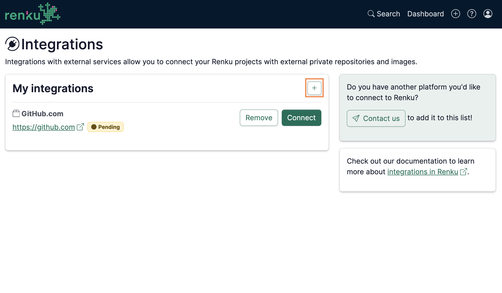

# Integrate with GitHub/GitLab

Renku allows you to connect to several external service providers, including GitHub, GitLab, ETH GitLab and SDSC GitLab.

:::tip

If your institution has a dedicated GitLab instance you would like to integrate with Renku, do not
hesitate to [Contact](../../community)  us, and we will be happy to add it to Renku's integrations.

:::

1. In the User menu in the top right corner, click on **Integrations.**
2. For the desired services, click on **Connect.**
    1. Approve the steps. After that, the service status will turn into connected.

    

3. (GitHub only) Follow the prompts to install the Renku app in the namespace(s) where you want to
   use repositories in Renku.

Now you can [add code repositories to your
projects](add-code-repository-to-project) and read & write them in sessions!

import connectAccountsVideo from './connect-your-renku-account-to-your-github-or-gitlab-account-10.mov';

<video controls width="100%" src={connectAccountsVideo} />
