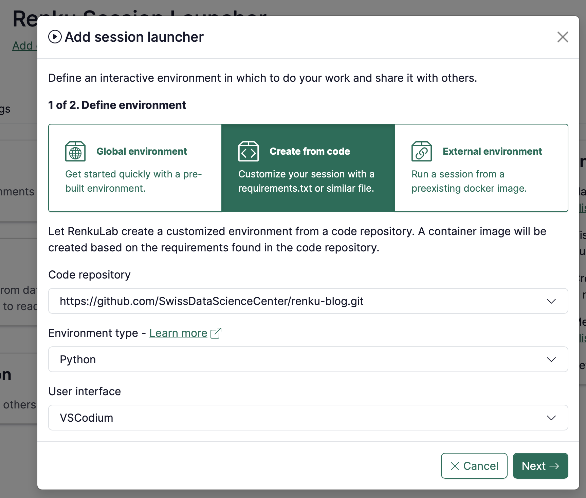
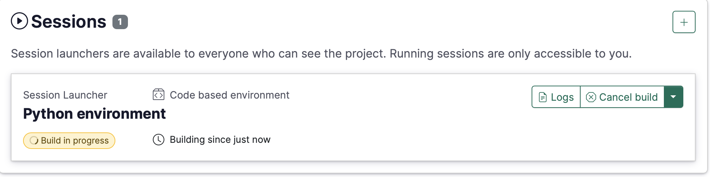
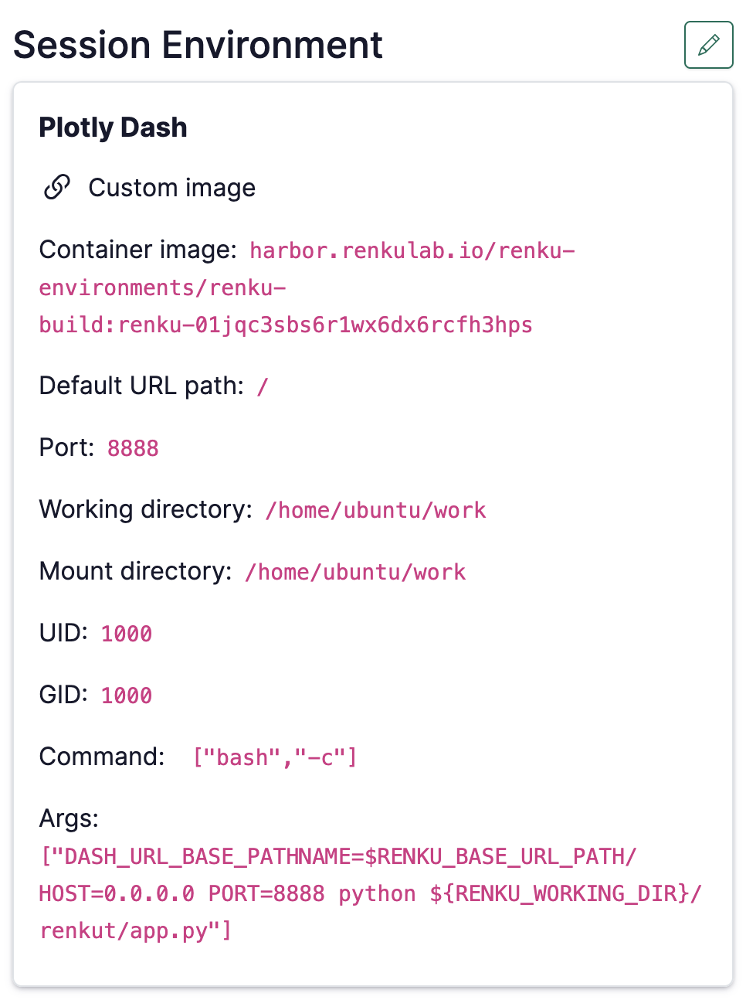
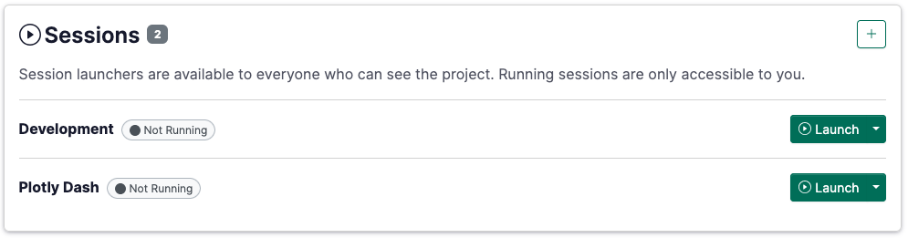

# Create an environment with custom packages installed

If you’d like a set of custom packages to be installed and ready to go when you (or anyone else)
launches a session in your project, you can take advantage of Renku’s **code based environments**.

With Renku code based environments, you can point Renku to a code repository that contains an
environment definition file, such as an `environment.yml`, `requirements.txt`, `pyproject.toml`, or
`renv.lock`, and Renku will build a custom environment for your session for you!

This guide has 2 parts:

- First, we will walk through what kinds of files you can use to [define code based
  environments](#what-kinds-of-environment-definitions-are-supported) in Renku.
- Second, we’ll show you how to [create a code-based
  environment](#how-to-create-a-code-based-environment-for-your-renku-session) for your project.

## What kinds of environment definitions are supported?

RenkuLab’s code-based environments currently support creating **Python** and **R** environments.

### Defining a Python Environment

There are multiple ways you can define a python environment for your Renku session:

- [Miniconda (`environment.yml`) (recommended)](#miniconda-environmentyml-recommended)
- [Pip (`requirements.txt`)](#pip-requirementstxt)
- [Poetry (`pyproject.toml`)](#poetry-pyprojecttoml)
- [uv (`pyproject.toml` and `uv.lock`)](#uv-pyprojecttoml-and-uvlock)

See below for more details on how to use each of these systems.

:::info
If you’d like to learn more about the system Renku uses to create python environments, check
out [Paketo Buildpacks](https://paketo.io/docs/howto/python/#use-a-package-manager).
:::

#### Miniconda (`environment.yml`) (recommended)

Include an `environment.yml` file located at the root (top level) of the code repository.

<details>
<summary>Here’s an example `environment.yml`:</summary>

    ```yaml
    # Note: name can be changed
    name: "base"
    channels:
    	# important: do not use 'defaults', but always include 'nodedefaults'
      - conda-forge
      - nodefaults
    dependencies:
      - python=3.9 # set your python version here
      - tensorflow-gpu
      - numba
      - scikit-learn
      - pandas
      - seaborn
      - matplotlib
      - jupyterlab
      - xarray
      - pip
      - pip:
    	  # put packages to be installed by pip here
        - deepsmiles
        - rdkit
    # Note: prefix can be changed
    prefix: "/opt/conda"
    ```

</details>

Important usage notes:

- Regarding the Python version: specify your Python version with `=` and not `==`! Using `==` will
  result in the lowest version being used, without bug fixes and security updates, e.g. using
  `python==3.10` will install `3.10.0` while using `python=3.10` will install `3.10.19` or a
  newer release. You can also use a version string similar to `python>=3.12,<3.13` (will install latest `3.12.x`).
- Regarding conda channels:
  - `nodefaults` must be included. See example above.
  - We recommend using the `conda-forge` channel or other non-anaconda channels.
  - The `defaults` channel is not recommended and often results in failed builds (due to rate limits imposed by Anaconda).
- Please note that miniconda can only be used at this time to create Python environments, not R environments.
- Environments defined with one of these files will be created via miniconda. Configuring a version of miniconda is not supported.

#### Pip (`requirements.txt`)

Include a valid `requirements.txt` file at the root (top level) of your code repository. Renku will create an environment from this file using `pip`.

:::info

Defining a python environment via a requirements.txt file will create a python environment with
python version `3.10`. It is not currently possible to specify a different python version.

:::

<details>
<summary>Here is an example `requirements.txt`:</summary>

    ```
    numpy==2.2.2
    pandas==2.2.3
    jupyterlab==4.3.5
    ```

</details>

#### Poetry (`pyproject.toml`)

Including a `pyproject.toml` file at the root of your code repository triggers the poetry installation process. The buildpack will invoke `poetry` to install the application dependencies defined in `pyproject.toml` and set up a virtual environment.

Note that poetry version `1.8.3` will be used.

<details>
<summary>Here is an example `pyproject.toml`:</summary>

    ```toml
    [tool.poetry]
    name = "python-poetry-1"
    version = "0.1.0"
    description = ""
    authors = ["Flora Thiebaut <flora.thiebaut@sdsc.ethz.ch>"]
    readme = "README.md"
    # Important: use `package-mode = false` if the repository
    # is not an installable package.
    package-mode = false

    [tool.poetry.dependencies]
    python = "^3.12"
    numpy = "^2.2.2"
    pandas = "^2.2.3"
    jupyterlab = "^4.3.5"
    scipy = "^1.15.1"
    torch = "^2.6.0"
    pytorch-lightning = "^2.5.0.post0"

    [build-system]
    requires = ["poetry-core"]
    build-backend = "poetry.core.masonry.api"
    ```

</details>

#### uv (`pyproject.toml` and `uv.lock`)

Include a `pyproject.toml` file and a `uv.lock` file at the root (top level) of your code repository. The buildpack will invoke `uv` to install the dependencies recorded in `uv.lock`.

If you do not have a `uv.lock` file yet, you can generate one by running `uv lock` in your local project.

:::info

Renku sets the environment variable `UV_PROJECT_ENVIRONMENT` to `$RENKU_WORKING_DIR/.venv` in the session. This means the regular `python` command has access to everything installed with `uv add`, and you do not need to pass the `--active` flag to `uv` commands.

:::

<details>
<summary>Here is an example `pyproject.toml`:</summary>

    ```toml
    [project]
    name = "my-renku-project"
    version = "0.1.0"
    description = ""
    readme = "README.md"
    requires-python = ">=3.12"
    dependencies = [
        "numpy>=2.2.2",
        "pandas>=2.2.3",
        "jupyterlab>=4.3.5",
        "scipy>=1.15.1",
    ]
    ```

</details>

### Defining an R Environment with renv

Renku can build an R environment from an [`renv`](https://rstudio.github.io/renv/) lockfile.
`renv` records the R packages used by your project in `renv.lock`; Renku uses this lockfile to
restore those packages when building the session image.

To use `renv` with a code-based environment:

1. In your R project, install and initialize `renv` if you have not already done so:

   ```r
   install.packages("renv")
   renv::init()
   ```

2. Install the packages your project needs as usual, for example:

   ```r
   install.packages(c("dplyr", "ggplot2"))
   ```

3. Write your analysis code that uses those packages.

4. Snapshot the environment to update the lockfile:

   ```r
   renv::snapshot()
   ```

   :::warning

   The `renv::snapshot()` command will pick up only the packages that are
   installed _and_ used in your source code. If you install packages but do not use them (yet)
   they will not be added by default.

   :::

5. Commit `renv.lock` at the root (top level) of the code repository. You should also commit the
   files created by `renv` that are meant to be shared with the project, such as `.Rprofile` and
   `renv/activate.R`.

When Renku builds the image, it restores the packages recorded in `renv.lock`. If a package requires
system libraries that are not available in the build image, the build can fail. In that case,
consider using a custom Docker image instead; see [How to use your own docker image for a Renku
session](use-your-own-docker-image-for-renku-session).

## How to create a code-based environment for your Renku session

:::info

This functionality only works with **public code repositories**. If your code repository is
private, please see [Creating a custom environment from a private code
repository](create-environment-with-custom-packages-private-code-repository).

:::

1. Make sure the code repository that contains your environment definition file is added to your
   Renku project.
2. Create a **new session launcher** by clicking the "+" button in the Launchers section, and select either Session Launcher or Job Launcher.
3. Select the **Create from code** option

   

4. Select the **Code repository**

   :::info

   Note: The code repository must be public. If your code repository is private, please see
   [Creating a custom environment from a private code
   repository](create-environment-with-custom-packages-private-code-repository)

   :::

   :::info

   Note: The code repository must be already linked to the Renku project

   :::

5. Select the **Environment type**. Choose **Python** for Python environment definition files,
   or **R** for repositories that use `renv.lock`.
6. Select the **User interface** you’d like your session to have, such as VSCodium/JupyterLab
   for Python environments or RStudio for R environments.
7. Click **Next**
8. Define the **name** of the Session Launcher
9. Select the default **compute resources**
10. Click on **Add launcher**

The environment is now being built by RenkuLab. You can see the status on the session launcher.



When the environment is built, you can launch your session.

## Updating a code-based environment

1. When you want to make changes to your environment (add new packages), first
   update the environment definition file in the code repository where the
   environment is defined.
2. Then, rebuild the environment in RenkuLab:
   1. Click on the launcher to open the launcher side panel.
   2. Navigate to the **Environment** section.
   3. Click on **Rebuild**.

## [experimental] Using a dashboard with a code-based environment

:::warning

Temporary and experimental! The description below is a current work-around but we will streamline
this workflow in the near future!

:::

Your project might have a nice dashboard inside, which you would want others to see. If your
repository’s requirements include a dashboard tool (e.g. streamlit or plotly dash), it is relatively
simple to have Renku build the image, and convert it to show the dashboard instead of VSCodium. This
way, you can have, for example, one launcher for development that you use and another to show others
the results.

To set up a dashboard with an environment built from your repository, you can follow these steps:

1. Follow the steps for creating a [code-based environment](#how-to-create-a-code-based-environment-for-your-renku-session) above.
2. Once the image is done building, edit the environment and change it to a “Custom Environment”
3. Edit the `Command` to be `["bash", "-c"]` and `Args` to correspond to your app - see common examples [here](use-your-own-docker-image-for-renku-session).

Once you are done, your environment configuration should look something like this:

<p class="image-container-s">

</p>

And your launcher set up could be, for example:



## Creating a code-based environment from a private code repository

Please see [Creating a custom environment from a private code
repository](create-environment-with-custom-packages-private-code-repository).
