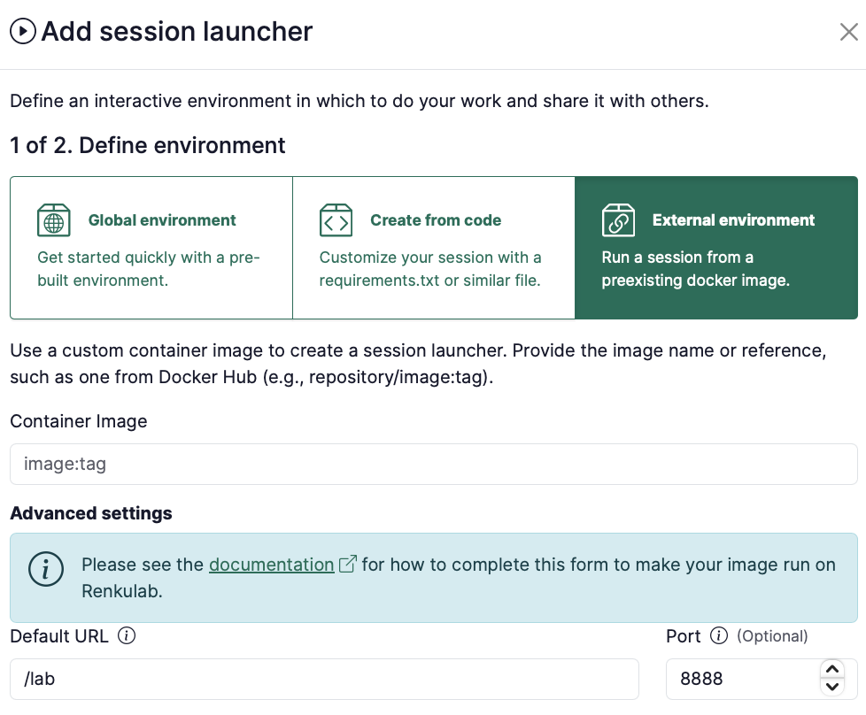
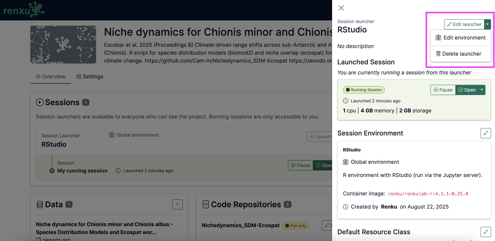

# Use your own docker image for a launcher

## What Docker images can I use in RenkuLab sessions or jobs?

There are some limitations to what images you can use in Renku sessions. The image must meet **all** of the conditions below in order to work on RenkuLab:

1. **The image needs a front end (only applies to session launchers)**

   The image you use needs a user interface web frontend to run so that you can access the session via the browser. Examples of these include JupyterLab, VSCode or RStudio.

2. **The image will be run as non-root**

   For security reasons, sessions are started with a non-root user.

## How to configure an image as a custom environment

In the project page:

1. Under **Launchers** section click on ➕ to add a new session or job launcher
2. Choose **Session** or **Job** in the type selector.
3. Select **External environment**

<p class="image-container-l">

</p>

3. For the container image, provide an **image identifier**.
   - Some examples of image identifiers:
     - if the image is hosted on DockerHub:
       - `renku/renkulab-py:3.10-0.24.0`
       - `continuumio/anaconda3:2024.06-1`
     - if the image is hosted on gitlab.renkulab.io:
       - `registry.renkulab.io/laura.kinkead1/n2o-pathway-analysis:980f4a3`
   - The image identifier should be in the format that works with `docker pull`
4. Depending on the image you’re using, you’ll need to fill in the **Advanced settings**. See [Example image configurations for common front ends](./configure-frontends-for-a-session-environment) for ready-to-use configurations, or the information below for how to fill it in:

   :::danger

   This part is important! Please read carefully.

   :::
   - I’m using an image created by **Renku** and that is **newer** than version 0.24.0 (the version number is in the image tag).

     The only additional parameter you have to provide in the session launcher creation dialog is the `Default URL` and this should be set to `/lab`.

     

   - I’m using an image created by **Renku** and that is **older** than version 0.24.0 (the version number is in the image tag).

     :::note

     If you are working with an image in a launcher where the **launcher was created before November 27, 2024**, the launcher was migrated automatically with the new Renku release to include the necessary advanced settings. The instructions below apply only to new session launchers you are creating for the first time.

     :::

     For Renku base images of version 0.24.0 or older (or images that are based on these images), you have 2 options:
     1. **Option 1:** Upgrade your base image to 0.25.0 or newer. This can be done by going into the settings of the Renku 1.0 project that builds the image, and accepting the updates. Or, directly update your Dockerfile to refer to the newer base image.
     2. **Option 2:** Provide additional configuration in the launcher. Here is an example configuration needed to run a Renku base image of version 0.24.0 or older:
        - **Container Image**: `renku/renkulab-py:3.10-0.24.0` or whatever image you are trying to use
        - **Default URL**: `/lab` (or `/rstudio` if you are using `renku/renkulab-r` or `renku/renkulab-bioc`). (only applies to session launchers)
        - **Mount Directory**: `/home/jovyan/work`
        - **Working Directory**: `/home/jovyan/work`
        - **UID**: `1000`
        - **GID**: `100`
        - **Command ENTRYPOINT**: `["sh", "-c"]`
        - **Command Arguments**:

          ```json
          [
            "/entrypoint.sh jupyter server --ServerApp.ip=0.0.0.0 --ServerApp.port=8888 --ServerApp.base_url=$RENKU_BASE_URL_PATH --ServerApp.token=\"\" --ServerApp.password=\"\" --ServerApp.allow_remote_access=true --ContentsManager.allow_hidden=true --ServerApp.allow_origin=* --ServerApp.root_dir=\"/home/jovyan/work\""
          ]
          ```

   - I’m using an image created **somewhere else** (not by Renku).

     You need to fill in the **Advanced Settings** for your image to work on RenkuLab. See [Example image configurations for common front ends](./configure-frontends-for-a-session-environment).

5. Select the **Resource class** that best fits your expected computational needs.

   :::tip

   If the available resource classes are too small for your compute requirements, we can create a custom resource pool for you! See [Request a Custom Resource Pool](../../resource-pools-and-classes#request-custom-resource-pool).

   :::

6. Give your session or job launcher a **name**
7. Click on **Add launcher** button

:::info

Note that you can always **modify your launcher** by clicking on top of it on the project’s page, and using the menu on the right:

<p class="image-container-l">

</p>

:::

## About Renku Session URLs {#about-renku-session-urls}

The biggest challenge with running custom images on Renku is managing the URL path where the session is accessible. This path is not known ahead of time but only once the session has been launched. Renku injects two environment variables in each session to indicate the full session URL and the path portion of the URL. These environment variables are named respectively `RENKU_BASE_URL` and `RENKU_BASE_URL_PATH`. Regardless of what image you are running on Renku you will have to specify the path where the session can be accessed. Most programs you will run in an image will assume that the path where they run is `/`, but we never run session at such location. For example, on [renkulab.io](http://renkulab.io) sessions are available at URLs like the following: `https://renkulab.io/sessions/tasko-olevsk-bfff446a2f41`

For the session available at the URL above, the environment variables have the following values:

- `RENKU_BASE_URL` = `https://renkulab.io/sessions/tasko-olevsk-bfff446a2f41`
- `RENKU_BASE_URL_PATH` = `/sessions/tasko-olevsk-bfff446a2f41`
