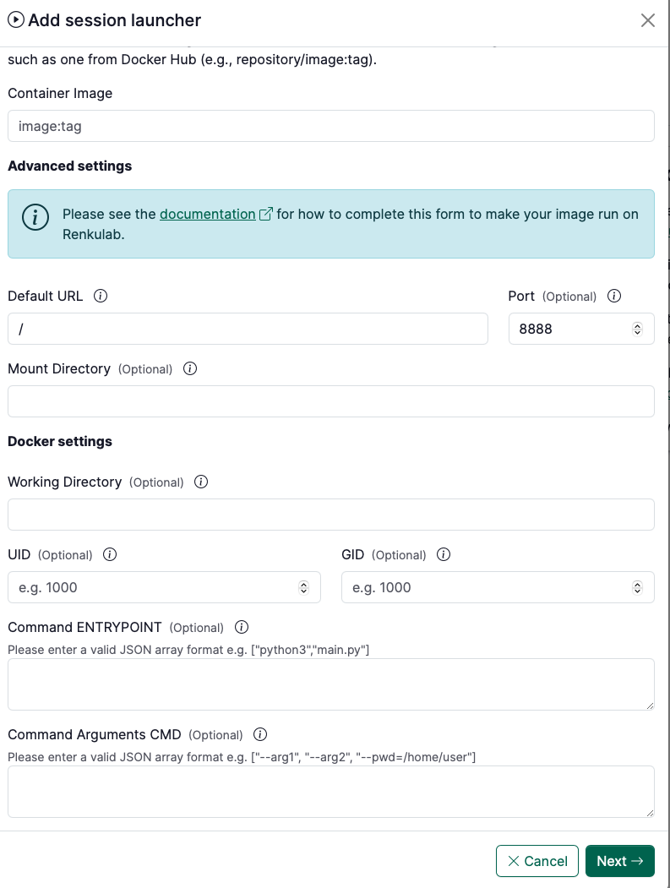

# Configure front ends for a session environment

In order to run a docker image in a session, Renku needs to know some information about how to run and serve that image.

In this section, you can see example configurations for commonly used images. If you build an image with one of these images as the base, then you can use this provided configuration to make that image run in RenkuLab. The information below can be copied and pasted into the **Advanced Settings** form for creating a **custom environment**.

This page provides reference configurations to use in the **Advanced Settings** step of [How to use your own docker image for a Renku session](./use-your-own-docker-image-for-renku-session), specifically for images not built by Renku.

<p class="image-container-l">

</p>

### Jupyter

- Container Image: `jupyter/minimal-notebook:python-3.11`
- Port: `8888`
- Default URL: `/lab`
- Command ENTRYPOINT:

```json
["sh", "-c"]
```

- Command Arguments CMD ([learn more](./use-your-own-docker-image-for-renku-session#about-renku-session-urls)):

```json
[
  "jupyter server --ServerApp.ip=0.0.0.0 --ServerApp.port=8888 --ServerApp.base_url=$RENKU_BASE_URL_PATH --ServerApp.token=\"\" --ServerApp.password=\"\" --ServerApp.allow_remote_access=true --ContentsManager.allow_hidden=true --ServerApp.allow_origin=*"
]
```

### Julia and Jupyter

- Container Image: `jupyter/julia-notebook:x86_64-python-3.11.6`
- Port: `8888`
- Default URL: `/lab`
- Working Directory: `/home/jovyan/work`
- Mount Directory: `/home/jovyan/work`
- Command ENTRYPOINT:

```json
["sh", "-c"]
```

- Command Arguments CMD ([learn more](./use-your-own-docker-image-for-renku-session#about-renku-session-urls)):

```json
[
  "jupyter server --ServerApp.ip=0.0.0.0 --ServerApp.port=8888 --ServerApp.base_url=$RENKU_BASE_URL_PATH --ServerApp.token=\"\" --ServerApp.password=\"\" --ServerApp.allow_remote_access=true --ContentsManager.allow_hidden=true --ServerApp.allow_origin=*"
]
```

### RStudio

- Container Image: `rocker/rstudio:4.5.1`, or an image built on top of it
- Port: `8888`
- Default URL: `/`
- Working Directory: `/home/rstudio`
- Mount Directory: `/home/rstudio`
- UID: `1000`
- GID: `1000`
- Strip session URL path prefix: **enabled**
- Command ENTRYPOINT:

```json
["sh", "-c"]
```

- Command Arguments CMD ([learn more](./use-your-own-docker-image-for-renku-session#about-renku-session-urls)):

```json
[
  "mkdir -p $RENKU_MOUNT_DIR/.rstudio && printf 'provider=sqlite\\ndirectory=%s\\n' $RENKU_MOUNT_DIR/.rstudio > $RENKU_MOUNT_DIR/.rstudio/db.conf && export USER=$(whoami) && exec /usr/lib/rstudio-server/bin/rserver --server-daemonize=0 --server-user=$USER --auth-none=1 --www-address=0.0.0.0 --www-port=8888 --www-root-path=$RENKU_BASE_URL_PATH --www-frame-origin=same --www-verify-user-agent=0 --server-data-dir=$RENKU_MOUNT_DIR/.rstudio/data --database-config-file=$RENKU_MOUNT_DIR/.rstudio/db.conf"
]
```

### VSCode

- Container Image: Build a docker image that includes vscode in the PATH
- Port: `8888`
- Command ENTRYPOINT:

```json
["sh", "-c"]
```

- Command Arguments CMD ([learn more](./use-your-own-docker-image-for-renku-session#about-renku-session-urls)):

```json
[
  "code serve-web --server-base-path $RENKU_BASE_URL_PATH/ --without-connection-token --host 0.0.0.0 --port 8888"
]
```

### Web apps (Streamlit, Plotly Dash, Shiny, Gradio)

To serve a dashboard or interactive app built with Streamlit, Plotly Dash, Shiny, Gradio or a similar framework, publish it as an **app** rather than a session. An app gets a stable public URL that anyone can open, without a Renku account and without launching a session. Your image runs its own web server, listening on `$RENKU_SESSION_PORT` and `0.0.0.0`.

See [Publish an App](../../app/guides/host-app) for how to set this up, with example start commands.

## Next steps

Once you've copied the configuration for your front end, return to [How to use your own docker image for a Renku session](./use-your-own-docker-image-for-renku-session) to finish creating your launcher.
