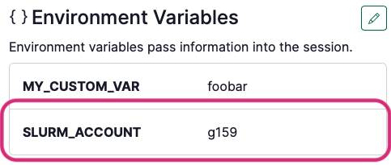

import { Columns, Column } from "@theme/MDXComponents";

  

    # What does work
    
    - Launch interactive Renku sessions at CSCS on: `Eiger` and `Bristen`
        - Sessions on `Daint` , `Clariden` work, but only with special images created by the Renku team. Simplified integration with ARM clusters is coming soon. Please [Contact us](/docs/users/community) for more info.

    - Access data from scratch, store and home

    - By default, the job is submitted against your default CSCS account

                    

                    
*If you’d like the job go to a different account:*

                    

                    1. Open your session launcher side panel
                    2. Scroll down to the Environment variables section
                    3. Add an environment variable with key `SLURM_ACCOUNT` and set the value to your CSCS organisation (e.g. `g159`).
                    

                    [See the example Project "Demo HPC"](https://staging.dev.renku.ch/p/flora.thiebaut/demo-hpc#launcher-01K58XQSDV5HFF0T9A6D1G16ZF)

                    
                    

    - “Create from code” environments and Global environments work (on Eiger only)

                    

                    
If you’d like to test Daint outside of the pre-prepared project:

                    

                    At the moment, only special images work on Daint. The [testing project](https://staging.dev.renku.ch/p/flora.thiebaut/demo-hpc-clean#launcher-01K604HWZBNTTVD9G8VKATVJ8Z) comes with a launcher suitable for Daint. Here’s how to test on Daint in your own project (we will integrate this into RenkuLab more properly later!):
                    1. Create a session launcher with an **External Environment**
                    2. For the configuration, copy configuration from [this session launcher](https://staging.dev.renku.ch/p/flora.thiebaut/demo-hpc#launcher-01K5XTKBQK4XCCB6WTAQ7AVZJZ).
                    3. Ask to be added to a Daint resource pool
                    

                    Tested: has torch and reports cuda access to 4 GPUs
                    

    - Code repositories added to the Renku project are added to your session

  

  

    # What doesn’t work yet 2

    
:x: Renku data connectors

    
:x: External environments (bringing your own docker image)

    
:x: Renku session secrets

    
:x: Configuring the max run time of the job

    
:x: Submitting slurm jobs from within the session

  

