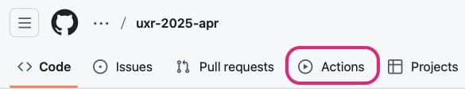
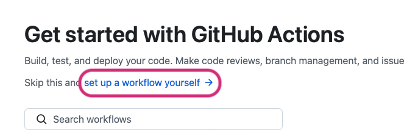
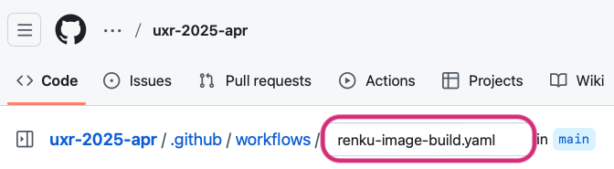
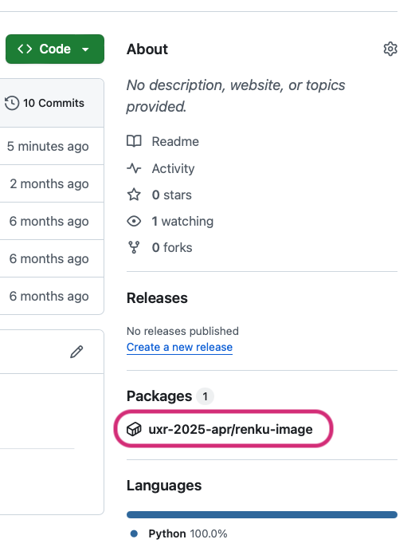
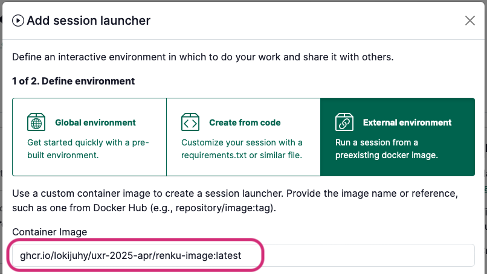

# Create an environment with custom packages from a private code repository (GitHub Actions)

Would you like Renku to create an environment for you with the packages you need pre-installed? Renku can create a docker image for your Renku session for you based on a environment definition file in a code repository, such as a `environment.yml`, `requirements.txt`, or `pyproject.toml`.

If your code repository is public, you can have Renku build this image directly as part of your project! See [How to create an environment with custom packages installed](create-environment-with-custom-packages-installed).

If your code repository is private, follow the instructions below.

## Create a GitHub action to build a docker image

1. First, make sure your code repository meets the requirements for Renku to build an image for you. See [What kinds of environment definitions are supported?](create-environment-with-custom-packages-installed)
2. In your GitHub code repository, in the upper menu, click on **Actions**.

    <p class="image-container-l">
    
    </p>

3. Click **set up a workflow yourself**

    <p class="image-container-l">
    
    </p>

4. Change the filename to **renku-image-build.yaml**

    <p class="image-container-l">
    
    </p>

5. Paste the following into the file editor:

    ```yaml
    name: build image

    on:
      push:

    jobs:
      build-image:
        runs-on: ubuntu-24.04
        permissions:
          contents: read
          packages: write
          attestations: write
          id-token: write
        steps:
          - uses: actions/checkout@v4
          - name: Login to GitHub Container Registry
            uses: docker/login-action@v3
            with:
              registry: ghcr.io
              username: ${{ github.actor }}
              password: ${{ secrets.GITHUB_TOKEN }}
          - name: Set up Docker Buildx
            uses: docker/setup-buildx-action@v3
          - name: Docker meta
            id: meta
            uses: docker/metadata-action@v5
            with:
              images: ghcr.io/${{ github.repository }}/renku-image
              tags: |
                type=sha,prefix=
                type=raw,value=latest,enable=${{ github.ref == 'refs/heads/main' }}
                type=semver,pattern={{version}},event=tag
          - name: Build RenkuLab image
            uses: swissdatasciencecenter/renku-frontend-buildpacks/actions/build-image@main
            with:
              tags: ${{ steps.meta.outputs.tags }}
              frontend: jupyterlab
    ```

6. By default, the action defined above will create an image with JupyterLab as the front end. If you prefer a different front end, replace `jupyterlab` in the last line of the file with one of the following alternative front ends:
    - `jupyterlab`: Web-based interactive development for Jupyter notebooks, code, and data.
    - `vscodium`: A freely-licensed version of Microsoft’s editor VS Code.
    - `ttyd`: A web-based terminal with a minimalist interface.
7. Commit changes

## Add the built image to your Renku project

1. Go back the main page of your code repository
2. In the right menu, under **Packages**, click on the entry that reads **repo-name/renku-image**.

    <p class="image-container-l">
    
    </p>

3. **Copy your image URL** from the install box.
    1. Note: Only copy the part that begins with `ghcr.io/...` (don’t copy `docker pull`)

    

4. In your Renku project, **add a new session launcher**
5. Select **External environment**
6. Enter the image URL you copied into the **Container Image** field

    

   :::tip
   Would you like your launcher environment to update automatically everytime you push? Replace the very last part of the image URL after the `:` with `latest`, as in the image above.
   :::

7. In the advanced settings, set the following fields:
    1. Working directory: `/home/ubuntu/work`
    2. Mount directory: `/home/ubuntu/work`
8. Finish creating your launcher, giving your launcher a name and selecting the compute resources.
