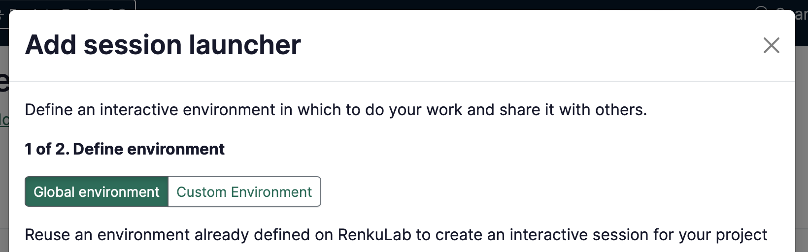

# Add a session launcher to your project

There are 3 ways to create a session launcher on RenkuLab. Which of the situations below best describes you?

### **I just want to get started quickly!**

Choose from the **Global environments** to create a session with commonly used packages pre-installed.

→ Continue [below](/docs/users/sessions/guides/add-session-launcher-to-project) with the documentation on this page to get started!

### I have a **code repository that defines what packages I need.**

Select the **Create from Code** option and let Renku build a environment based on your code for you - no knowledge of Docker required!

→ See [How to create an environment with custom packages installed](/docs/users/sessions/guides/create-environment-with-custom-packages-installed).

### I already have a **docker image I want to use.**

Select the **External Environment** option to configure Renku to run your docker image.

→ See [How to use your own docker image for a Renku session](/docs/users/sessions/guides/use-your-own-docker-image-for-renku-session).

---

The rest of this guide will walk you through creating a basic launcher with a global environment.

In the project page:

1. In the **Sessions** section click on ➕ to add a new session launcher
2. Choose **Global environment** (if it’s not already selected)
    
    

    
    

    
3. Select an environment from the list.
    
    :::info
        
    Don’t see an environment that suits your needs? You can create your own! See [How to create an environment with custom packages installed](/docs/users/sessions/guides/create-environment-with-custom-packages-installed) or [How to use your own docker image for a Renku session](/docs/users/sessions/guides/use-your-own-docker-image-for-renku-session)
    
    :::
    
4. Click **Next**
5. (optional) Give your session launcher a **Name**.
6. Select the **Resource class** that best fits your expected computational needs.
    
    :::note
    
    If the available resource classes are too small for your compute requirements, see [How to select compute resources for your session](/docs/users/sessions/guides/select-compute-resources-for-session) and [Contact](/docs/users/community)  us!
    
    :::
    
7. Click on **Add session launcher**

:::info

If you need to add dependencies to the environment, see [How to install packages on-the-fly in your session](/docs/users/sessions/guides/install-packages-on-the-fly-in-your-session)

:::

:::info

Note that you can always **modify your session launcher** by clicking on it on the project’s page, to open the session launcher side panel:

:::
