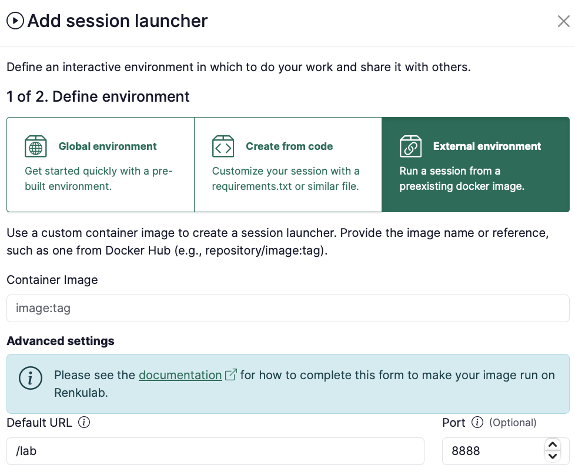

# How to use your own docker image for a Renku session

<aside>


Looking for a quicker way to get started in a Renku session? See [How to add a session launcher to your project](/docs/users/sessions/guides/add-session-launcher-to-project).

</aside>

**Contents**

# What Docker images can I use in RenkuLab sessions?

There are some limitations to what images you can use in Renku sessions. The image must meet **all** of the conditions below in order to work on RenkuLab:

1. **The image needs a front end**
    
    The image you use needs a user interface web frontend to run so that you can access the session via the browser. Examples of these include JupyterLab, VSCode or RStudio.
    
2. **The image must be public**
    
    RenkuLab can not yet use images that not publicly accessible.
    
3. **The image will be run as non-root**
    
    For security reasons, sessions are started with a non-root user.
    

# How to configure an image as a custom environment

In the project page:

1. Under **Sessions** section click on ➕ to add a new launcher
2. Select **External environment**
    
    
    
3. For the container image, provide an **image identifier**.
    - Some examples of image identifiers:
        - if the image is hosted on DockerHub:
            - `renku/renkulab-py:3.10-0.24.0`
            - `continuumio/anaconda3:2024.06-1`
        - if the image is hosted on gitlab.renkulab.io:
            - `registry.renkulab.io/laura.kinkead1/n2o-pathway-analysis:980f4a3`
    - The image identifier should be in the format that works with `docker pull`
4. Depending on the image you’re using, you’ll need to fill in the **Advanced settings**. See the information below for how to fill it in:
    
    <aside>
    
    
    This part is important! Please read carefully.
    
    </aside>
    
    - I’m using an image created by **Renku** and that is **newer** than version 0.24.0 (the version number is in the image tag).
        
        The only additional parameter you have to provide in the session launcher creation dialog is the `Default URL` and this should be set to `/lab`.
        
        
        
    - I’m using an image created by **Renku** and that is **older** than version 0.24.0 (the version number is in the image tag).
        
        <aside>
        
        
        Note: If you are working with an image in a launcher where the l**auncher was created before November 27, 2024**, the launcher was migrated automatically with the new Renku release to include the necessary advanced settings. The instructions below apply only to new session launchers you are creating for the first time.
        
        </aside>
        
        For Renku base images of version 0.24.0 or older (or images that are based on these images), you have 2 options:
        
        1. **Option 1:** Upgrade your base image to 0.25.0 or newer. This can be done by going into the settings of the Renku 1.0 project that builds the image, and accepting the updates. Or, directly update your Dockerfile to refer to the newer base image.
        2. **Option 2:** Provide additional configuration in the session launcher. Here is an example configuration needed to run a Renku base image of version 0.24.0 or older:
            - **Container Image**: `renku/renkulab-py:3.10-0.24.0` or whatever image you are trying to use
            - **Default URL**: `/lab`  (or `/rstudio` if you are using `renku/renkulab-r` or `renku/renkulab-bioc`).
            - **Mount Directory**: `/home/jovyan/work`
            - **Working Directory**: `/home/jovyan/work`
            - **UID**: `1000`
            - **GID**: `100`
            - **Command ENTRYPOINT**: `["sh", "-c"]`
            - **Command Arguments**:
                
                ```json
                ["/entrypoint.sh jupyter server --ServerApp.ip=0.0.0.0 --ServerApp.port=8888 --ServerApp.base_url=$RENKU_BASE_URL_PATH --ServerApp.token=\"\" --ServerApp.password=\"\" --ServerApp.allow_remote_access=true --ContentsManager.allow_hidden=true --ServerApp.allow_origin=* --ServerApp.root_dir=\"/home/jovyan/work\""]
                ```
                
    - I’m using an image created **somewhere else** (not by Renku).
        
        You need to fill in the **Advanced Settings** for your image to work on RenkuLab. See [Example image configurations for common front ends](/docs/users/sessions/guides/use-your-own-docker-image-for-renku-session) below.
        
    
5. Select the **Resource class** that best fits your expected computational needs.
    
    <aside>
    
    
    If the available resource classes are too small for your compute requirements, we can create a custom resource pool for you! See [Request a Custom Resource Pool](Resource%20Pools%20&%20Classes%2011f0df2efafc802dbe05f4dcd375431f.md).
    
    </aside>
    
6. Give your session launcher a **name**
7. Click on **Add session launcher** button

<aside>


Note that you can always **modify your session launcher** by clicking on top of it on the project’s page, and using the menu on the right:



</aside>

# Example image configurations for common front ends

In order to run a docker image in a session, Renku needs to know some information about how to run and serve that image.

In this section, you can see example configurations for commonly used images. If you build an image with one of these images as the base, then you can use this provided configuration to make that image run in RenkuLab.  The information below can be copied and pasted into the **Advanced Settings** form for creating a **custom environment**.


### Jupyter

- Container Image: `jupyter/minimal-notebook:python-3.11`
- Port: `8888`
- Default URL: `/lab`
- Command ENTRYPOINT:

```json
["sh", "-c"]
```

- Command Arguments CMD ([learn more](/docs/users/sessions/guides/use-your-own-docker-image-for-renku-session)):

```json
["jupyter server --ServerApp.ip=0.0.0.0 --ServerApp.port=8888 --ServerApp.base_url=$RENKU_BASE_URL_PATH --ServerApp.token=\"\" --ServerApp.password=\"\" --ServerApp.allow_remote_access=true --ContentsManager.allow_hidden=true --ServerApp.allow_origin=*"]
```

### Julia and Jupyter

- Container Image: `jupyter/julia-notebook:x86_64-python-3.11.6`
- Port: `8888`
- Default URL: `/lab`
- Working Directory: `/home/jovyan/work`
- Mount Directory: `/home/jovyan/work`
- Command ENTRYPOINT:

```json
["sh", "-c"]
```

- Command Arguments CMD ([learn more](/docs/users/sessions/guides/use-your-own-docker-image-for-renku-session)):

```json
["jupyter server --ServerApp.ip=0.0.0.0 --ServerApp.port=8888 --ServerApp.base_url=$RENKU_BASE_URL_PATH --ServerApp.token=\"\" --ServerApp.password=\"\" --ServerApp.allow_remote_access=true --ContentsManager.allow_hidden=true --ServerApp.allow_origin=*"]
```

### Rstudio

<aside>
🚧

Not yet available

</aside>

### RShiny

<aside>
🚧

Not yet available

</aside>

[How to serve a Shiny app without its code](/docs/users/projects/guides/serve-shiny-app-without-its-code)

### VSCode

- Container Image: Build a docker image that includes vscode in the PATH
- Port: `8888`
- Command ENTRYPOINT:

```json
["sh", "-c"]
```

- Command Arguments CMD ([learn more](/docs/users/sessions/guides/use-your-own-docker-image-for-renku-session)):

```json
["code serve-web --server-base-path $RENKU_BASE_URL_PATH/ --without-connection-token --host 0.0.0.0 --port 8888"]
```

### Streamlit

- Container Image: Build a docker image that includes streamlit and any other requirements needed by your streamlit app
- Port: `8888`
- Command ENTRYPOINT:

```json
["sh", "-c"]
```

- Command Arguments CMD (fill in `<your-repo-name>/<your-app>`) ([learn more](/docs/users/sessions/guides/use-your-own-docker-image-for-renku-session)):

```json
["streamlit run $RENKU_WORKING_DIR/<your-repo-name>/<your-app>.py --server.port=8888 --server.address=0.0.0.0 --server.baseUrlPath=$RENKU_BASE_URL_PATH"]
```

### Plotly Dash

- Container Image: Build a docker image that includes plotly and any other requirements needed by your plotly app
- Port: `8888`
- Command ENTRYPOINT:

```json
["sh", "-c"]
```

- Command Arguments CMD (fill in `<your-repo-name>/<your-app>`!) ([learn more](/docs/users/sessions/guides/use-your-own-docker-image-for-renku-session)):

```json
["DASH_URL_BASE_PATHNAME=$RENKU_BASE_URL_PATH/ HOST=0.0.0.0 PORT=8888 python $RENKU_WORKING_DIR/<your-repo-name>/<your-app>.py"]
```

### Gradio

- Container Image: Build a docker image that includes Gradio and any other requirements needed by your Gradio app
- Port: `8888`
- Command ENTRYPOINT:

```json
["sh", "-c"]
```

- Command Arguments CMD (fill in `<your-repo-name>/<your-app>`!)([learn more](/docs/users/sessions/guides/use-your-own-docker-image-for-renku-session)):

```json
["python $RENKU_WORKING_DIR/<your-repo-name>/<your-app>.py --server_port=8888 --server_name=0.0.0.0 --root_path=$RENKU_BASE_URL_PATH"]
```

Note that these command line arguments need to be defined in your Gradio app file. This can be done easily with Python’s [argparse](https://docs.python.org/3/library/argparse.html) library, for example. Just paste the following lines into your Gradio file:

```python
from argparse import ArgumentParser

parser = ArgumentParser()
parser.add_argument('--server_port', default=8888, type=int)
parser.add_argument('--server_name', default=None, type=str)
parser.add_argument('--root_path', default=None, type=str)

args = parser.parse_args()
```

and then make sure to launch your app with the arguments that were set:

```python
with gr.Blocks() as app: # or app = gr.Interface(...)
		# Gradio blocks
		...

app.launch(server_port=args.server_port,
					 server_name=args.server_name,
					 root_path=args.root_path)
```

# About Renku Session URLs

The biggest challenge with running custom images on Renku is managing the URL path where the session is accessible. This path is not known ahead of time but only once the session has been launched. Renku injects two environment variables in each session to indicate the full session URL and the path portion of the URL. These environment variables are named respectively `RENKU_BASE_URL` and `RENKU_BASE_URL_PATH`. Regardless of what image you are running on Renku you will have to specify the path where the session can be accessed. Most programs you will run in an image will assume that the path where they run is `/`, but we never run session at such location. For example, on [renkulab.io](http://renkulab.io) sessions are available at URLs like the following: `https://renkulab.io/sessions/tasko-olevsk-bfff446a2f41`

For the session available at the URL above, the environment variables have the following values:

- `RENKU_BASE_URL` = `https://renkulab.io/sessions/tasko-olevsk-bfff446a2f41`
- `RENKU_BASE_URL_PATH` = `/sessions/tasko-olevsk-bfff446a2f41`
