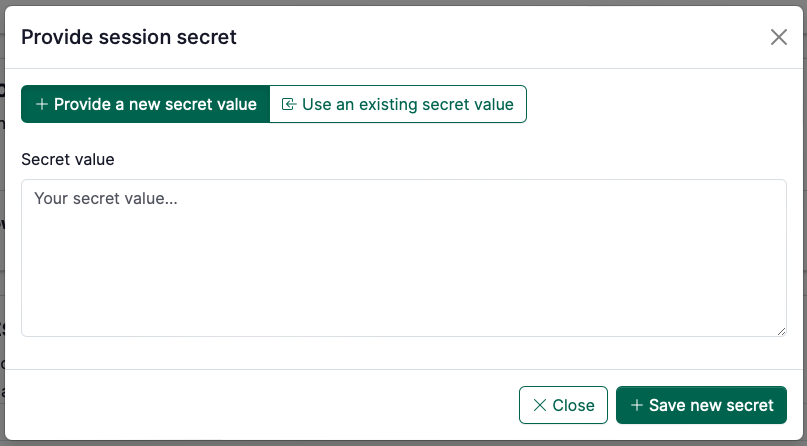
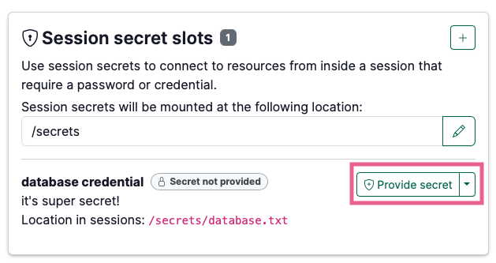
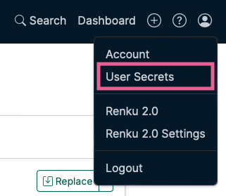

# Configure a session secret

Session secrets help you connect to protected resources, such as databases or external compute systems, from a Renku session in a standardized and shareable manner. Collaborating with secrets is easy too: configure a single session secret slot to ensure that the secret shows up the same way for everyone, and each person enters their own value.

## **How to add a session secret slot to the project**

The session secret **slot** determines how the secret shows up in the session (the secret file name and path), which is the same for every member of the project.

If you are adding a session secret to a project for the first time, follow these steps to set up the secret slot:

1. Go to project **Settings**.
2. Scroll down to the **Session secret slots** section.
3. Click the ➕ button to add a session secret slot.

    

    
    

4. Give the session secret slot a **name** and a **description** so that other project members know what the secret is for.
5. Specify the **filename** for the secret slot.
6. Click **Add session secret slot** and continue to the next section…

## How to enter your value for a session secret

Once a have created a session secret slot, you may optionally enter your secret for the slot.

:::info

Secrets you enter on Renku are only saved for you. Secrets are not shared with other Renku users.

:::

You can either:

- **Provide a new secret value**: You can enter the for secret you want to use for the secret slot.
- **Use an existing secret value**: This lets you reuse a secret you have already saved in Renku for this secret slot.

    :::tip

    If you use the same database in multiple projects, you can save the database credential in Renku once, and use the *Use an existing secret value* option to attach that secret to multiple projects.

    :::

**Where do I go to enter a secret for a session secret slot?**

There are a few ways to get to the screen above.

1. If you just created a session secret slot, you will see the screen above directly as the next step after creating the session secret slot.

1. When you launch a session on a project that has session secrets slots, you will be prompted during session launch to enter secrets for the slots.

1. You can always go to project **Settings**, scroll to **Session Secret Slots**, and click the **Provide secret** button.

## How to view all session secrets you have saved on Renku

1. Click on the **user menu** in the top right and select **User Secrets**.

    

    
    

This page shows you all secrets you have saved on Renku, both saved session secrets and saved data connector secrets.

From this page, you can:

- View in which projects and data connectors the secret is used.
- Replace the value of the secret. This updates the value that is used for all connected session secrets or data connectors.
- Delete the secret.
