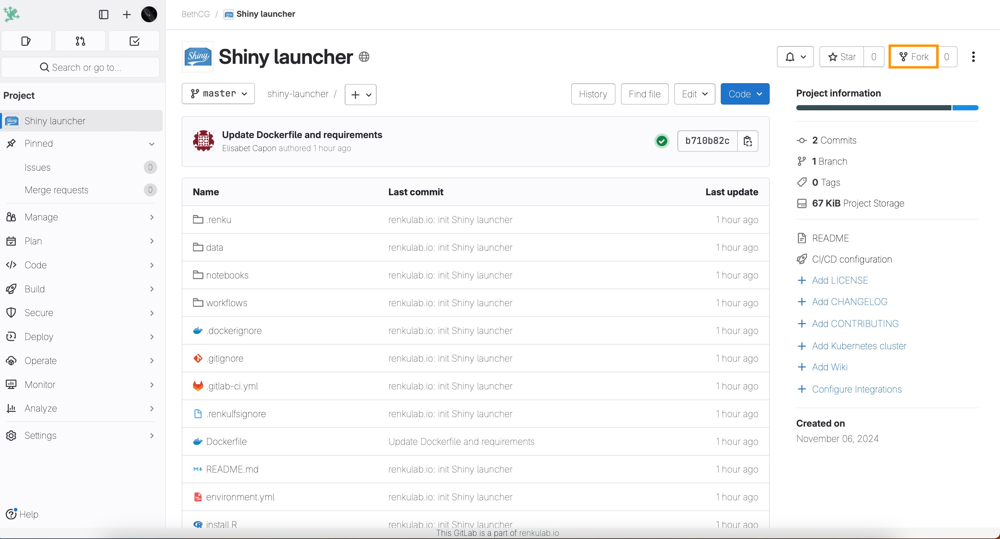
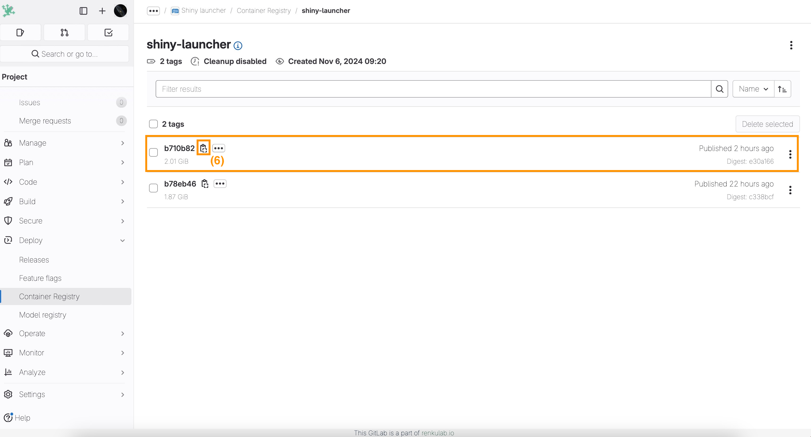

# How to create a custom environment and launcher for a Shiny app

:::info

If you have a Shiny app that needs additional R packages, this how-to guide will help you create a new Renku environment that includes all packages and can run the Shiny app in the browser (using R version 4.2.0).

If you have a shiny app that does not need any additional R packages, you can instead use the simpler guide [How to set up a Shiny app launcher](/docs/users/sessions/guides/set-up-shiny-app-launcher).

:::

:::note

We know this how-to guide is not easy, and we are hard at work to make this easier in the future! We are currently working on a feature to make it easy to add custom packages to your session environment. In the mean time, follow this how-to guide to create your own custom environment.

:::

### Attach your Shiny app code repository to your project:

1. [How to add a code repository to your project](/docs/users/code/guides/add-code-repository-to-project)

### Create a custom Renku environment and launcher to serve your Shiny app:

1. Create a fork of this repository: [https://gitlab.renkulab.io/bethcg/shiny-launcher](https://gitlab.renkulab.io/bethcg/shiny-launcher), we will refer to the fork as _project-fork_.

   

2. In _project-fork_, modify the `install.R` file to include the required R packages for your project, as explained [here](/docs/users/sessions/guides/environments/install-packages-on-the-fly-in-your-session#r).
3. Commit your changes for _project-fork_.
4. Select **Deploy(4a)/Container Registry(4b)** on the left menu of _project-fork_.
5. Click on top of your image registry to access the tags **(5)**.

   

6. Copy the last tagged image (_registry_link_).

   

7. Add a session launcher to your Renku project with the following **Custom Environment** option as explained in [How to use your own docker image for a Renku session](/docs/users/sessions/guides/environments/use-your-own-docker-image-for-renku-session) considering the following parameters:
   1. **Container Image:** `*user_registry_link*`
   2. **Default URL:** `/shiny/work/<*path-to-app>*/`

      where `*<path-to-app>*` should be the path to the folder of the file starting the Shiny app.

      Make sure to include `/shiny/work/`at the beginning and the slash at the end!

You can now start a session with your new shiny launcher to access the shiny app directly in your browser.
