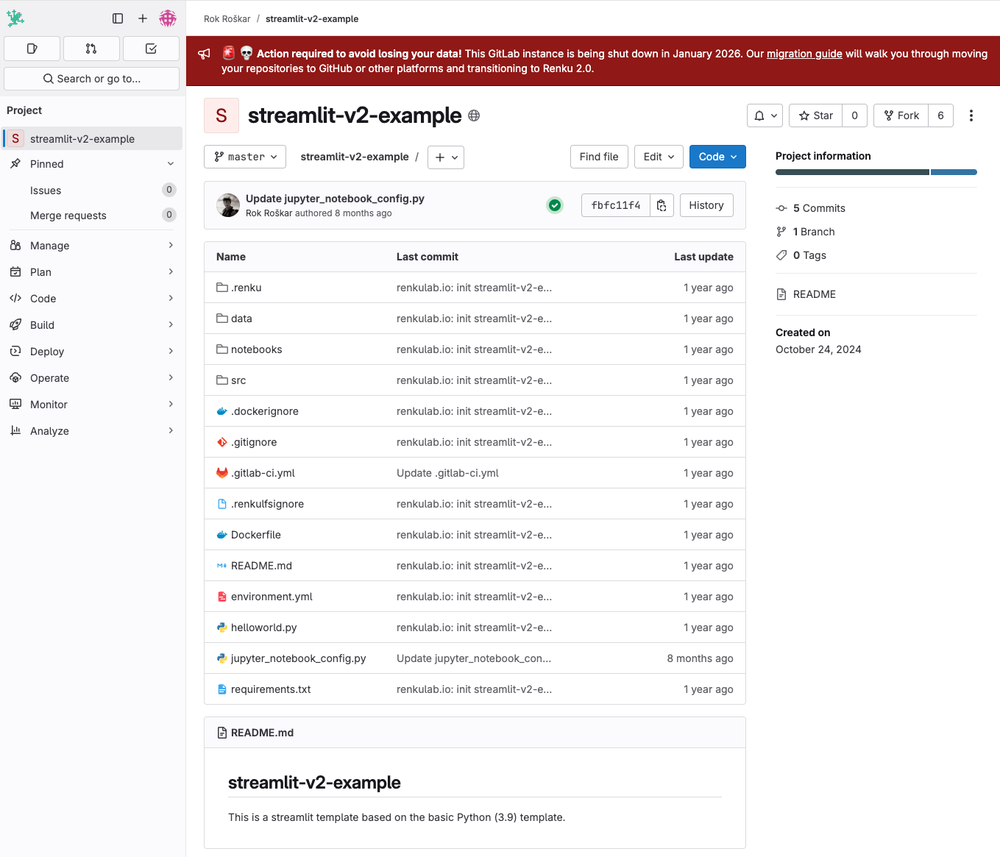
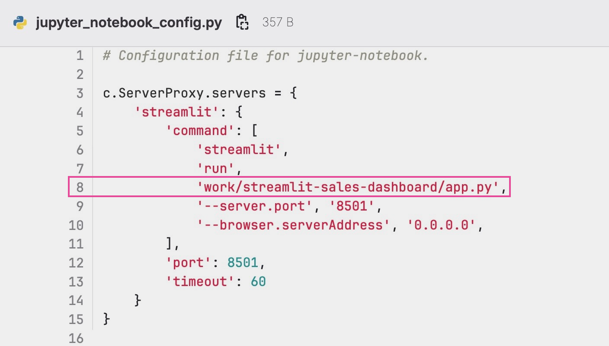
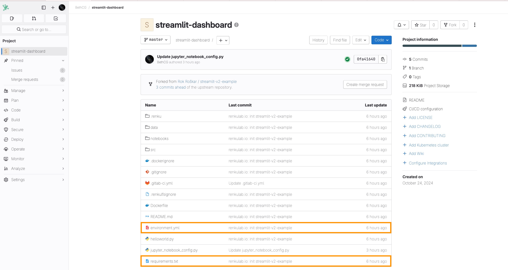
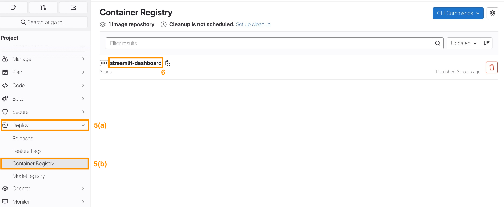
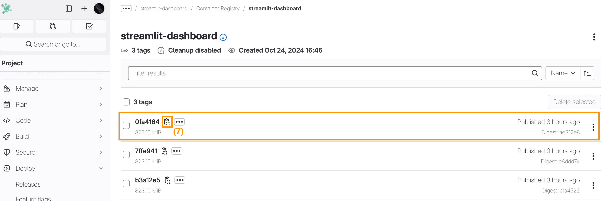

# How to create a Streamlit app on top of your project

:::info

This documentation is out-of-date and will be updated soon!

:::

As of now, it is still possible to launch your Streamlit app on top of your Renku 2.0 project as follows.

1. Create a fork of this repository: https://gitlab.renkulab.io/rok.roskar/streamlit-v2-example, we will refer to the fork as project-fork.

2. In _project-fork_, modify line 8 in the file `jupyter_noteboox_config.py`to the path to your python entry file for Streamlit within your Renku 2.0 project ( e.g. `work/name-fork-project/helloworld.py` or `work/main-project-repository/streamlit/app.py` or `work/repository-2/app.py` )

   ⚠️ Do not forget to add `work/` at the beginning of the path !

3. Add all the package dependencies you will need to run your Renku 2.0 project in the requirements.txt file or in the environment.yml , as explained [here](./environments/install-packages-on-the-fly-in-your-session).

4. Commit your changes for _project-fork_.
5. Select **Deploy(5a)/Container Registry(5b)** on the left menu of _project-fork_.
6. Click on top of your image registry to access the tags **(6)**.

7. Copy the latest tagged image (registry_link).

8. Add a session launcher to your Renku 2.0 project the following **Custom Environment** set-up \*\*\*\*as described in [How to use your own docker image for a Renku session](./environments/use-your-own-docker-image-for-renku-session). Consider the following two parameters:
   1. **Container Image:** `*registry_link*`
   2. **Default URL:** `/streamlit`
9. [Optional] If the entry point for your streamlit app will be hosted in _project-fork,_ add _project-fork_ code repository to your Renku 2.0 project.

You can now start a session with your new streamlit launcher to access the streamlit app directly in your browser.
