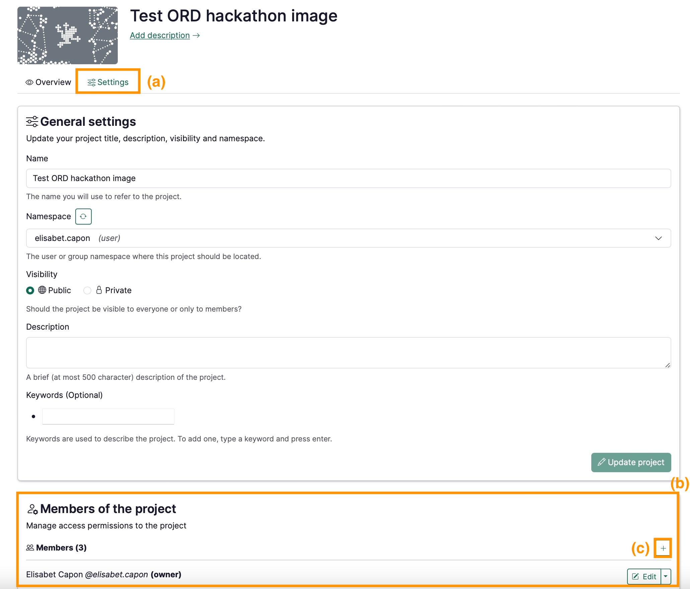

# Add people to a project

You can easily add collaborators to your project. They may have different roles, either owners, editors or viewers.

In the project page:

1. Click on the **Settings** tab **(a)**
2. Edit the **Members of the projec**t section **(b)**
- Click  ➕  **(c)**
- Look up the user’s name
- Assign the role
    - For more information about roles, see [Permissions, Roles, and Access Rights](Permissions,%20Roles,%20and%20Access%20Rights%2013b0df2efafc803e9b57c30df1be6c0a.md)
- Repeat for as many new members as you wish

:::info
 Note that in order to add someone to a project, they need to have already created their account on RenkuLab.

:::

