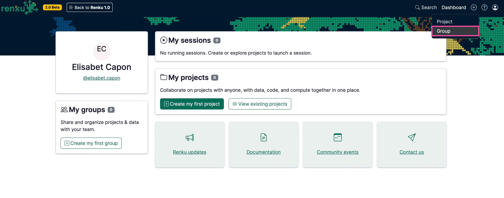
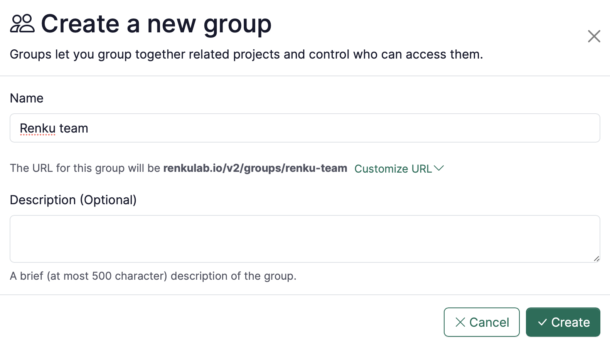

# Create a group

:::tip

Creating a group allows you to gather all the information and resources (data, people, projects, etc.) of your team or research project under a single roof.

:::

1. Click ➕ at the top right corner of [renkulab.io](http://renkulab.io) after logging in.
    1. Click on **Group**.
    
    
    
2. On the Group creation page:
    - **Name**: enter your preferred identifier.
    - **Description (Optional)**: add the description of your group.
    - Click on the **Create** button.
    
    

    
    

    
3. To add people to your group, see [How to add members to a group](/docs/users/collaboration/guides/add-members-to-group)
