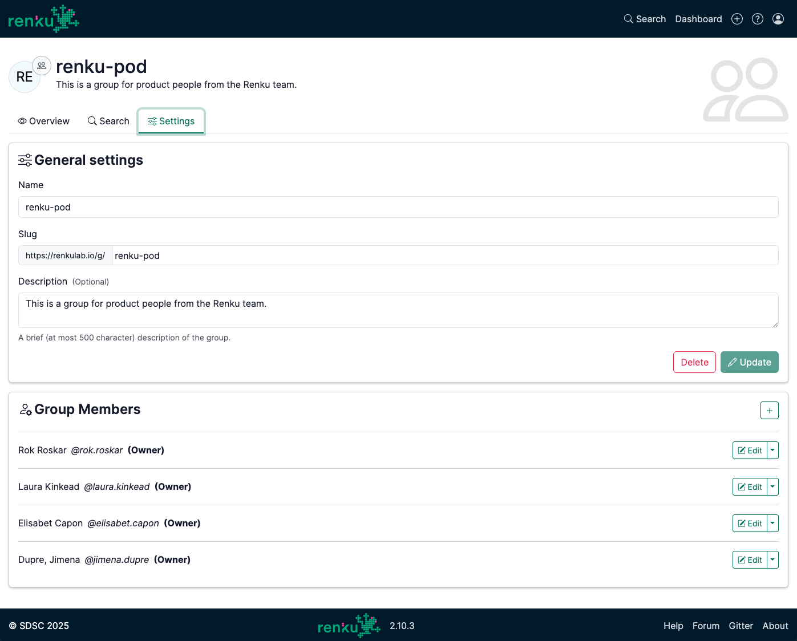
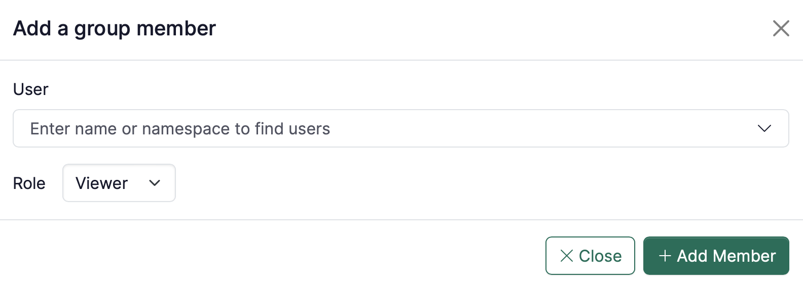

# Add members to a group

1. Go to the Group page and edit its properties under the tab **Settings**:
    
    
    
2. Click on the **+** in the **Group Members** section.
    - **User**: Find a user by typing the person’s name.
    - **Role**: Decide the rights of the users when adding them (you can always come back to this page to revise people’s rights by click on **Edit**).
    
    

    
    

    

:::tip

To learn more about roles in groups, see [Group Permissions](/docs/users/collaboration/permissions#group-permissions)

:::
