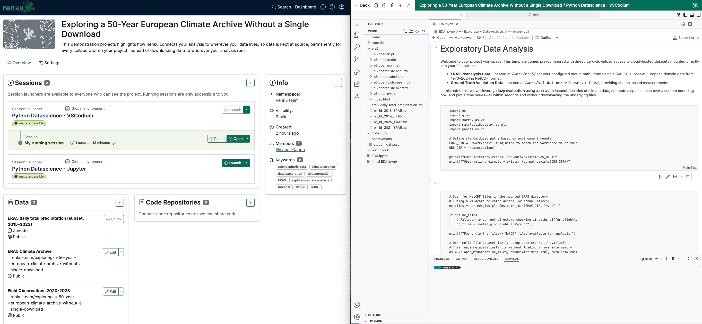
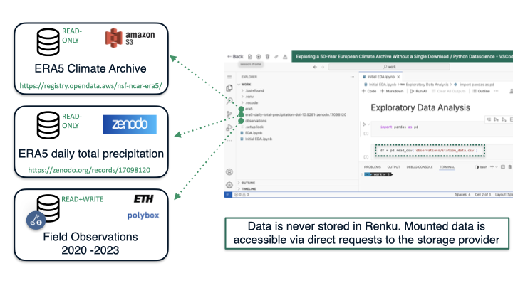
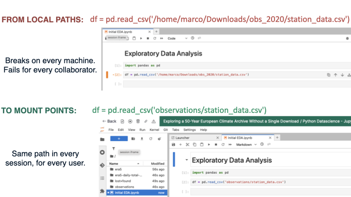

# Your data ready in seconds

## Connect any cloud data source directly to your session: Renku mounts it for you

Every researcher and data scientist faces the same ritual: you have a new dataset to explore, so you download the data you have received and open a terminal to start a transfer that will take hours: you may copy files to a remote server, update hardcoded paths across multiple notebooks/scripts, and hope your colleague has the same folder structure. By the time the data is "ready," you have already lost about half a day to logistics rather than science.

This problem turns much worse when you have multi-terabyte datasets in fields like climate science, genomics, or medical imaging. You cannot simply `scp` a 5 TB satellite imagery archive to a laptop, and even cloud compute instances may run out of local disk mid-analysis. Hence, data scientists and researchers spend a significant amount of time managing data movement.

Renku eliminates this entirely. Instead of downloading data to wherever your analysis runs, Renku connects your analysis to wherever your data lives, so data is kept at source, permanently for every collaborator on your project.

### Set up and reuse data connectors in your Renku projects

Setting up the project [Exploring a 50-Year European Climate Archive Without a Single Download](https://renkulab.io/p/renku-team/exploring-a-50-year-european-climate-archive-without-a-single-download) demonstrates Renku capabilities for exploratory data analysis. We will set up three data connectors: a **public S3 bucket in AWS** hosting the [ERA5 reanalysis dataset](https://registry.opendata.aws/nsf-ncar-era5/), a **DOI-linked Zenodo** dataset 4-years subset for [daily total precipitation](https://zenodo.org/records/17098120) and a **private Polybox** read-write data connector protected with credentials with some station observations (syntehtically create for demonstration purposes, which you can recreate by uploading the original [dataset](https://drive.google.com/drive/folders/1mdpfrlShIGksz0Ent_POihU1kqMggD7o?usp=sharing) in your favorite data storage provider. At this initial stage, we usually do not have a code repository for version control, and we usually create notebooks on-the-fly. In Renku you can either store these notebooks directly in a data connector with read and write access, or you can download them directly to your computer from the session, and upload them after session restart to your local disk.

  

**Create the project from scratch**

1. From a new project page, go to the **Data** section and click **+** to add a connector.
2. For the **[ERAS reanalysis dataset](https://registry.opendata.aws/nsf-ncar-era5/)**: Go to the **+ Create a data connector** tab, and select **s3** as the storage type and enter the bucket name `nsf-ncar-era5` and region `us-west-2`.
3. Click **Test connection** and a green confirmation appears immediately.
4. Name the connector as `ERA5 Climate Archive` and set the mount point to `era5` (under Advanced Settings), then click **+ Add connector**.
5. Repeat steps 1 to 4, for the other data sources:
    -  **[ERA5 daily total precipitation](https://zenodo.org/records/17098120)**: In the **Link a data connector** tab paste the DOI of the Zenodo dataset, `https://doi.org/10.5281/zenodo.17098120`, and click on the **Link** button.
    -  **Station observations**: Go to the **+ Create a data connector** tab, and select your storage provider (e.g. Polybox/Shared as explained in the [how-to guides](../../data/guides/connect-data)). Click on **Next** and provide connection details. After that, name the connector as `Field Observations 2020-2023` and set the mount point to `observations`.
6. Create a global session launcher (e.g. Python Datascience - Jupyter), and click on **Launch**. The selected UI (e.g. JupyterLab) file browser shows all mount points populated.
7. Create a notebook and begin analysis without any download, path configuration or `os.environ` juggling steps. You can find [here](https://drive.google.com/drive/folders/1mdpfrlShIGksz0Ent_POihU1kqMggD7o?usp=sharing) an example Notebook that you can upload in your session (e.g. by right-clicking on the UI file browser).

### One-time configuration, available in every session

Renku supports access to a wide range of cloud and institutional storage systems through [data connectors](../../data/data), including Amazon S3 buckets, Azure Blob Storage, SwitchDrive and PolyBox (via WebDAV), OpenBIS, GoogleDrive, Dropbox, SFTP servers such as the EPFL NAS, and any publicly archived dataset accessible by DOI from repositories such as Zenodo, Dataverse, or EnviDat. You configure a connector once by providing the endpoint, container or bucket name, and any required credentials, and that connector is permanently linked to your project. Every subsequent session, whether launched by you or a collaborator, finds the data already mounted and ready to read with no additional setup, except for entering the credentials when accessing protected data connectors for the first time.

For **DOI-referenced datasets**, the process is even simpler: paste the DOI into **Link a data connector** tab, and Renku resolves it to the specific dataset version on the upstream repository. Your project now references that exact dataset, pinned by DOI, rather than a URL that may change or disappear without warning. See [How to connect data from a data repository](../../../data/guides/connect-data/connect-data-from-data-repositories) for the full walkthrough.

### Mounted, not transferred

When Renku connects a session to a data source, it does not copy files to local disk. It mounts the remote storage as a directory in the session filesystem, making the data appear local to your analysis code while transparently reading it on demand.

The practical consequence is immediate: a 10 TB raw data archive is accessible in your session within seconds, and your first `pd.read_csv()` or `xr.open_dataset()` call reads only the bytes it needs. You do not have to wait for a full transfer and you can browse the directory structure of massive archives at interactive speed. Lazy-loading libraries such as `xarray`, `dask`, and `arrow` pair naturally with this approach, giving you efficient access to petabyte-scale datasets.

  

### Your data never leaves your infrastructure

Renku stores only the *connection configuration* of a data connector, including the endpoint address, container name, and optionally a reference to your credential secret, but never the data itself. When a session reads a file, the read request travels directly from the session environment to your storage provider. Sensitive institutional datasets, patient records under IRB approval, and proprietary data under NDA remain entirely within your storage infrastructure. Only a user with valid credentials can read them through a Renku session.

For public datasets accessed by DOI, no credentials are involved at all and Renku reads directly from the upstream repository with no intermediate storage.

### Stable paths across environments and collaborators

One of the most misleading causes of broken analysis pipelines is hardcoded data paths. A notebook that reads `/home/username/Downloads/climate/era5_2024.nc` on one machine fails silently on another. Renku solves this by giving each data connector a fixed, configurable mount point inside the session, for example `/work/era5/`, regardless of who launched it. Your code references that path, and Renku guarantees the data is there.

  

:::tip Remember

The data connector stores only the *connection configuration*, not the data itself. Your raw files never leave your storage provider, instead Renku requests them on demand, exactly as a mounted NFS share works on an HPC cluster. Revoke the access credentials and Renku immediately loses access. There is no copy on Renku to worry about.

:::
