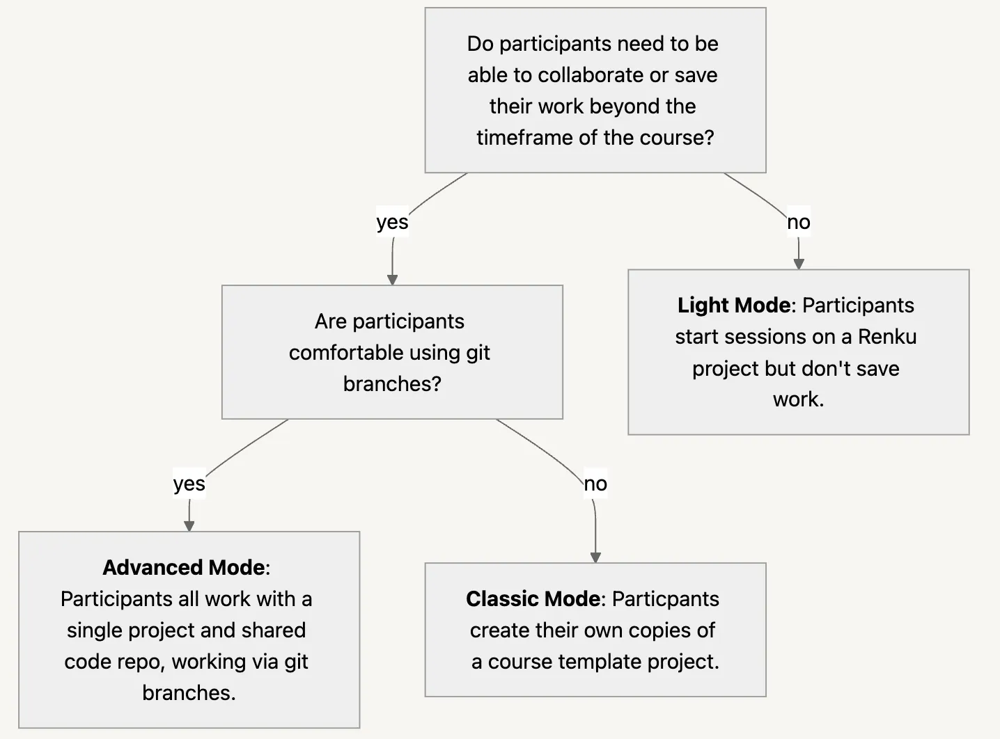

# Renku for Teaching

Renku simplifies teaching, giving students seamless access to course materials and interactive sessions directly in their browser—no installation required. Renku lets students focus on mastering the course material, without getting lost in setup. Renku’s focus on collaboration means it’s a great choice for courses with group work, too.

<p class="image-container-l">

</p>

# Register your course

In order to assure that sufficient resources are available for your course, please [register](https://renku.notion.site/ac0228ddcc1e4391840d961d1c10a4dc?pvs=105) your course in advance.

# Onboarding course participants in Renku

In order to manage rights of the course participants into Renku projects associated to your course, they need to be registered in Renku. Therefore, ask them to create an account in Renku, as described in [How to create your Renku account](https://docs.renkulab.io/en/latest/docs/users/getting-started/tutorial-start),  in advance before starting the course.

# Compute resources for your course

After you register your course, the Renku team will create a dedicated resource pool for your course based on the requirements that you have specified during the registration. Thus, the team will reach out to you and request for the list of course participants in order to add them to the course resource pool. 

Ensure that you select a class within that resource pool as the default resource for your course project(s). As a result, course participants will be able to use that resource pool during the course, if you set the session launcher to use the resources assigned in your resource pool.

# Managing access rights to course project(s)

We recommend you to create a group for your course following the instructions in [How to create a group](https://docs.renkulab.io/en/latest/docs/users/collaboration/guides/create-group).

Add the **course participants as** **viewers** of the course group. This will make it so the participants can see all of the projects in the group, but they will not be able to edit them.

We recommend to add **other course instructors as owners** of the group so that they can edit all the projects in the course group.

# Setting up a course with Renku projects

Depending on the requirements of the course, we propose several modes for setting up the course projects:

1. [**Light Course Mode**](https://docs.renkulab.io/en/latest/docs/users/use-cases/teaching/set-up-course-in-light-mode): Ideal for workshops where participants only need access to a simple compute session with course materials and do not need to collaborate.
    
2. [**Classic Course Mode:**](https://docs.renkulab.io/en/latest/docs/users/use-cases/teaching/set-up-course-in-classic-mode) Participants create their own copies of a course template project. Take full advantage of Renku’s collaboration features and integration with other platforms. 

    
3. [**Advanced Course Mode:**](https://docs.renkulab.io/en/latest/docs/users/use-cases/teaching/set-up-course-in-advanced-mode-using-git) Participants collaborate on code via git.

<!-- ```mdx-code-block
import DocCardList from '@theme/DocCardList';

<DocCardList />

``` -->

Follow the chart below to decide which mode best suits your course.



Sample Renku course project set-ups

We hereby share with you some sample projects that may inspire you for setting up your course:

- **Pluto/Julia -**  [**Computational Thinking in Julia/Pluto MIT Course**](https://renkulab.io/v2/projects/teaching-with-renku/demo-project-pluto)
- **RStudio -** [**ML regression for wine quality**](https://renkulab.io/v2/projects/teaching-with-renku/ml-regression-for-wine-quality)
- **Python/Jupyter/VS Code** -  [Object Oriented Programming in Python](https://renkulab.io/v2/projects/teaching-with-renku/object-oriented-programming)
- **Matlab** - [Numerical Methods with Applications](https://renkulab.io/v2/projects/teaching-with-renku/numerical-methods-with-applications)

# Watch an introductory session

<p class="image-container-l">
  <iframe
    width="560"
    height="315"
    src="https://www.youtube.com/embed/023Ou1wTI5s"
    title="YouTube video player"
    frameborder="0"
    allow="accelerometer; autoplay; clipboard-write; encrypted-media; gyroscope; picture-in-picture; web-share"
    allowfullscreen>
  </iframe>
  This webinar introduces instructors to Renku 2.0 and presents how to setup and create interactive, reproducible learning environments. After this webinar, you will be able to:

<p>✨ Understand Renku's core features for educational purposes </p>
<p> 🧑🏼‍🏫 Create and manage teaching materials in Renku </p>
<p> 📝 Set up collaborative student projects including reproducible assignments </p>
</p>
